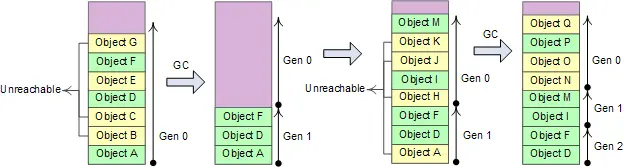
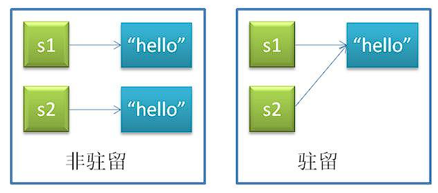
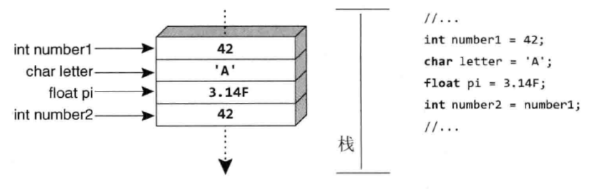
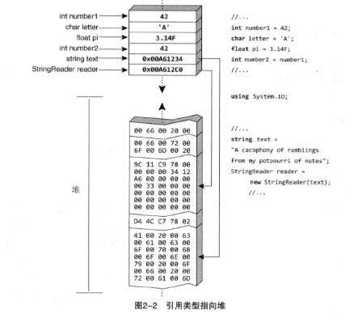

本文持续更新中，如果有写得不对的地方，麻烦大伙指正orz。

# 1 内存管理相关

## 1.1 GC（Garbage Collection）

> [C#垃圾回收机制(GC)](https://cloud.tencent.com/developer/article/2318791)

### 1.1.1 为什么需要GC

本文是CLR的一个组件，它控制内存的分配和释放，它的出现是为了简化程序员的内存管理工作。

在面向对象的环境中，每个类型都可以代表可供程序使用的一种资源，访问资源的步骤：

 - 调用IL指令newObj，为代表资源的类型分配内存（一般使用new操作符来完成）。
 - 初始化内存，设置资源的初始状态并使资源可使用。类型的实例构造器负责设置初始化状态。
- 访问类型的成员来使用资源。
- 摧毁资源的状态以进行清理。
- 释放内存。

上述的最后一步如果由程序员负责，可能会产生一些无法预测的问题（如：忘记释放不再使用的内存、试图使用已被释放的内存等等），因此GC被引入，单独负责这一步，简化了程序员的内存管理工作。

**new的底层逻辑**

托管堆上有一个nextObjPtr指针，指向下一个对象在堆中分配的位置。

当应用程序执行new操作符后，若内存中有足够的可用空间，就在nextObjPtr处放入对象，接着调用对象的构造方法，并为应用程序返回一个该对象的引用。

nextObjPtr会加上当前对象占用的字节数，获得下一个对象放入托管堆时的地址。

### 1.1.2 GC的工作原理

#### 工作原理

GC即垃圾回收。它是以应用程序的**root**为基础，遍历应用程序在托管堆（Heap）上动态分配的所有对象，通过识别它们是否被引用来确定哪些对象是已经死亡的，哪些是仍需要被使用的。其中，已经不再被引用的对象就是已经死亡的对象，即所谓的垃圾，需要被回收。这就是GC工作的原理。

#### 什么是root？

每个应用程序都包含一组root。每个root都是一个存储位置，其中包含指向引用类型对象的一个指针（可以理解为对象的引用）。该指针要么引用托管堆中的一个对象，要么为null。

在应用程序中，只要某对象变得不可达，也就是没有根（root）引用该对象，这个对象就会成为垃圾回收器的目标。

.NET中可以当作GC Root的对象有如下几种：

- 全局变量
- 静态变量
- 栈上的所有局部变量（JIT）
- 栈上传入的参数变量
- 寄存器中的变量

注意，只有**引用类型的变量**才被认为是root，值类型的变量永远不被认为是root。

#### GC算法：Mark-Compact 标记压缩算法

- 暂停进程中的所有线程。
- GC标记阶段
  - CLR遍历堆中所有对象，将他们的同步索引块中的某一位设为0。
  - **引用跟踪算法**：CLR基于应用程序的root进行检查，查看它们引用了哪些对象，其中空引用（null）的被CLR忽略掉。 任何根如果引用了堆上的对象，CLR都会标记那个对象，将它的同步索引块中的一位设为1 。 那些未被标记为1 的对象即垃圾，被垃圾回收。
- GC压缩阶段
  - 对象回收之后heap内存空间变得不连续，在heap中移动这些对象，使他们重新从heap基地址开始连续排列，类似于磁盘空间的碎片整理。
- 修复引用
  - 压缩过程移动了堆中的对象，使对象地址发生变化，因此需要修复所有引用，即更新它们存储的堆内地址。
  - 上一步有个类似于重定位表的东西，它记录了旧地址到新地址的映射，可以用在这一步。
- 恢复所有线程。

#### GC优化：Generational 分代算法

进行一次完整内存区域的GC（full GC）操作成本很高，因此我们采用分代算法对GC性能进行一定改善。

分代算法的思想：将对象按照生命周期分成新老对象，对新、老区域采用不同的回收策略和算法，加强对新区域的回收处理力度，争取在较短时间间隔、较小的内存区域内，以较低成本将执行路径上大量新近抛弃不再使用的局部对象及时回收掉。

分代算法的假设前提条件：

- 大量新创建的对象生命周期都比较短，而较老的对象生命周期会更长。
- 对部分内存进行回收比基于全部内存的回收操作要快。
- 新创建的对象之间关联程度通常较强。heap分配的对象是连续的，关联度较强有利于提高CPU cache的命中率。

.NET将heap分成3个代龄区域: Gen 0、Gen 1、Gen 2。



如果Gen 0 heap内存达到阀值，则触发0代GC，0代GC后Gen 0中幸存的对象进入Gen1。如果Gen 1的内存达到阀值，则进行1代GC，1代GC将Gen 0 heap和Gen 1 heap一起进行回收，幸存的对象进入Gen2。2代GC将Gen 0 heap、Gen 1 heap和Gen 2 heap一起回收。

Gen 0和Gen 1比较小，这两个代龄加起来总是保持在16M左右；Gen2的大小由应用程序确定，可能达到几G，因此0代和1代GC的成本非常低，2代GC称为fullGC，通常成本很高。

### 1.1.3 GC的触发时间

 - 最常见的触发条件：CLR在检测第0代内存超过预算时触发一次GC。

- 代码显式调用GC.Collect()。
- Windows报告低内存。
- CLR正在卸载AppDomain。
- CLR正在关闭。

### 1.1.4 如何减少垃圾回收

- 减少new产生对象的次数。
- 使用公用的对象（静态成员）。
- 将string换为stringBuilder（这部分详细看后面string的部分）。

### 1.1.5 手动回收

 - GC.Collect();
 - .Net的GC并不是实时性的，这会造成系统性能上的瓶颈和不确定性。所以有了IDisposable接口，IDisposable接口定义了Dispose方法，这个方法用来供程序员显式调用以释放非托管资源。

### 1.1.6 需要特殊清理的类型

在编写应用程序中肯定会涉及例如：操作文件 FileStream、网络资源socket、互斥锁 Mutex 等这些本机资源。

创建对象时不仅也要为它分配内存资源，还要为它分配本机资源。那么包含本机资源的类型被GC 时，GC会回收对象在托管堆中使用的内存，但这个类型的本机资源不清理的话，就会造成本机资源的泄漏。

所以，CLR提供了称为**终结**的机制，允许对象在被判定为垃圾之后，但在对象内存被回收之前执行一些代码。任何包装了本机资源的类型都支持终结。

CLR 判定一个对象不可达是，对象将终结它自己，释放它包装的本机资源。之后，GC 会从托管堆回收对象。

对于使用了本机资源的对象，在废弃它的时候我们该如何处理呢？

终极基类 System.Object 定义了受保护的虚方法 Finalize。如果你创建的对象使用了本机资源，你可以要重写Object 的虚方法。在类名前添加~ 符号来定义Finalize方法。垃圾回收器判定对象是垃圾后，会调用对象的Finalize 方法。

```c#
internal sealed class SomeType{
    ~SomeType()
    {
        //这里的代码会进入Finalize 方法
    }
}
```

拥有本机资源的对象经历垃圾回收的顺序是这样的：

- 拥有本机资源对象被标记为垃圾，等待GC清理。
- GC 将堆中其他垃圾回收完毕后才调用 Finalize方法，这些使用了本机资源的对象的内存没有被GC马上被回收，因为Finalize 方法可能要执行访问字段的代码。
- 上一步导致拥有本机资源的对象被提升到下一代，使对象活得比正常时间长。
- 当下一代对象被GC 回收时，拥有本机资源的对象的内存才会被回收。如果拥有本机资源的对象的字段引用了其他对象，那么它们也会被提升到下一代。

## 1.2 内存

### 1.2.1 内存分区

- **栈**：由编译器自动分配释放 ，存放值类型的对象本身，引用类型的引用地址（指针）等。其操作方式类似于数据结构中的栈。
- **堆**：用于存放引用类型对象本身。在c#中由.net平台的垃圾回收机制（GC）管理。栈，堆都属于动态存储区，可以实现动态分配。
- **静态区及常量区**
  - 如果一个类型是静态值类型或者常量对象，那么存储在静态区/常量区；如果一个类型是静态引用类型，那么引用存储在静态区/常量区，而对象本身存储在堆上。
  - 由于存在栈内的引用地址都在程序运行开始最先入栈，因此静态区和常量区内的对象的生命周期会持续到程序运行结束时，届时静态区内和常量区内对象才会被释放和回收（编译器自动释放）。所以应限制使用静态类，静态成员（静态变量，静态方法），常量，否则程序负荷高。
- **代码区**：存放函数体内的二进制代码。

### 1.2.2 为什么栈比堆快？
首先，栈是程序运行前就已经分配好的空间，所以运行时分配几乎不需要时间。而堆是运行时动态申请的，分配内存会有耗时。

其次，访问堆需要两次内存访问，第一次取得地址，第二次才是真正得数据，而栈只需访问一次。栈有专门的寄存器，压栈和出栈的指令效率很高，而堆需要由操作系统动态调度。
### 1.2.3 .NET&CLR
C# 程序在 .NET 上运行，而 .NET 是名为公共语言运行时 (CLR) 的虚执行系统和一组类库。CLR 是 Microsoft 对公共语言基础结构 (CLI) 国际标准的实现。 CLI 是创建执行和开发环境的基础，语言和库可以在其中无缝地协同工作。

用 C# 编写的源代码被编译成符合 CLI 规范的中间语言(IL)。 IL 代码和资源（如位图和字符串）存储在扩展名通常为 .dll 的程序集中。

执行 C# 程序时，程序集将加载到 CLR。 CLR 会直接执行实时 (JIT) 编译，将 IL 代码转换成本机指令。 CLR 可提供其他与自动垃圾回收、异常处理和资源管理相关的服务。 CLR 执行的代码有时称为“托管代码”。而“非托管代码”被编译成面向特定平台的本机语言。

### 1.2.4 C#中的内存泄漏
内存泄漏指的是程序中不再需要的内存没有被释放，从而导致内存使用不断增加，最终可能导致系统性能下降或应用程序崩溃。

C#的内存泄露情况有以下几种：
1.委托或事件没有解除注册。
2.静态引用：如果一个静态对象长时间存活且占用大量内存，并且该对象不会被释放或重置，可能导致内存泄漏。
3.长生命对象：如果对象的生命周期很长，而它又引用了大量短命对象，这些短命对象就无法被回收，从而导致内存泄漏。
4.未释放非托管资源：尽管垃圾回收器可以自动管理托管内存，但对非托管理资源（如文件句柄、数据库连接等）仍然需要手动释放。如果未正确释放这些资源，会导致内存泄漏（可以用接口IDispose进行释放）。

### 1.2.5 弱引用（Weak Reference）
弱引用（Weak Reference）是一种特殊的引用类型，它允许你引用一个对象而不阻止该对象被垃圾回收器（GC）回收。换句话说，弱引用不会延长对象的生命周期。

```csharp
var strongReference = new object(); // 创建一个强引用对象
var weakReference = new WeakReference<object>(strongReference); // 创建一个对该对象的弱引用
strongReference = null; // 删除强引用
```

# 2 数据结构

## 2.1 数组（Array）
### 一维数组

```csharp
int[] arrayA = new int[n];
int[] arrayB = new int[]{1,2,3};
```
### 二维数组
```csharp
//两行三列的二维数组
int[,] arrayA = new int[2,3];
int[,] arrayB = new int[,]{
	{1,2,3},
	{3,2,1},
};
```
### 交错数组
交错数组可以理解为**数组的数组**。
```csharp
//由于交错数组存放的数组长度可能各不相同，所以不指定第二维度
int[][] arrayA = new int[2][];
int[][] arrayB = new int[][]{
	new int[]{1,2,3},
	new int[]{3,2,1},
};
```
## 2.2 ArrayList&List
在C#中，由于数组都是固定长度的，所以常常不能满足我们开发的需求，因此出现了列表（可变长数组。

### 2.2.1 ArrayList
ArrayList是可变长数组，其内部维护的数组，当长度不足时，会自动扩容为原来的两倍。ArrayList存储的数据可以重复。

但ArrayList有一个缺点，就是存入ArrayList的数据都是Object类型的，所以将值类型存入和取出时会发生装箱拆箱操作，影响程序性能。

针对这一点，在.Net2.0泛型出现后，就提供了List。

### 2.2.2 List
List是ArrayList的泛型版本，它不存在装拆箱操作。不过需要在使用的时候先设置好类型。

List存储的数据可以重复，通过索引（下标）进行访问。

```csharp
List<int> list = new List<int>();
```
### 2.2.3 区别
ArrayList非泛型而List是泛型，ArrayList在值类型存取时存在装拆箱操作，List则避免了这个问题。
### 2.2.4 List底层
List内部是由数组实现的，当没有给予指定容量时，初始容量为0。

**Add**

在List的Add()函数中，每添加一个元素，Add接口都会首先检查容量是否足够，如果不够，会调用EnsureCapacity()函数进行扩容。

在EnsureCapacity()函数中，有这样一行代码：

```csharp
//_defaultCapacity：默认容量为4
//当list开始添加元素时，默认指定的最初容量为4，后续按2倍扩容
int newCapacity = _items.Length == 0? _defaultCapacity : _items.Length*2;
```
每次容量不够时，整个数组的容量都会扩充一倍，_defaultCapacity表示默认容量为4，因此整个扩充路线为4，8，16，32...以此类推。

List使用数组形式作为底层数据结构，优点是通过索引访问元素很快，缺点是在扩容时每次针对数组进行new操作都会造成内存垃圾，给垃圾回收（GC）带来了很多负担。

这里按2的指数扩容的方式，可以为GC减轻负担。但如果数组被连续申请扩容，还是会造成GC的不小负担。此外，如果数量使用不当，也会浪费大量空间，例如，当元素数量为520时，List会扩容到1024个元素，那么就会有504个空间单位被剩余，造成内存空间的大量浪费。

**Remove**

原理是先使用一个IndexOf函数以O(n)复杂度找到目标元素索引，再在RemoveAt()函数内使用Array.Copy对数组进行覆盖。

Array.Sort()

```c#
//将array1从index1开始的len个元素复制到array2（从index2开始
Array.Sort(array1,index1,array2,index2,len);
```

```c#
...
_size--;
if(index<_size) Array.Sort(_items,index+1,_items,index,_size-index);
...
```

其他接口原理与Add()接口和Remove()接口相似，可以看到，List效率并不高，只是通用性较强而已，大部分算法使用的都是线性复杂度的算法。

另外也可以从源码中看出，List是线程不安全的，它并没有对多线程做任何加锁或其他同步操作。由于并发情况下无法判断_size++的执行顺序，因此当我们在多线程间使用List时应加上安全机制。
## 2.3 字符串（string）
### 2.3.1 string的不变性和驻留性
string是一种比较特殊的引用类型。

**不变性**
字符串一经创建，值不可变。对字符串的各种修改操作都会创建新的字符串对象。

当你给一个字符串重新赋值，会在堆中重新开辟一块空间存储新值，并将栈内存储的地址修改为新开辟空间的地址，而老的值会继续存在于堆中，等到垃圾回收时再被销毁。

> [C#里其他不可变类型](https://zhuanlan.zhihu.com/p/655900143)

**驻留性**
运行时将字符串值存储在“驻留池（字符串池）”中，相同值的字符串都复用同一地址。

一般只有两种情况下字符串会被驻留：
1.字面量的字符串，这在编译阶段就能确定的“字符串常量值”。相同值的字符串只会分配一次，后面的就会复用同一引用。例如 string str = "abc" 这种。
2.过 string.Intern(string) 方法主动添加驻留池。

驻留的字符串（字符串池)在托管堆上存储，大家共享，内部其实是一个哈希表，存储被驻留的字符串和其内存地址。驻留池生命周期同进程，并不受GC管理。

### 2.3.2 字符串的比较（==和Equals()）
对于值类型，这俩都一样，都是比较两个值类型的值是否相等，所以在这里我们只探讨引用类型。
**原本的**
C#的“==”用来比较引用类型的地址是否相等，即对比的两个变量是否指向同一个内存地址。而Equal()则比较的是引用类型的内容是否相等，即堆内存里存放的值是否相等。
**string的**
而string的“==”进行了重载，作用和Equals()一致。
### 2.3.3 字符串的连接

> [C#字符串连接](https://www.cnblogs.com/popzhou/p/3676691.html)
> [C# string](https://www.cnblogs.com/anding/p/18221262)

**+=**

string str = tmpStr + "abc";会被优化程string.Concat(...)。通过分析string.Concat(params string[] values)的实现可以知道：先计算目标字符串的长度，然后申请相应的空间，最后逐一复制，时间复杂度为o(n)，常数为1。

固定数量的字符串连接效率最高的是+。

但是字符串的连+不要拆成多条语句，比如：

```csharp
string sql = "update tableName set int1=";
sql += int1.ToString();
sql += ...
```

这样的代码，不会被优化为string.Concat，就变成了性能杀手，因为第i个字符串需要复制n-i次，时间复杂度就成了o(n^2)。

**StringBuilder**

StringBuilder 只分配一次内存，如果第二次连接内存不足，则修改内存大小；它每次默认分配16字节，如果内存不足，则扩展到32字节，如果仍然不足，继续成倍扩展。

如果频繁的扩展内存，效率大打折扣，因为分配内存，时间开销相对比较大。如果事先能准确估计程序执行过程中所需要的内存，从而一次分配足内存，效率大大提高。

如果字符串的数量不固定，就用StringBuilder，一般情况下它使用2n的空间来保证o(n)的整体时间复杂度，常数项接近于2。

因为这个算法的实用与高效，.net类库里面有很多动态集合都采用这种牺牲空间换取时间的方式，一般来说效果还是不错的。

**string.Format**

它的底层是StringBuilder，所以其效率与StringBuiler相似。

### 2.3.4 空字符串

```csharp
string str = null;
string str = "";
string str = string.Empty;
```

**三者的区别**

str = null 在堆中没有分配内存地址。

str = "" 和 string.Empty 一样都是在堆内存中分配了空间，里面存储的是空字符串。

string.Empty是一个静态只读变量。

# 3 基础补充
## 3.1 值类型&引用类型
C#的类型有两种：值类型（value type）和引用类型（reference type）。值类型的变量存储数据，而引用类型的变量存储对数据的引用。
### 3.1.1 值类型
值类型直接包含值，换言之，变量引用的位置就是值在内存中实际存储的位置。将第一个变量的值赋给第二个变量，会在新变量的位置创建原始变量的值的一个内存副本。类似的，将值类型的实例传给方法，如Console.WriteLine()，也会生成一个内存副本，在方法内部对参数值进行任何修改都不会影响原始值。

对于值类型，每个变量都有它们自己的数据副本（ref和out参数除外）。


### 3.1.2 引用类型
相反，引用类型的变量存储的是对数据存储位置的引用，而不是直接存储数据。因此，为了访问数据，“运行时”要先从变量中读取内存位置，再“跳转”到包含数据的内存位置。

引用类型复制引用而不需要复制所引用的数据，表现为在栈内开辟一块新的空间，存储复制数据在堆中的地址，因此当有一个引用类型变量复制了另一个引用类型变量，该变量的改变也会引起另一个变量的改变。

### 3.1.3 值类型和引用类型的区别

 - 值类型数据存储在栈上，而引用类型数据存储在堆上。
 - 值类型的复制是按值传递的，引用类型的复制是按引用传递的，当我们对复制体进行修改时，值类型的原数据不会受到影响，而引用类型数据会随之改变。
 - 值类型存取快，引用类型存取慢。因为首先值类型存储在栈上，栈上的内存是事先分配好的。其次，访问堆需要两次内存访问，第一次取得地址，第二次才是真正得数据，而栈只需访问一次。栈有专门的寄存器，压栈和出栈的指令效率很高，而堆需要由操作系统动态调度。
 - 值类型继承自System.ValueType，引用类型继承自System.Object。
 - 值类型的内存管理由编译器自动完成，而引用类型的内存管理由垃圾回收器完成。
 - 值类型的生命周期由程序的作用域控制，而引用类型的生命周期由垃圾回收器控制。
### 3.1.4 装箱和拆箱
- 装箱
  - 值类型转换为引用类型。
  - 从托管堆中为新生成的引用对象分配内存，然后将值类型的数据拷贝到刚分配的内存中，并返回该内存的地址。这个地址存储在栈上作为对象的引用。
- 拆箱
  - 引用类型转换为值类型。
  - 首先获取托管堆中属于值类型那部分字段的地址，将引用对象中的值拷贝到位于栈上的值类型实例中。拆箱只是获取引用对象中指向值类型部分的指针，而内容拷贝是赋值语句触发。

装箱会产生较大性能损失（主要是构造新对象），拆箱的性能损失较小（主要是强制类型转换）。

```csharp
using System;
class Test{
	static void Main(){
		int i = 123;
		object o = i;     //Boxing
		int j = (int)o;   //Unboxing
	}
}
```
### 3.1.5 try&finally实验
**情况一**

```csharp
void Start(){
	int i = GetInt();
	Debug.Log("第A处 i="+i);
}
int GetInt(){
	int i=10;
	try{
		return i;
	}
	finally{
		i=11;
		Debug.Log("第B处 i="+i);
	}
}
```
结果：

```csharp
B=11
A=10
```

执行顺序：先执行try，然后缓存i，由于i是值类型，所以实际上缓存的是一个i的数据副本，值为10，然后再执行finally，最后return。

**情况二**

```csharp
class Test{
	public int i=10;
}
class CSharpLearing:MonoBehaviour{
	void Start(){
		Test t=GetObj();
		Debug.Log("第A处 i="t.i);
	}
	Test GetObj(){
		Test t = new Test();
		try{
			return t.i;
		}
		finally{
			t.i = 11;
			Debug.Log("第B处 i="+t.i);
		}
	}
}
```
结果：

```csharp
B=11
A=11
```
虽然return依旧对要返回的数据进行缓存，但由于t是引用类型，因此后面执行的finally中对数据的操控依旧影响到了t。
## 3.2 ref和out
ref和out可以将值类型以引用的方式进行传递，从而改变原来变量中的值。

它们俩的区别在于：通过ref传入的参数必须在传入方法前对其进行初始化操作，而通过out传入的参数不需要在传入方法前对其初始化，即便初始化了，也会在传入方法时清空，然后再在方法内赋初值。

例如当我们使用Swap我们可以使用ref：

```csharp
class Program{
	static void Main(string[] args){
		Program pg = new Program();
		int x = 10;
		int y = 233;
		pg.Swap(ref x,ref y);
		Console.WriteLine(x+" "+y);
	}
	static void Swap(ref int x,ref int y){
		int temp = x;
		x = y;
		y = x;
	}
}
```
## 3.3 字段和属性

```csharp
public class Person{
	private string name;
	public string Name{
		get{return name;}
		set{name = value;}
	}
}
public class Program{
	Person preson = new Person();
	person.Name = "manqi";
	Console.WriteLine(person.Name);
}
```
属性是一种特殊的方法，用于控制对成员变量的访问和赋值。通过使用属性，可以对成员变量进行保护，使得外部代码无法对其直接访问和修改。

优点：
- 安全性：将读、写权限分开：get和set是分开实现的，保证了数据安全。
- 灵活性：给属性赋值或取值时，可以根据自己的需求实现各种不同的赋值或取值逻辑。
## 3.4 结构体（struct）
### 3.4.1 定义
结构体可以简单地视为值类型的类。

```csharp
struct Point{
	public int x,y;
	public Point(int x,int y){
		this.x = x;
		this.y = y;
	}
}
```
### 3.4.2 结构体VS类
**区别**

- 结构体中声明的字段无法赋予初值，类可以。
- 结构体的构造函数中，必须为结构体所有字段赋值，类的构造函数则没有这个限制。
- 类为引用类型，可继承；结构体为值类型，不可继承（只能继承接口）。

**选择**

类是引用类型，因此类的对象存储在堆中。而结构体是值类型，结构体的对象存储在栈中。堆空间大，但访问速度慢。栈空间小，但访问速度快。因此，当我们描述的对象是一个轻量级对象时，选用结构体可提高效率。但如果我们希望传值的时候传递的是对象的引用而非对象的拷贝，那么我们可以选用类。
## 3.5 委托&Lambda&事件
[委托看这里](https://blog.csdn.net/manpi/article/details/141110646?spm=1001.2014.3001.5501)

## 3.6 元组（Tuple）
元组提供了一种简洁的方式来组合多个值，尤其是在你需要返回多个值或将多个值作为一个整体传递时。例如，你可以使用元组来返回多个结果而无需定义一个新的类或结构体。

在C#中，你可以使用System.ValueTuple命名空间下的ValueTuple结构来创建元组。

PS：ValueTuple比起Tuple更推荐使用。

元组创建：
```csharp
// 创建一个元组，包含两个元素
var person = (Name: "Alice", Age: 30);
Console.WriteLine(person.Name); // 输出: Alice
Console.WriteLine(person.Age);  // 输出: 30
```

or

```csharp
(int,float,bool,string) tmp = (1,5.5f,true,"123");
Console.WriteLine(yz.Item1);
```

or

```csharp
(int i,float f) yz = (1,5.5f);
Console.WriteLine(yz.i);
```

元组解构：

```csharp
var (name, age) = person;
Console.WriteLine(name); // 输出: Alice
Console.WriteLine(age);  // 输出: 30
```

返回多个值：

```csharp
public (string FullName, int Age) GetPersonInfo()
{
    return ("Bob", 25);
}
```

## 3.7 new
new的三个作用：

1.创建一个对象。
2.子类函数声明加上new关键字，可以隐藏掉父类方法。
3.泛型约束采用new()表示泛型参数需要一个无参构造。
# 4 特性
## 4.1 面向对象三大特征
### 4.1.1 封装
封装指的是隐藏类的实现细节，对外只暴露必要的接口和方法。它将数据和操作封装在一个类中，控制数据的访问权限。例如：事件就体现了封装的概念。

在C#中，封装的体现：

 - 访问修饰符
    - public：对任何类和成员都公开，无访问限制。
	- internal：只能在包含该类的程序集中访问该类。
	- protected：对该类和该类的派生类公开。
	- protected internal：protected+internal。
	- private：仅对该类公开。
- 属性
- 事件
- ...

### 4.1.2 继承
继承允许我们创建一个新的类，去继承已有的类的属性和方法，并添加或修改自己的属性和方法。通过继承，可以实现代码的复用，提高程序的可维护性和可扩展性。
### 4.1.3 多态
#### 重载（overload）

重载是编译时多态，指的是在同一个类中定义多个同名的方法，但参数列表不同，这样可以根据不同的参数列表调用不同的方法。

#### 重写（override）

重写是运行时多态，指的是在继承关系中，子类可以重写基类中的虚方法和抽象方法。

## 4.2 抽象
### 4.2.1 虚函数VS抽象函数
- 虚函数用virtual修饰，在基类中定义；抽象函数用abstract修饰，在抽象类中定义。
- 虚函数有实现体，抽象函数没有实现体。
- **虚函数子类可以选择性重写，而子类必须实现抽象方法，否则子类也必须声明为抽象类。**
- 虚函数可以通过基类对象的引用或子类对象的引用调用，而抽象函数只能通过子类对象的引用调用。

```csharp
public abstract class Animal{
    public abstract void Eat();
    public virtual void Run(){
        Console.WriteLine("Animal is running.");
    }
}

public class Dog : Animal{
    public override void Eat(){
        Console.WriteLine("Dog is eating.");
    }
    public override void Run(){
        Console.WriteLine("Dog is running.");
    }
}

public static void Main(string[] args){
    Animal animal1 = new Dog(); // 通过基类对象的引用调用虚方法
    animal1.Run(); // 输出：Dog is running.

    Dog dog1 = new Dog(); // 通过子类对象的引用调用虚方法和抽象方法
    dog1.Run(); // 输出：Dog is running.
    dog1.Eat(); // 输出：Dog is eating.
}
```
### 4.2.2 抽象类VS接口
 - 抽象类不能被实例化，而接口也不能被实例化，只有具体类才能被实例化。
- 抽象类可以包含抽象方法和具体方法，也就是说抽象类中可以有部分已经实现的方法，但接口不行，接口只能包含抽象方法，没有具体的实现。
- 抽象类可以被具体类继承，并且可以作为父类来提供一些通用的行为和属性，而接口可以被具体类实现，一个类可以实现多个接口，从而实现多重继承。
- 抽象类通常用于定义类的层次结构，并提供一些通用的方法和属性，而接口则通常用于定义一些规范或者协议，来保证实现该接口的类拥有一定的行为和属性。

## 4.3 反射（Reflection）

> [C# 反射（Reflection）超详细解析](https://blog.csdn.net/weixin_45136016/article/details/139095147)

允许程序在运行时检查和操作对象的类型信息。
System.Type是一个典型的反射的例子。

```csharp
public void Method(Object obj){
	//在运行时获取类型信息
	Type t = obj.GetType();
}
```
## 4.4 泛型（Generic）
### 4.4.1 为什么使用泛型？
使用泛型是一种增强程序功能的技术，具体表现在以下几个方面：

 - 它有助于您最大限度地重用代码、保护类型的安全以及提高性能。
 - 您可以创建泛型集合类。.NET 框架类库在 System.Collections.Generic 命名空间中包含了一些新的泛型集合类。您可以使用这些泛型集合类来替代 System.Collections 中的集合类。
 - 您可以创建自己的泛型接口、泛型类、泛型方法、泛型事件和泛型委托。
 - 您可以对泛型类进行约束以访问特定数据类型的方法。
 - 关于泛型数据类型中使用的类型的信息可在运行时通过使用反射获取。

最常用的泛型例子：

```csharp
List<T>
```
编译时由编译器会对泛型进行类型替换。
### 4.4.2 泛型约束

泛型允许你定义具有通用类型参数的类、接口、方法等，使得代码能够适应多种数据类型。泛型的约束（Generic Constraints）是对这些通用类型参数所能接受的类型的限制。

C#里有这么几种泛型约束：

**值类型约束**

```csharp
public void Method<T>(T obj) where T:struct{}
```

**引用类型约束**
```csharp
public void Method<T>(T obj) where T:class{}
```
**无参构造约束**
限制类型参数必须有一个无参数的构造函数。

```csharp
public void Method<T>(T obj) where T:new(){
	public T CreateInstance()
    {
        return new T(); // 由于约束，确保 T 有一个无参数构造函数
    }
}
```
**类约束**
限制类型参数必须继承自某个特定的基类。
```csharp
public void Method<T>(T obj) where T:BaseClass{}
```

**接口约束**
限制类型参数必须实现某个接口。
```csharp
public void Method<T>(T obj) where T:ISomeInterface{}
```

**另一个泛型约束**
限制类型参数T必须是另一个类型参数U的子类型。
```csharp
public void Method<T, U>(T obj) where T:U{}
```
### 4.4.3 协变和逆变

> [协变和逆变](https://blog.csdn.net/weixin_41793160/article/details/135179750)

## 4.5 闭包
闭包允许函数访问外部作用域中的变量，用Lambda或者匿名函数实现，可以捕获不属于其作用域的值。
# 5 面试题
**为什么构造函数不能是虚函数？**
构造函数和虚函数在设计概念和实现上是存在冲突的。

构造函数的主要职责是初始化对象的状态，在一个类的对象被创建时，构造函数负责分配内存、初始化成员变量。构造函数在创建对象的过程中是按继承层次从基类到派生类依次调用的（这里其实很好理解，因为父类都还没初始化好，何来子类呢）。

而虚函数则不同。
1）从设计层面，虚函数是一种支持多态性的方法，在多态情况下只执行其中的一个，这点和构造函数不同。
2）从存储空间角度，虚函数对应一个虚函数表（vtable），可是这个vtable其实是存储在对象的内存空间的。问题出来了，如果构造函数是虚的就需要通过vtable来调用，可是对象还没有实例化，也就是内存空间还没有，无法找到vtable，所以构造函数不能为虚函数。
