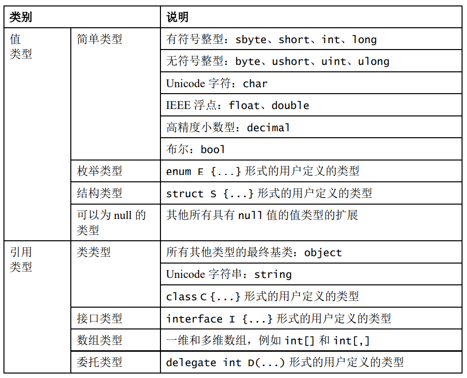
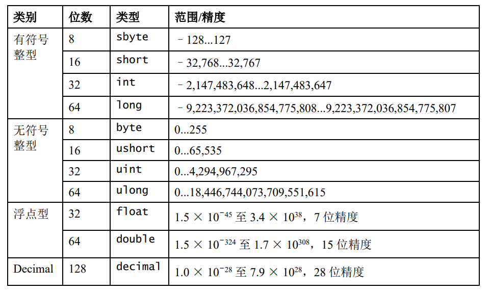
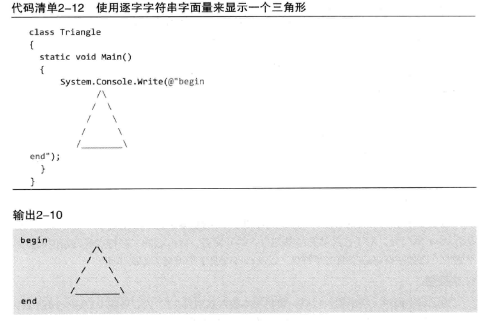

# 1 概述

## 1.1 GC

### 1.1.1 GC是什么？

GC（Garbage Collection，垃圾回收），它的主要职责是分配和释放托管堆（Managed Heap）上的内存。在 C# 中，程序员不需要像 C++ 那样手动调用 `free()` 或 `delete`，GC 会自动识别不再使用的对象并回收其占用的空间。

### 1.1.2 GC的工作流程（标记压缩算法：Mark-Compact）

#### 1 流程

- 暂停所有执行的线程

- 标记阶段
  - GC标记所有堆中的对象为“待清理”
  - GC遍历应用程序所有的根（root），递归地查看它们引用了那些对象（如果根指向对象A，那么把A标记为存活，接着看A引用了谁），最后没有被标记的对象就被判定为垃圾
    - **根（Root）** 是垃圾回收器用来判断对象是否“存活”的**起点**。 在 .NET 的内存管理中，一个对象是否会被回收，取决于它是否“可达”。垃圾回收器从一组“根”开始遍历，凡是能通过这些根直接或间接引用的对象，都被视为正在使用中，不会被回收
    - 根通常是一个引用类型的变量
- 重定位阶段
  - 由于GC会在内存中移动存活的对象以消除内存碎片，对象的地址会发生变化，因此必须更新原本指向旧地址的变量，让它们指向最新的地址
  - 修复的具体步骤
    - 计算新地址
      - 在标记阶段结束之后，GC已经知道内存里面哪些位置是空的，它可以根据一个对象前面一共有多少空闲的内存空间，来计算对象需要移动到的地址
    - 更新引用表
      - GC 会遍历所有的根（Roots）以及所有存活对象内部的字段，更新它们的值，从旧地址改成新地址
- 压缩阶段
  - GC 将所有标记为“存活”的对象向堆的起始端（低地址）移动，使它们从堆的基地址开始连续排列（所以垃圾对象释放是通过覆盖实现的）

#### 2 大对象堆（LOH）不参与压缩，而是采用“扫除”

大对象堆（Large Object Heap）是托管堆的一个特殊区域，专门用来存放体积较大的对象。

**核心特性：不压缩**

这是 LOH 与普通堆最显著的区别，也是书中强调的重点：

- **普通堆**：GC 会移动存活对象以消除碎片（压缩）
- **LOH**：出于性能考虑，GC默认不会压缩大对象堆
  - 原因：移动一个大对象会导致CPU拷贝开销极大，并造成长时间的程序暂停（GC 停顿）
  - 后果：LOH 容易产生内存碎片。如果堆中有大量空洞，即使总空闲内存足够，也可能因为没有连续的大块空间而导致 `OutOfMemoryException`

**释放机制：扫除**

由于 LOH 不执行压缩（移动对象），它的释放过程是：

- **清扫**：将不再被引用的对象空间标记为“空闲”
- **复用**：维护一张**空闲列表（Free List）**。当有新的大对象需要分配时，GC尝试从列表中找一块足够大的连续空间塞进去

### 1.1.3 Generational 分代算法

进行一次完整内存区域的GC（full GC）操作成本很高，因此我们采用分代算法对GC性能进行一定改善。

分代算法的思想：将对象按照生命周期分成新老对象，对新、老区域采用不同的回收策略和算法，加强对新区域的回收处理力度，争取在较短时间间隔、较小的内存区域内，以较低成本将执行路径上大量新近抛弃不再使用的局部对象及时回收掉。

分代算法的假设前提条件：

- 大量新创建的对象生命周期都比较短，而较老的对象生命周期会更长
- 对部分内存进行回收比基于全部内存的回收操作要快
- 新创建的对象之间关联程度通常较强。heap分配的对象是连续的，关联度较强有利于提高CPU cache的命中率

.NET将heap分成3个代龄区域: Gen 0、Gen 1、Gen 2。


如果Gen 0 heap内存达到阀值，则触发0代GC，0代GC后Gen 0中幸存的对象进入Gen1。如果Gen 1的内存达到阀值，则进行1代GC，然后幸存的对象进入Gen2，Gen2达到阈值再进行释放。

Gen 0和Gen 1比较小，这两个代龄加起来总是保持在16M左右；Gen2的大小由应用程序确定，可能达到几G，因此0代和1代GC的成本非常低，2代GC称为fullGC，通常成本很高。

### 1.1.4 GC的触发条件

- 第0代内存达到阈值
- 当操作系统报告低内存时，托管堆会强制触发GC以释放尽可能多的内存，从而将资源还给系统（这种情况下往往会触发Full GC）
- 显式调用`GC.Collect()`
- 补充：当大对象堆（LOH）的空间不足以满足一个大对象的分配请求，也会触发Full GC

### 1.1.5 如何避免GC

- 减少垃圾产生
  - 优先使用值类型
    - C# 7.0 引入的 `(int, int)` 这种元组是值类型（`ValueTuple`），而旧版的 `Tuple<int, int>` 是引用类型。使用新版元组可以减少堆内存分配
    - 当希望在方法内部封装一段逻辑时，相比于匿名委托（Lambda），局部函数在某些情况下可以减少闭包产生的对象分配
  - 避免装箱（避免将值类型包装成引用类型存入堆中）
  - 重复利用对象（对象池模式）
- 控制GC行为

**为什么当我们希望在方法内部去封装一段逻辑时，相比于匿名委托（Lambda），更推荐使用局部函数？**

Lambda表达式的闭包总是产生堆分配，当使用Lambda表达式并捕获外部变量时，编译器会执行以下操作：

- 创建一个私有类
- 实例化对象：在包含该 Lambda 的方法运行时，会在托管堆上 `new` 出这个类的实例
- 变量搬家：被捕获的局部变量会被提升（Promote）到这个堆对象中，作为它的字段

```c#
public void CalculateWithLambda()
{
    double pi = 3.14159;

    // 定义一个 Lambda 表达式并赋值给 Func 委托
    // 注意：这会导致编译器创建一个隐藏的类实例在堆上，以捕获 pi
    Func<double, double> getArea = radius => pi * radius * radius;

    double area = getArea(10);
}
```

局部函数的闭包：优化为栈分配，编译器会优先尝试使用 `struct`（值类型） 来存储捕获的变量：

- 创建私有结构体：编译器生成一个临时的结构体来存放捕获的变量
- 栈上操作：由于结构体是值类型，它直接在栈（Stack）上创建，不涉及堆分配
- 引用传递：局部函数通过 `ref` 传递这个结构体

```c#
public void CalculateWithLocalFunction()
{
    double pi = 3.14159;

    // 定义一个局部函数
    // 优点：编译器会通过结构体在栈上捕获 pi，通常不产生堆分配
    double GetArea(double radius)
    {
        return pi * radius * radius;
    }

    double area = GetArea(10);
}
```

### 1.1.6 GC不能直接处理非托管资源

非托管资源：

- 文件句柄（File Handles）

- 数据库连接（Database Connections）

- 网络套接字（Network Sockets）

- 窗口句柄（GDI/Window Handles）

- 非托管内存：通过 `Marshal.AllocHGlobal` 等直接申请的内存

虽然GC无法直接释放非托管资源，但它提供了两种机制：

- 终结器（Finalizer）：你可以在类中定义 `~ClassName()`。当 GC 准备回收对象内存时，它会发现这个对象有终结器，并将其放入一个特殊的“终结队列”。由一个独立的线程运行这些代码来释放非托管资源

- IDisposable 接口与 `Dispose()` 模式：开发者通过显式调用 `Dispose()` 或使用 `using` 语句，在不需要资源时立即手动释放非托管资源

```c#
class ResourceHolder : IDisposable
{
    // 1. 终结器
    ~ResourceHolder() => Dispose(false);

    // 2. 公有 Dispose
    public void Dispose()
    {
        Dispose(true);
        // 既然手动释放了，就告诉 GC 别再运行终结器（提升性能）
        GC.SuppressFinalize(this);
    }

    // 3. 核心清理逻辑
    protected virtual void Dispose(bool disposing)
    {
        // 释放非托管资源（无论如何都要做）
        CloseHandle(); 

        if (disposing)
        {
            // 只有手动 Dispose 时，才释放托管资源
            // 因为此时可以确定引用的其他托管对象还活着
            otherManagedObject?.Dispose();
        }
    }
}
```

## 1.2 内存分区

### 1.2.1 分区

- **栈**：由编译器自动分配释放 ，存放值类型
- **堆**：用于存放引用类型对象本身。在C#中由.net平台的垃圾回收机制（GC）管理。栈，堆都属于动态存储区，可以实现动态分配
- **静态区及常量区**
  - 如果一个类型是静态值类型或者常量对象，那么存储在静态区/常量区；如果一个类型是静态引用类型，那么引用存储在静态区/常量区，而对象本身存储在堆上。
  - 由于存在栈内的引用地址都在程序运行开始最先入栈，因此静态区和常量区内的对象的生命周期会持续到程序运行结束时，届时静态区内和常量区内对象才会被释放和回收（编译器自动释放）。所以应限制使用静态类，静态成员（静态变量，静态方法），常量，否则程序负荷高
- **代码区**：存放函数体内的二进制代码

### 1.2.2 为什么栈比堆快？

首先，栈是程序运行前就已经分配好的空间，所以运行时分配几乎不需要时间。而堆是运行时动态申请的，分配内存会有耗时。

其次，访问堆需要两次内存访问，第一次取得地址，第二次才是真正得数据，而栈只需访问一次。栈有专门的寄存器，压栈和出栈的指令效率很高。

# 2 类型

## 2.1 值类型&引用类型

C#的类型有两种：值类型(value type)和引用类型(reference type)。值类型的变量存储数据，而引用类型的变量存储对数据的引用（对象）。

### 2.1.1 值类型

值类型直接包含值，换言之，变量引用的位置就是值在内存中实际存储的位置。将第一个变量的值赋给第二个变量，会在新变量的位置创建原始变量的值的一个内存副本。类似的，将值类型的实例传给方法，如`Console.WriteLine()`，也会生成一个内存副本，在方法内部对参数值进行任何修改都不会影响原始值。

对于值类型，每个变量都有它们自己的数据副本（ref和out参数除外）。


### 2.1.2 引用类型

相反，引用类型的变量存储的对象的地址，而不是直接存储数据。因此，为了访问数据，“运行时”要先从变量中读取内存位置，再“跳转”到包含数据的内存位置。


引用类型复制引用而不需要复制所引用的数据，表现为在栈内开辟一块新的空间，存储复制数据在堆中的地址，因此当有一个引用类型变量复制了另一个引用类型变量，该变量的改变也会引起另一个变量的改变。

### 2.1.3 值类型和引用类型的区别

- 值类型数据存储在栈上，而引用类型数据存储在堆上
- 值类型的复制是按值传递的，引用类型的复制是按引用传递的，当我们对复制体进行修改时，值类型的原数据不会受到影响，而引用类型数据会随之改变
- 值类型存取快，引用类型存取慢，因为值类型存储在栈上，栈上的内存是事先分配好的
- 值类型继承自`System.ValueType`，引用类型继承自`System.Object`（但`System.ValueType`也继承于`System.Object`）
- 值类型的内存管理由编译器自动完成，而引用类型的内存管理由垃圾回收器完成
- 值类型的生命周期由程序的作用域控制，而引用类型的生命周期由垃圾回收器控制

### 2.1.4 装箱和拆箱

- 装箱（可以显式也可以隐式转换）
  - 值类型转换为引用类型
  - 从托管堆中为新生成的引用对象分配内存，然后将值类型的数据拷贝到刚分配的内存中，并返回该内存的地址。这个地址存储在栈上作为对象的引用
- 拆箱（只能显式转换）
  - 引用类型转换为值类型
  - 获取托管堆中属于值类型那部分字段的地址，将引用对象中的值拷贝到位于栈上的值类型实例中

装箱会产生较大性能损失（主要是构造新对象）。

```c#
using System;
class Test{
	static void Main(){
		int i = 123;
		object o = i;     //Boxing
		int j = (int)o;   //Unboxing
	}
}
```

## 2.2 类型的进一步划分

而值类型和引用类型可以进一步划分：



八种整数类型分别支持8位、16位、32位和64位整数值的有符号和无符号形式。

两种浮点类型：float和double，分别使用32位单精度和64位双精度的IEEE 754格式表示。

decimal类型是128位的数据类型，适合用于财务计算和货币计算。

char类型表示一个UTF-16编码单元，string类型表示UTF-16编码单元的序列。



## 2.3 基础类型

### 2.3.1 数组

#### 1 一维数组

```c#
int[] array = new int[n];
```

#### 2 二维数组

```c#
int[,] array = new int[n,n];
int len = array.Length;  //len=n*n;
```

#### 3 交错数组

```c#
int[][] array = new int[2][];
for(int i=0;i<array.Length;i++){
	array[i] = new int[2];
}
int len1 = array.Length;
int len2 = array[0].Length;
```

### 2.3.2 string

#### 1 @符号

在C#中，可以在字符串前面使用@符号，指明转义序列不被处理，结果是一个逐字字符串字面量，它会将反斜杠当作普通字符处理，还会逐字解释所有空白字符。

如以下代码中的三角形会在控制台上原样输出：



#### 2 字符串的不可变性

字符串的不可变性指的是指一个 `string` 对象一旦在托管堆上被创建，它的**内容（字符序列）就永远不能被修改**。当你给一个字符串重新赋值，会在堆中重新开辟一块空间存储新值，并将栈内存储的地址修改为新开辟空间的地址，而老的值会继续存在于堆中，等到垃圾回收时再被销毁。

字符串的不可变性是因为字符串底层的数组是由final修饰的。


#### 3 string VS stringBuilder

`string`是不可变的字符串类型，一旦创建，它的值就不能被修改。每次对字符串的修改都会生成一个新的字符串对象，并将原字符串对象标记为垃圾回收。这会造成额外的内存分配和垃圾回收的开销，尤其是当操作的字符串长度很大时，性能会非常低下。

`stringBuilder`类是可变的字符串类型，它可以在原有的字符串上进行添加、删除、替换、连接等操作，而不会创建新的字符串对象。这意味着`stringBuilder`的性能比`string`更高，尤其是在操作大量字符串时。

因此，如果你需要在程序中频繁操作字符串并且要求高性能，建议使用`stringBuilder`类。如果你只需要对字符串进行简单的操作并且不关心性能，可以使用`string类。另外，string`类还具有很多方便的方法，比如`Split`、`Join`、`Contains`等，可以方便地操作字符串，因此在某些场景下也是很有用的。

不过现在已经把`string`的+操作优化成`stringBuilder`的了，所以一般用string就可以了。

另外，由于`string`的不可变性，天然线程同步，而`stringBuilder`可变，非线程同步。

### 2.3.3 null&void&可空修饰符？

null值表示变量不引用任何有效的对象，void表示没有类型，或者没有任何值。

而对于每个不可以为null的值类型T，都有一个相应的可以为null的类型T?。该类型可以容纳附加值null。

## 2.4 用户可定义类型

### 2.4.1 分类

C#程序使用类型声明创建新类型，类型声明指定新类型的名称和成员。在C#类型分类中，有五类是用户可定义的：

- 类类型(class type)【支持泛型】
  - 定义了一个包含数据成员（字段）和函数成员（方法、属性等）的数据结构
- 结构类型(struct type)【支持泛型】
  - 定义了一个包含数据成员和函数成员的数据结构。但与类不同，结构是一种值类型，不需要堆分配。它不支持用户指定的继承，所有结构类型都隐式地从object继承
- 接口类型(interface type)【支持泛型】
  - 接口类型定义了一个协定，作为一个公共函数成员的命名集。实现某个接口的类或结构必须提供该接口的函数成员的实现。一个接口可以从多个接口继承，而一个类或结构可以实现多个接口
- 枚举类型(enum type)
  - 枚举类型是具有命名常量的特殊类型。每种枚举类型都有一个基础类型（八种整型之一）
- 委托类型(delegate type)【支持泛型】
  - 委托类型表示对具有特定参数列表和返回类型的方法的引用。通过委托，我们能够将方法作为实体赋值给变量和作为参数传递。委托类似于其他语言中函数指针的概念，但与函数指针不同，委托是面向对象的，并且是类型安全的

### 2.4.2 结构体(struct)

#### 1 定义

定义了一个包含数据成员和函数成员的数据结构。但与类不同，结构是一种值类型，不需要堆分配。它不支持用户指定的继承，所有结构类型都隐式地从object继承。

结构可以简单地视为值类型的类。

```c#
struct Point{
	public int x,y;
	public Point(int x,int y){
		this.x = x;
		this.y = y;
	}
}
class Test{
	static void Main(){
		Point a = new Point(10,10);
		Point b = a;
		a.x = 20;
		Console.WriteLine(b.x);  //output: 10
	}
}
```

以上示例中，用a给b赋值实际上是创建了一个a的副本，因此对a.x的修改不会影响b.x。

可见结构相对于类的劣势是，复制整个结构通常不如复制对象引用的效率高。

#### 2 结构体和类的区别

- 结构体中声明的字段无法赋予初值，类可以。
- 结构体的构造函数中，必须为结构体所有字段赋值，类的构造函数则没有这个限制。
- 类为引用类型，可继承；结构体为值类型，不可继承（只能继承接口）。

#### 3 结构体和类的选择

类是引用类型，因此类的对象存储在堆中。而结构体是值类型，结构体的对象存储在栈中。堆空间大，但访问速度慢。栈空间小，但访问速度快。因此，当我们描述的对象是一个轻量级对象时，选用结构体可提高效率。但如果我们希望传值的时候传递的是对象的引用而非对象的拷贝，那么我们可以选用类。

### 2.4.3 接口(interface)

接口定义了一个可由类和结构实现的协定。接口可以包含方法、属性、事件和索引器。接口不提供它所定义的成员的实现，仅指定实现该接口的类或结构必须提供的成员。

接口支持多继承。

```c#
interface IControl{
	void Paint();
}
interface ITextBox : IControl{
	void SetText(string text);
}
public class EditBox : IControl{
    public void Paint(){...}
}
```

### 2.4.4 枚举类型(enum)

枚举类型是具有一组命名常量的独特的值类型。

```c#
using System;
enum Color{
	Red,
	Green,
	Blue
}
class Test{
    static void Main(){
        Color c = Color.Red;
        PrintColor(c);
    }
	static void PrintColor(Color color){
		switch(color){
			case Color.Red:
				Console.WriteLine("Red");
				break;
			case Color.Green:
				Console.WriteLine("Green");
				break;
			case Color.Blue:
				Console.WriteLine("Blue");
				break;
			default:
				Console.WriteLine("Unknown color");
				break;
		}
	}
}
```

### 2.4.5 委托类型(delegate)

#### 1 委托是什么

委托类似于C++中的函数指针，但相对于函数指针，它面向对象，并且类型安全。委托是一种类，可以将它相当于对一组方法的引用。

#### 2 委托和事件

事件（Event）是对委托的“封装”或“保护”，从设计角度上看，它们的关系有点像属性和字段之间的关系。

| **特性**     | **委托 (Delegate)**                   | **事件 (Event)**                            |
| ------------ | ------------------------------------- | ------------------------------------------- |
| **定义方式** | 一个普通的变量或字段                  | 使用 `event` 关键字修饰的委托实例           |
| **外部调用** | 类外部可以**直接触发**（Invoke）      | 类外部**禁止触发**，只能由内部类逻辑触发    |
| **赋值操作** | 外部可以使用 `=` 覆盖所有已绑定的方法 | 外部**禁止使用 `=`**，只能使用 `+=` 或 `-=` |

**为什么要发明“事件”？**

如果只用委托，会存在两个致命的安全隐患：

- **恶意清空**：假设你写了一个 `public Action OnDataReceived;`。类外面的某个程序员不小心写了 `obj.OnDataReceived = null;`，那么之前所有订阅了该通知的方法都会被无意中抹除
- **越权触发**：委托就像一个公有的按钮。如果你把委托暴露出去，任何人都能在类外面调用 `obj.OnDataReceived()`，这破坏了封装性，事件保证了只有发布者能触发通知，而订阅者只能等待

**事件解决了这两个问题**：它在编译器层面限制了外部只能通过 `+=` 注册、`-=` 注销，而**只有类内部**才能看到那个真正的委托并执行它。

**事件的底层实现：**

当你写 `public event Action OnClick;` 时，编译器实际上为你生成了三个东西：

- 一个**私有的**委托字段（实际存储方法地址）
- 一个公有的 `add_OnClick` 方法（对应 `+=`）
- 一个公有的 `remove_OnClick` 方法（对应 `-=`）

```c#
using System;

// 1. 定义一个委托类型（约定长相）
public delegate void TemperatureHandler(double temp);

public class Thermostat
{
    // 2. 纯委托字段（不安全：外部可以随意覆盖或触发）
    public TemperatureHandler OnTempChangedDelegate;

    // 3. 事件定义（安全：封装了委托）
    public event TemperatureHandler OnTempChangedEvent;

    public void Measure(double currentTemp)
    {
        // 逻辑判断：当温度超过 30 度时触发通知
        if (currentTemp > 30)
        {
            // 触发委托
            OnTempChangedDelegate?.Invoke(currentTemp);

            // 触发事件（只能在类内部触发）
            OnTempChangedEvent?.Invoke(currentTemp);
        }
    }
}

public class Program
{
    public static void Main()
    {
        Thermostat thermostat = new Thermostat();

        // 订阅者 1
        thermostat.OnTempChangedDelegate += t => Console.WriteLine($"委托收到：{t}度");
        thermostat.OnTempChangedEvent += t => Console.WriteLine($"事件收到：{t}度");

        // --- 核心区别展示 ---

        // 情况 A：委托是危险的
        // 外部可以直接清空（使用 = 而不是 +=）
        thermostat.OnTempChangedDelegate = null; 
        // 外部可以直接触发（明明温度没到，却可以伪造通知）
        thermostat.OnTempChangedDelegate?.Invoke(999);

        // 情况 B：事件是安全的
        // thermostat.OnTempChangedEvent = null; // 编译错误！不能使用 =
        // thermostat.OnTempChangedEvent.Invoke(999); // 编译错误！外部禁止触发

        // 正常工作
        thermostat.Measure(35);
    }
}
```

#### 3 委托和Lambda

委托（Delegate） 和 Lambda 表达式 的关系被描述为“容器”与“内容”的关系。简单来说：委托是定义好的逻辑槽位（类型），而 Lambda 表达式是填入其中的具体逻辑代码（实现）。

```c#
public void RunWithLambda()
{
    // Lambda 表达式：x => x % 2 == 0
    // 赋值给内置委托 Func<int, bool>
    Func<int, bool> isEven = x => x % 2 == 0;

    bool result = isEven(4); // true
}
```

另外，我们不能写`var myLambda = x => x * x;`，因为编译器并不知道x是什么，必须显式地告诉它委托类型：`Func<int, int> myLambda = x => x * x;`，编译器才能根据`Func`的签名推导出`x`是`int`。

# 3 基础

## 3.1 ref和out

ref和out可以将值类型以引用的方式进行传递，从而改变原来变量中的值。

它们俩的区别在于：通过ref传入的参数必须在传入方法前对其进行初始化操作，而通过out传入的参数不需要在传入方法前对其初始化，即便初始化了，也会在传入方法时清空，然后再在方法内赋初值。

out的错误使用：

```c#
class Program{
	static void Main(string[] args){
		Program pg = new Program();
		int x = 10;
		int y = 233;
		pg.Swap(out x,out y);
        Console.WriteLine(x+" "+y);
	}
	static void Swap(out int x,out int y){
		int temp = x;   //error:x在函数内部没有赋初值，报错。
		x = y;
		y = temp;
	}
}
```

要实现Swap应该用ref：

```c#
class Program{
	static void Main(string[] args){
		Program pg = new Program();
		int x = 10;
		int y = 233;
		pg.Swap(ref x,ref y);
		Console.WriteLine(x+" "+y);
	}
	static void Swap(ref int x,ref int y){
		int temp = x;
		x = y;
		y = x;
	}
}
```

```
//输出：
233 10
```

## 3.2 字段&属性

### 3.2.1 示例代码

```c#
public class Person{
	private string name;
	public string Name{
		get{return name;}
		set{name = value;}
	}
}
public class Program{
	Person preson = new Person();
	person.Name = "manqi";
	Console.WriteLine(person.Name);
}
```

### 3.2.2 联系

属性是一种特殊的方法，用于控制对成员变量的访问和赋值。通过使用属性，可以对成员变量进行保护，使得外部代码无法对其直接访问和修改。

### 3.2.3 属性的优点

- 安全性：将读、写权限分开：get和set是分开实现的，保证了数据安全。
- 灵活性：给属性赋值或取值时，可以根据自己的需求实现各种不同的赋值或取值逻辑。

## 3.3 Sealed关键字

类声明时可以防止其他类继承此类，方法声明时可以防止派生类重写此方法。

# 4 特性

## 4.1 面向对象的三大特征

### 4.1.1 封装

封装指的是隐藏类的实现细节，对外只暴露必要的接口和方法。它将数据和操作封装在一个类中，控制数据的访问权限。

在C#中，封装可以通过两种方式实现。

##### 1 访问修饰符

- public：对任何类和成员都公开，无访问限制。
- internal：只能在包含该类的程序集中访问该类。
- protected：对该类和该类的派生类公开。
- protected internal：protected+internal。
- private：仅对该类公开。

##### 2 属性

属性是一种特殊的方法，用于控制对成员变量的访问和赋值。通过使用属性，可以对成员变量进行保护，使得外部代码无法对其直接访问和修改。

```c#
private int age;
public int Age{
    get{return age;}
    set{age = value;}
}
```

### 4.1.2 继承

继承允许我们创建一个新的类，去继承已有的类的属性和方法，并添加或修改自己的属性和方法。通过继承，可以实现代码的复用，提高程序的可维护性和可扩展性。

### 4.1.3 多态

多态允许我们使用不同的方式来处理同一种类型或对象。

在C#中，多态可以通过两种方式实现。

#### 1 重载（overload

重载是编译时多态，指的是在同一个类中定义多个同名的方法，但参数列表不同，这样可以根据不同的参数列表调用不同的方法。

#### 2 重写（override

重写是运行时多态，指的是在继承关系中，子类可以重写基类中的虚方法和抽象方法。

## 4.2 抽象

### 4.2.1 虚函数 VS 抽象函数

- 虚函数用virtual修饰，在基类中定义；抽象函数用abstract修饰，在抽象类中定义。
- 虚函数有实现体，抽象函数没有实现体。
- 虚函数子类可以选择性重写，而子类必须实现抽象方法，否则子类也必须声明为抽象类。
- 虚函数可以通过基类对象的引用或子类对象的引用调用，而抽象函数只能通过子类对象的引用调用。

```c#
public abstract class Animal{
    public abstract void Eat();
    public virtual void Run(){
        Console.WriteLine("Animal is running.");
    }
}

public class Dog : Animal{
    public override void Eat(){
        Console.WriteLine("Dog is eating.");
    }
    public override void Run(){
        Console.WriteLine("Dog is running.");
    }
}

public static void Main(string[] args){
    Animal animal1 = new Dog(); // 通过基类对象的引用调用虚方法
    animal1.Run(); // 输出：Dog is running.

    Dog dog1 = new Dog(); // 通过子类对象的引用调用虚方法和抽象方法
    dog1.Run(); // 输出：Dog is running.
    dog1.Eat(); // 输出：Dog is eating.
}
```

### 4.2.2 抽象类 VS 接口

- 抽象类不能被实例化，而接口也不能被实例化，只有具体类才能被实例化。
- 抽象类可以包含抽象方法和具体方法，也就是说抽象类中可以有部分已经实现的方法，但接口不行，接口只能包含抽象方法，没有具体的实现。
- 抽象类可以被具体类继承，并且可以作为父类来提供一些通用的行为和属性，而接口可以被具体类实现，一个类可以实现多个接口，从而实现多重继承。
- 抽象类通常用于定义类的层次结构，并提供一些通用的方法和属性，而接口则通常用于定义一些规范或者协议，来保证实现该接口的类拥有一定的行为和属性。

## 4.3 反射

反射是指在运行时动态获取类型信息以及访问和操作这些类型的成员。反射机制使得我们可以在运行时动态地加载、创建、使用和销毁对象，而不需要在编译时就确定所有类型信息。

Unity的脚本就是通过反射机制去实现的。

在C#中，反射机制主要由以下两个核心类来支持：

- System.Reflection.Assembly：表示程序集，可以用来加载、检查和执行程序集中的类型。
- System.Type：表示类型，可以用来获取类型的信息、成员和方法等。

通过反射机制，我们可以在运行时动态地获取类型信息，比如获取类型的名称、基类、实现的接口、成员变量、属性、方法和事件等。我们还可以使用反射机制创建类型的实例、调用类型的方法和属性等。

反射机制虽然非常强大，但是也需要注意一些性能上的问题。使用反射机制可能会导致性能下降，因为在运行时需要进行许多额外的操作。此外，反射机制也不太安全，因为可以访问私有成员和方法。因此，在使用反射机制时应该注意安全性和性能。

## 4.4 泛型

泛型指的是多个类型共享一组代码的情况，一般使用占位符T来表示泛型。

