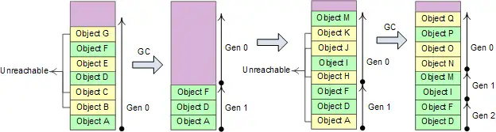
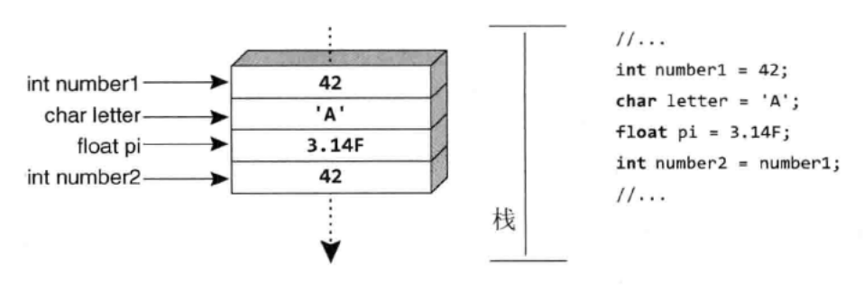
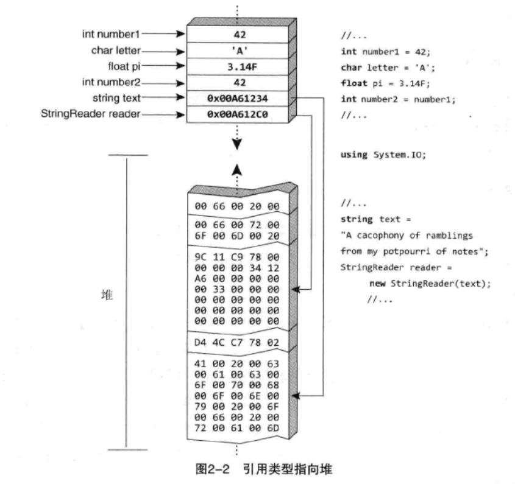
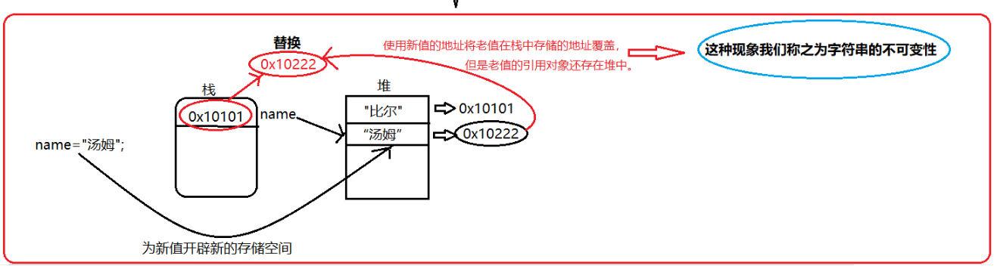

# 1 GC和内存分区

## 1.1 GC

### 1.1.1 GC是什么？

GC（Garbage Collection，垃圾回收），它的主要职责是分配和释放托管堆（Managed Heap）上的内存。在 C# 中，程序员不需要像 C++ 那样手动调用 `free()` 或 `delete`，GC 会自动识别不再使用的对象并回收其占用的空间。

### 1.1.2 GC的工作流程（标记压缩算法：Mark-Compact）

#### 1 流程

- 暂停所有执行的线程

- 标记阶段
  - GC标记所有堆中的对象为“待清理”
  - GC遍历应用程序所有的根（root），递归地查看它们引用了那些对象（如果根指向对象A，那么把A标记为存活，接着看A引用了谁），最后没有被标记的对象就被判定为垃圾
    - **根（Root）** 是垃圾回收器用来判断对象是否“存活”的**起点**。 在 .NET 的内存管理中，一个对象是否会被回收，取决于它是否“可达”。垃圾回收器从一组“根”开始遍历，凡是能通过这些根直接或间接引用的对象，都被视为正在使用中，不会被回收
    - 根通常是一个引用类型的变量
- 重定位阶段
  - 由于GC会在内存中移动存活的对象以消除内存碎片，对象的地址会发生变化，因此必须更新原本指向旧地址的变量，让它们指向最新的地址
  - 修复的具体步骤
    - 计算新地址
      - 在标记阶段结束之后，GC已经知道内存里面哪些位置是空的，它可以根据一个对象前面一共有多少空闲的内存空间，来计算对象需要移动到的地址
    - 更新引用表
      - GC 会遍历所有的根（Roots）以及所有存活对象内部的字段，更新它们的值，从旧地址改成新地址
- 压缩阶段
  - GC 将所有标记为“存活”的对象向堆的起始端（低地址）移动，使它们从堆的基地址开始连续排列（所以垃圾对象释放是通过覆盖实现的）

#### 2 大对象堆（LOH）不参与压缩，而是采用“扫除”

大对象堆（Large Object Heap）是托管堆的一个特殊区域，专门用来存放体积较大的对象。

**核心特性：不压缩**

这是 LOH 与普通堆最显著的区别，也是书中强调的重点：

- **普通堆**：GC 会移动存活对象以消除碎片（压缩）
- **LOH**：出于性能考虑，GC默认不会压缩大对象堆
  - 原因：移动一个大对象会导致CPU拷贝开销极大，并造成长时间的程序暂停（GC 停顿）
  - 后果：LOH 容易产生内存碎片。如果堆中有大量空洞，即使总空闲内存足够，也可能因为没有连续的大块空间而导致 `OutOfMemoryException`

**释放机制：扫除**

由于 LOH 不执行压缩（移动对象），它的释放过程是：

- **清扫**：将不再被引用的对象空间标记为“空闲”
- **复用**：维护一张**空闲列表（Free List）**。当有新的大对象需要分配时，GC尝试从列表中找一块足够大的连续空间塞进去

### 1.1.3 Generational 分代算法

进行一次完整内存区域的GC（full GC）操作成本很高，因此我们采用分代算法对GC性能进行一定改善。

分代算法的思想：将对象按照生命周期分成新老对象，对新、老区域采用不同的回收策略和算法，加强对新区域的回收处理力度，争取在较短时间间隔、较小的内存区域内，以较低成本将执行路径上大量新近抛弃不再使用的局部对象及时回收掉。

分代算法的假设前提条件：

- 大量新创建的对象生命周期都比较短，而较老的对象生命周期会更长
- 对部分内存进行回收比基于全部内存的回收操作要快
- 新创建的对象之间关联程度通常较强。heap分配的对象是连续的，关联度较强有利于提高CPU cache的命中率

.NET将heap分成3个代龄区域: Gen 0、Gen 1、Gen 2。



如果Gen 0 heap内存达到阀值，则触发0代GC，0代GC后Gen 0中幸存的对象进入Gen1。如果Gen 1的内存达到阀值，则进行1代GC，然后幸存的对象进入Gen2，Gen2达到阈值再进行释放。

Gen 0和Gen 1比较小，这两个代龄加起来总是保持在16M左右；Gen2的大小由应用程序确定，可能达到几G，因此0代和1代GC的成本非常低，2代GC称为fullGC，通常成本很高。

### 1.1.4 GC的触发条件

- 第0代内存达到阈值
- 当操作系统报告低内存时，托管堆会强制触发GC以释放尽可能多的内存，从而将资源还给系统（这种情况下往往会触发Full GC）
- 显式调用`GC.Collect()`
- 补充：当大对象堆（LOH）的空间不足以满足一个大对象的分配请求，也会触发Full GC

### 1.1.5 如何避免GC

- 减少垃圾产生
  - 优先使用值类型
    - C# 7.0 引入的 `(int, int)` 这种元组是值类型（`ValueTuple`），而旧版的 `Tuple<int, int>` 是引用类型。使用新版元组可以减少堆内存分配
    - 当希望在方法内部封装一段逻辑时，相比于匿名委托（Lambda），局部函数在某些情况下可以减少闭包产生的对象分配
  - 避免装箱（避免将值类型包装成引用类型存入堆中）
  - 重复利用对象（对象池模式）
- 控制GC行为

**为什么当我们希望在方法内部去封装一段逻辑时，相比于匿名委托（Lambda），更推荐使用局部函数？**

Lambda表达式的闭包总是产生堆分配，当使用Lambda表达式并捕获外部变量时，编译器会执行以下操作：

- 创建一个私有类
- 实例化对象：在包含该 Lambda 的方法运行时，会在托管堆上 `new` 出这个类的实例
- 变量搬家：被捕获的局部变量会被提升（Promote）到这个堆对象中，作为它的字段

```c#
public void CalculateWithLambda()
{
    double pi = 3.14159;

    // 定义一个 Lambda 表达式并赋值给 Func 委托
    // 注意：这会导致编译器创建一个隐藏的类实例在堆上，以捕获 pi
    Func<double, double> getArea = radius => pi * radius * radius;

    double area = getArea(10);
}
```

局部函数的闭包：优化为栈分配，编译器会优先尝试使用 `struct`（值类型） 来存储捕获的变量：

- 创建私有结构体：编译器生成一个临时的结构体来存放捕获的变量
- 栈上操作：由于结构体是值类型，它直接在栈（Stack）上创建，不涉及堆分配
- 引用传递：局部函数通过 `ref` 传递这个结构体

```c#
public void CalculateWithLocalFunction()
{
    double pi = 3.14159;

    // 定义一个局部函数
    // 优点：编译器会通过结构体在栈上捕获 pi，通常不产生堆分配
    double GetArea(double radius)
    {
        return pi * radius * radius;
    }

    double area = GetArea(10);
}
```

### 1.1.6 GC不能直接处理非托管资源

非托管资源：

- 文件句柄（File Handles）

- 数据库连接（Database Connections）

- 网络套接字（Network Sockets）

- 窗口句柄（GDI/Window Handles）

- 非托管内存：通过 `Marshal.AllocHGlobal` 等直接申请的内存

虽然GC无法直接释放非托管资源，但它提供了两种机制：

- 终结器（Finalizer）：你可以在类中定义 `~ClassName()`。当 GC 准备回收对象内存时，它会发现这个对象有终结器，并将其放入一个特殊的“终结队列”。由一个独立的线程运行这些代码来释放非托管资源

- IDisposable 接口与 `Dispose()` 模式：开发者通过显式调用 `Dispose()` 或使用 `using` 语句，在不需要资源时立即手动释放非托管资源

```c#
class ResourceHolder : IDisposable
{
    // 1. 终结器
    ~ResourceHolder() => Dispose(false);

    // 2. 公有 Dispose
    public void Dispose()
    {
        Dispose(true);
        // 既然手动释放了，就告诉 GC 别再运行终结器（提升性能）
        GC.SuppressFinalize(this);
    }

    // 3. 核心清理逻辑
    protected virtual void Dispose(bool disposing)
    {
        // 释放非托管资源（无论如何都要做）
        CloseHandle(); 

        if (disposing)
        {
            // 只有手动 Dispose 时，才释放托管资源
            // 因为此时可以确定引用的其他托管对象还活着
            otherManagedObject?.Dispose();
        }
    }
}
```

## 1.2 内存分区

### 1.2.1 分区

- **栈**：由编译器自动分配释放 ，存放值类型
- **堆**：用于存放引用类型对象本身。在C#中由.net平台的垃圾回收机制（GC）管理。栈，堆都属于动态存储区，可以实现动态分配
- **静态区及常量区**
  - 如果一个类型是静态值类型或者常量对象，那么存储在静态区/常量区；如果一个类型是静态引用类型，那么引用存储在静态区/常量区，而对象本身存储在堆上。
  - 由于存在栈内的引用地址都在程序运行开始最先入栈，因此静态区和常量区内的对象的生命周期会持续到程序运行结束时，届时静态区内和常量区内对象才会被释放和回收（编译器自动释放）。所以应限制使用静态类，静态成员（静态变量，静态方法），常量，否则程序负荷高
- **代码区**：存放函数体内的二进制代码

### 1.2.2 为什么栈比堆快？

首先，栈是程序运行前就已经分配好的空间，所以运行时分配几乎不需要时间。而堆是运行时动态申请的，分配内存会有耗时。

其次，访问堆需要两次内存访问，第一次取得地址，第二次才是真正得数据，而栈只需访问一次。栈有专门的寄存器，压栈和出栈的指令效率很高。

# 2 基础

## 2.1 ref和out

ref和out可以将值类型以引用的方式进行传递，从而改变原来变量中的值。

它们俩的区别在于：通过ref传入的参数必须在传入方法前对其进行初始化操作，而通过out传入的参数不需要在传入方法前对其初始化，即便初始化了，也会在传入方法时清空，然后再在方法内赋初值。

out的错误使用：

```c#
class Program{
	static void Main(string[] args){
		Program pg = new Program();
		int x = 10;
		int y = 233;
		pg.Swap(out x,out y);
        Console.WriteLine(x+" "+y);
	}
	static void Swap(out int x,out int y){
		int temp = x;   //error:x在函数内部没有赋初值，报错。
		x = y;
		y = temp;
	}
}
```

要实现Swap应该用ref：

```c#
class Program{
	static void Main(string[] args){
		Program pg = new Program();
		int x = 10;
		int y = 233;
		pg.Swap(ref x,ref y);
		Console.WriteLine(x+" "+y);
	}
	static void Swap(ref int x,ref int y){
		int temp = x;
		x = y;
		y = x;
	}
}
```

```
//输出：
233 10
```

## 2.2 字段&属性

### 2.2.1 示例代码

```c#
public class Person{
	private string name;
	public string Name{
		get{return name;}
		set{name = value;}
	}
}
public class Program{
	Person preson = new Person();
	person.Name = "manqi";
	Console.WriteLine(person.Name);
}
```

### 2.2.2 联系

属性是一种特殊的方法，用于控制对成员变量的访问和赋值。通过使用属性，可以对成员变量进行保护，使得外部代码无法对其直接访问和修改。

### 2.2.3 属性的优点

- 安全性：将读、写权限分开：get和set是分开实现的，保证了数据安全。
- 灵活性：给属性赋值或取值时，可以根据自己的需求实现各种不同的赋值或取值逻辑。

## 2.3 Sealed关键字

类声明时可以防止其他类继承此类，方法声明时可以防止派生类重写此方法。

# 3 类型

## 3.1 值类型&引用类型

C#的类型有两种：值类型(value type)和引用类型(reference type)。值类型的变量存储数据，而引用类型的变量存储对数据的引用（对象）。

### 3.1.1 值类型

值类型直接包含值，换言之，变量引用的位置就是值在内存中实际存储的位置。将第一个变量的值赋给第二个变量，会在新变量的位置创建原始变量的值的一个内存副本。类似的，将值类型的实例传给方法，如`Console.WriteLine()`，也会生成一个内存副本，在方法内部对参数值进行任何修改都不会影响原始值。

对于值类型，每个变量都有它们自己的数据副本（ref和out参数除外）。



### 3.1.2 引用类型

相反，引用类型的变量存储的对象的地址，而不是直接存储数据。因此，为了访问数据，“运行时”要先从变量中读取内存位置，再“跳转”到包含数据的内存位置。



引用类型复制引用而不需要复制所引用的数据，表现为在栈内开辟一块新的空间，存储复制数据在堆中的地址，因此当有一个引用类型变量复制了另一个引用类型变量，该变量的改变也会引起另一个变量的改变。

### 3.1.3 值类型和引用类型的区别

- 值类型数据存储在栈上，而引用类型数据存储在堆上
- 值类型的复制是按值传递的，引用类型的复制是按引用传递的，当我们对复制体进行修改时，值类型的原数据不会受到影响，而引用类型数据会随之改变
- 值类型存取快，引用类型存取慢，因为值类型存储在栈上，栈上的内存是事先分配好的
- 值类型继承自`System.ValueType`，引用类型继承自`System.Object`（但`System.ValueType`也继承于`System.Object`）
- 值类型的内存管理由编译器自动完成，而引用类型的内存管理由垃圾回收器完成
- 值类型的生命周期由程序的作用域控制，而引用类型的生命周期由垃圾回收器控制

### 3.1.4 装箱和拆箱

- 装箱（可以显式也可以隐式转换）
  - 值类型转换为引用类型
  - 从托管堆中为新生成的引用对象分配内存，然后将值类型的数据拷贝到刚分配的内存中，并返回该内存的地址。这个地址存储在栈上作为对象的引用
- 拆箱（只能显式转换）
  - 引用类型转换为值类型
  - 获取托管堆中属于值类型那部分字段的地址，将引用对象中的值拷贝到位于栈上的值类型实例中

装箱会产生较大性能损失（主要是构造新对象）。

```c#
using System;
class Test{
	static void Main(){
		int i = 123;
		object o = i;     //Boxing
		int j = (int)o;   //Unboxing
	}
}
```

## 3.2 string

### 3.2.1 字符串的不可变性

字符串的不可变性指的是指一个 `string` 对象一旦在托管堆上被创建，它的**内容（字符序列）就永远不能被修改**。当你给一个字符串重新赋值，会在堆中重新开辟一块空间存储新值，并将栈内存储的地址修改为新开辟空间的地址，而老的值会继续存在于堆中，等到垃圾回收时再被销毁。

字符串的不可变性是因为字符串底层的数组是由final修饰的。



### 3.2.3 string VS stringBuilder

`string`是不可变的字符串类型，一旦创建，它的值就不能被修改。每次对字符串的修改都会生成一个新的字符串对象，并将原字符串对象标记为垃圾回收。这会造成额外的内存分配和垃圾回收的开销，尤其是当操作的字符串长度很大时，性能会非常低下。

`stringBuilder`类是可变的字符串类型，它可以在原有的字符串上进行添加、删除、替换、连接等操作，而不会创建新的字符串对象。这意味着`stringBuilder`的性能比`string`更高，尤其是在操作大量字符串时。

因此，如果你需要在程序中频繁操作字符串并且要求高性能，建议使用`stringBuilder`类。如果你只需要对字符串进行简单的操作并且不关心性能，可以使用`string`类。另外，`string`类还具有很多方便的方法，比如`Split`、`Join`、`Contains`等，可以方便地操作字符串，因此在某些场景下也是很有用的。

另外，由于`string`的不可变性，天然线程同步，而`stringBuilder`可变，非线程同步。

## 3.3 委托/事件/Lambda

### 3.3.1 委托（delegate）

#### 1 委托是什么

委托类似于C++中的函数指针，可以指向方法。但与函数指针不同的是，函数指针本质上是一个内存地址，而委托本质上是一个特殊的类（它的实例支持绑定多个方法——多播委托）。

#### 2 委托的写法

**定义**

```c#
// 定义一个名为 MyHandler 的委托，要求方法必须接收一个 string 并返回 int
public delegate int MyHandler(string message);
```

**实例化**

委托可以指向实例方法，也可以指向静态方法。

```c#
public class Processor {
    public int Print(string s) { Console.WriteLine(s); return s.Length; }
}

// 1. 指向实例方法
Processor p = new Processor();
MyHandler handler1 = new MyHandler(p.Print);

// 2. 简写形式（语法糖）
MyHandler handler2 = p.Print;

// 3. 匿名函数/Lambda
MyHandler handler3 = (msg) => msg.Length;
```

**调用**

```c#
int result = handler1("Hello"); 
// 或者显式调用
int result2 = handler1.Invoke("Hello");
```

#### 3 委托的现代写法（泛型委托-Action/Func/Predicate）

| **委托类型**           | **特点**                             | **例子**                       |
| ---------------------- | ------------------------------------ | ------------------------------ |
| **`Action<T>`**        | 无返回值 (void)                      | `Action<int, string> log;`     |
| **`Func<T, TResult>`** | 有返回值，最后一个泛型参数是返回类型 | `Func<double, double> square;` |
| **`Predicate<T>`**     | 返回 `bool`，常用于过滤条件          | `Predicate<int> isEven;`       |

#### 4 委托的底层实现

当你写下 `delegate void Test();` 时，编译器会将其转换为一个类。以下是关键的底层细节：

**内存结构**

委托对象在堆上占用空间，包含三个关键字段：

- `_target`：如果绑定的是实例方法，存储该对象的引用；如果是静态方法，则为`null`
- `_methodPtr`：存储方法的内存地址（IntPtr）
- `_invocationList`：存储多播委托实例的数组

**多播委托**

当你使用`+=`是，底层执行的是`Delegate.Combine`。

- 不可变性：委托对象是不可变的。每次执行 `+=` 都会创建一个全新的委托实例，并将旧的数据拷贝过去
- 返回值问题：多播委托执行时会依次调用所有方法，但只会返回最后一个方法的运行结果

当委托只有一个方法时，`_methodPtr`直接指向该方法的代码地址。但当你使用`+=`注册了多个方法后：

- `_methodPtr` 的值： 它不再指向你定义的任何一个具体业务方法，而是指向 `MulticastDelegate` 内部的一个特殊的桩函数（Stub），通常被称为 `MulticastInvoke`
- `_target` 的值： 此时 `_target` 不再指向某个业务对象，而是指向委托对象自身

注册前（单播）：

- `_target`: 业务对象 A
- `_methodPtr`: 业务方法 `Method1` 的地址
- `_invocationList`: `null`

注册后（多播 `del += Method2`）：

- 产生新对象： 产生一个新的委托实例（因为委托是不可变的）
- 填充列表： `_invocationList` 变成一个数组，里面按顺序装载了指向 `Method1` 和 `Method2` 的独立委托对象
- 重定向： * `_target` 指向这个新的委托实例本身

- `_methodPtr` 指向 CLR 内部的 `MulticastInvoke` 桩代码

当你调用 `del()` 时，CPU 实际上跳转到了 `MulticastInvoke`。这个桩函数的工作逻辑非常简单客观：

- 它从 `_target`（即委托对象自己）中取出 `_invocationList` 数组
- 开启一个循环，按顺序取出数组里的每一个委托实例
- 依次调用这些实例的 `Invoke` 方法
- 如果是带返回值的委托，循环会不断覆盖结果，最终只返回最后一个方法的返回值

### 3.3.2 事件（event）

#### 1 事件是什么

事件是对委托的封装，本质上是一个限制了访问权限的委托访问器。从设计角度上看，它们的关系有点像属性和字段之间的关系。

事件隐藏了`Invoke`和`=`赋值权限，确保了只有委托对象自己能触发通知，外部只能订阅通知的逻辑。

#### 2 事件的底层实现

当你声明一个“事件”时：

```c#
public event MyDelegate MyEvent;
```

译器实际上会为你生成三样东西（这与 C# 属性 `Property` 的实现逻辑如出一辙）：

- **一个私有的委托字段**：`private MyDelegate _MyEvent;`
- **一个 `add` 方法**：对应 `+=` 操作，内部调用 `Delegate.Combine`
- **一个 `remove` 方法**：对应 `-=` 操作，内部调用 `Delegate.Remove`

#### 3 为什么需要事件

假设你正在写一个“银行账户”类，有一个“余额变动”的通知。

- **如果用委托：** 任何外部代码都可以写 `account.BalanceChanged = null;`。这会导致所有其他订阅者（比如短信通知、日志系统）瞬间被踢出，且只有这一个外部代码能收到通知。甚至外部代码可以伪造通知调用 `account.BalanceChanged.Invoke(...)`
- **如果用事件：** 外部代码**只能**通过 `+=` 注册自己，或者 `-=` 注销自己。它无法清空别人的订阅，也无法代表“银行账户”去发布余额变动通知

## 3.4 Lambda

Lambda是匿名函数。

### 3.4.1 Lambda的底层实现

根据 Lambda 是否捕获外部变量（即是否形成闭包），编译器的处理路径会发生分叉。

**第一阶段：语法解析**

当你写下 `(x) => x + 1` 时，编译器首先会进行**类型推导**。Lambda 本身没有“独立类型”，它必须被分配给一个特定的委托类型（如 `Func<int, int>`）或表达式树。

**第二阶段：编译器转换**

**路径A：静态Lambda（无闭包）**

如果 Lambda 只是纯粹的逻辑计算，不引用外部局部变量：

- 动作：编译器在当前类中生成一个 静态私有方法，名字通常像 `<Main>b__0`
- 优化：为了性能，编译器通常会生成一个静态字段来缓存这个委托实例，避免重复创建委托对象

**路径B：实例Lambda（有闭包）**

如果 Lambda 引用了外部局部变量：

- 构造容器：编译器创建一个隐藏的类（DisplayClass），标记为 `[CompilerGenerated]`
- 变量迁移：将局部变量从“栈”提升到该类的“字段”中
- 方法定义：将 Lambda 的逻辑定义为该类的 成员方法
- 注入代码：在原代码位置，编译器插入 `new DisplayClass()` 的指令，并将局部变量的赋值操作改为对该类字段的赋值

**第三阶段：运行时生成**

无论是静态路径还是实例路径，最终都会进入运行时：

- 实例化委托：

  - `_methodPtr` 指向上述生成的隐藏方法地址

  - `_target` 指向 `null`（静态）或指向 `DisplayClass` 的实例（闭包）

- JIT 编译：当委托第一次被调用时，JIT 编译器将 IL 代码（中间语言）编译成针对当前 CPU 的 机器码，存放在 Code Cache 区域

- 执行：CPU 跳转到机器码地址执行逻辑

| **步骤**           | **静态 Lambda (无闭包)**   | **闭包 Lambda (变量提升)**                      |
| ------------------ | -------------------------- | ----------------------------------------------- |
| **底层归属**       | 原类的私有静态方法         | 隐藏类的实例方法                                |
| **内存分配**       | 几乎为零（通常有单例缓存） | **每次执行都会在堆上 new 对象**                 |
| **`_target` 指向** | `null`                     | **DisplayClass 实例**                           |
| **IL 指令**        | `ldftn` (加载静态方法指针) | `newobj` + `ldvirtftn` (新建对象并加载实例方法) |

### 3.4.2 闭包

#### 1 闭包的本质

闭包指的是一个函数（通常是 Lambda 或匿名方法）与其执行环境（捕获的局部变量）结合而形成的实体。

在C#中，局部变量原本是存在于栈上的，方法执行完就会被销毁。但如果一个 Lambda 引用了这个局部变量，为了保证 Lambda 在后续调用时变量依然有效，编译器会执行**变量提升**（拉长变量的生命周期）。

当写下这段代码：

```c#
public Action GetAction() {
    int count = 0; // 局部变量
    return () => {
        count++; 
        Console.WriteLine(count);
    };
}
```

编译器在底层会秘密生成以下结构：

- **生成一个私有类**（通常命名为 `<>c__DisplayClass...`）
- **字段提升**：将局部变量 `count` 定义为该类的**字段**
- **方法转换**：将 Lambda 表达式的代码逻辑转换为该类的**实例方法**
- **对象实例化**：在 `GetAction` 执行时，会在**托管堆**上 `new` 出这个私有类的实例

此时，变量 `count` 已经不在栈上了，它变成了堆上一个对象的成员。只要委托还活着，这个对象就活着，`count` 也就一直存在。

#### 2 闭包会产生什么问题

- 为了提升局部变量的生命周期而生成类，导致了额外的内存占用
- 共享引用：因为闭包捕获的是变量的**引用**而不是值的快照，这在循环中非常容易出错

```c#
var actions = new List<Action>();
for (int i = 0; i < 3; i++) {
    actions.Add(() => Console.WriteLine(i));
}

foreach (var a in actions) a(); 
// 客观结果输出：3, 3, 3 (在旧版本 C# 中)
```

**原因**：这 3 个 Lambda 捕获的是同一个 `DisplayClass` 实例中的同一个字段 `i`。当循环结束时，`i` 的值是 3，所以调用时全都是 3。

# 4 特性

## 4.1 面向对象的三大特征

### 4.1.1 封装

封装指的是隐藏类的实现细节，对外只暴露必要的接口和方法。它将数据和操作封装在一个类中，控制数据的访问权限。

在C#中，封装可以通过两种方式实现。

##### 1 访问修饰符

- public：对任何类和成员都公开，无访问限制
- internal：只能在包含该类的程序集中访问该类
- protected：对该类和该类的派生类公开
- protected internal：protected+internal
- private：仅对该类公开

##### 2 属性

属性是一种特殊的方法，用于控制对成员变量的访问和赋值。通过使用属性，可以对成员变量进行保护，使得外部代码无法对其直接访问和修改。

```c#
private int age;
public int Age{
    get{return age;}
    set{age = value;}
}
```

### 4.1.2 继承

继承允许我们创建一个新的类，去继承已有的类的属性和方法，并添加或修改自己的属性和方法。通过继承，可以实现代码的复用，提高程序的可维护性和可扩展性。

### 4.1.3 多态

在C#中，多态可以通过两种方式实现。

#### 1 重载（overload

重载是编译时多态，指的是在同一个类中定义多个同名的方法，但参数列表不同，这样可以根据不同的参数列表调用不同的方法。

#### 2 重写（override

重写是运行时多态，指的是在继承关系中，子类可以重写基类中的虚方法和抽象方法。

## 4.2 抽象

### 4.2.1 虚函数 VS 抽象函数

- 虚函数用virtual修饰，在基类中定义；抽象函数用abstract修饰，在抽象类中定义
- 虚函数有实现体，抽象函数没有实现体
- 虚函数子类可以选择性重写，而子类必须实现抽象方法，否则子类也必须声明为抽象类
- 虚函数可以通过基类对象的引用或子类对象的引用调用，而抽象函数只能通过子类对象的引用调用

```c#
public abstract class Animal{
    public abstract void Eat();
    public virtual void Run(){
        Console.WriteLine("Animal is running.");
    }
}

public class Dog : Animal{
    public override void Eat(){
        Console.WriteLine("Dog is eating.");
    }
    public override void Run(){
        Console.WriteLine("Dog is running.");
    }
}

public static void Main(string[] args){
    Animal animal1 = new Dog(); // 通过基类对象的引用调用虚方法
    animal1.Run(); // 输出：Dog is running.

    Dog dog1 = new Dog(); // 通过子类对象的引用调用虚方法和抽象方法
    dog1.Run(); // 输出：Dog is running.
    dog1.Eat(); // 输出：Dog is eating.
}
```

### 4.2.2 抽象类 VS 接口

- 抽象类不能被实例化，而接口也不能被实例化，只有具体类才能被实例化
- 抽象类可以包含抽象方法和具体方法，也就是说抽象类中可以有部分已经实现的方法，但接口不行，接口只能包含抽象方法，没有具体的实现
- 抽象类可以被具体类继承，并且可以作为父类来提供一些通用的行为和属性，而接口可以被具体类实现，一个类可以实现多个接口，从而实现多重继承。
- 抽象类通常用于定义类的层次结构，并提供一些通用的方法和属性，而接口则通常用于定义一些规范或者协议，来保证实现该接口的类拥有一定的行为和属性

## 4.3 反射

### 4.3.1 描述

反射是指在运行时动态获取类型信息以及访问和操作这些类型的成员。反射机制使得我们可以在运行时动态地加载、创建、使用和销毁对象，而不需要在编译时就确定所有类型信息。

Unity的脚本就是通过反射机制去实现的。

在C#中，反射机制主要由以下两个核心类来支持：

- System.Reflection.Assembly：表示程序集，可以用来加载、检查和执行程序集中的类型。
- System.Type：表示类型，可以用来获取类型的信息、成员和方法等。

通过反射机制，我们可以在运行时动态地获取类型信息，比如获取类型的名称、基类、实现的接口、成员变量、属性、方法和事件等。我们还可以使用反射机制创建类型的实例、调用类型的方法和属性等。

反射机制虽然非常强大，但是也需要注意一些性能上的问题。使用反射机制可能会导致性能下降，因为在运行时需要进行许多额外的操作。此外，反射机制也不太安全，因为可以访问私有成员和方法。因此，在使用反射机制时应该注意安全性和性能。

### 4.3.2 反射的应用

- 编辑器扩展与工具开发
  - **自定义 Inspector：** 当你写 `CustomEditor` 时，底层通过反射获取类中的所有字段，并将其绘制在面板上
  - **查找引用：** 比如你需要写一个工具，扫描项目里所有 Prefab 上的脚本，找出哪些脚本引用了某个特定的纹理。由于脚本类型千差万别，你必须通过反射遍历字段
- 消息/事件派发系统 (Message Systems)
  - 为了实现模块间的彻底解耦（A 模块不需要知道 B 模块的存在），反射常用于自动注册
  - **反射做法：** 在游戏启动时，反射扫描所有带有 `[MessageHandler(1001)]` 特性的方法，将其存入 `Dictionary<int, MethodInfo>`。当收到网络包时，直接从字典取出并 `Invoke`。这比写几千个 `switch-case` 要整洁得多
- 序列化与反序列化
  - 当你解析一个 JSON 字符串时，解析器会反射读取目标类的所有字段名，匹配 JSON 中的 Key，然后通过 `field.SetValue()` 把值填进去
  - **Unity 的内部机制：** Unity 自身的 `Yaml` 序列化（保存 Scene/Prefab）其实也是基于反射来识别哪些变量带有 `[SerializeField]`

## 4.4 协变和逆变

### 4.4.1 定义

在C#这种强类型语言中，协变和逆变定义了在泛型接口或委托中，继承关系怎么影响类型转换。

其核心解决的问题是：如果A是B的父类，那么`List<A>`能否视为`List<B>`。

| **术语**                  | **关键字** | **描述**                                         | **核心逻辑**           |
| ------------------------- | ---------- | ------------------------------------------------ | ---------------------- |
| **协变 (Covariance)**     | `out`      | 允许使用比原始指定的类型**派生程度更高**的类型。 | 只能作为**输出回值**。 |
| **逆变 (Contravariance)** | `in`       | 允许使用比原始指定的类型**派生程度更低**的类型。 | 只能作为**输入参数**。 |

### 4.4.2 协变：out

协变允许你将返回子类的对象赋值给期望返回父类的泛型接口。

想象一个“生产者”。如果一个接口只负责向外“吐”数据（只读），那么吐出 `Apple`（子类）也就是在吐出 `Fruit`（父类）。

```c#
public interface IEnumerable<out T> { ... } // .NET 源码中定义了 out

IEnumerable<string> strList = new List<string>();
IEnumerable<object> objList = strList; // 协变：string 是 object 的子类，转换成立
```

**限制：** `T` 只能出现在方法的**返回值**位置。

### 4.4.3 逆变：in

逆变允许你将期望父类的泛型接口赋值给期望子类的变量。

 想象一个“消费者”。如果一个接口负责“处理”数据（只写）。一个能处理 `Animal`（父类）的方法，必然能处理 `Dog`（子类）。

```c#
public interface IComparer<in T> { ... } // .NET 源码中定义了 in

IComparer<object> objComparer = new MyObjectComparer();
IComparer<string> strComparer = objComparer; // 逆变：将父类比较器赋给子类变量，成立
```

**限制：** `T` 只能出现在方法的**参数输入**位置。

### 4.4.4 游戏开发中的应用

作为客户端程序员，你最常遇到它们的地方是**委托（Delegate）**：

- **`Func<out T>`**：返回值是协变的。你可以把 `Func<Derived>` 传给需要 `Func<Base>` 的地方

- **`Action<in T>`**：参数是逆变的。你可以把 `Action<Base>` 传给需要 `Action<Derived>` 的地方

# 面试题

## C#泛型和C++模板的区别

**C++ 模板 (Templates)：源码级替换**

- 本质：C++ 模板是“编译器的宏”。当你写一个 `vector<int>` 和 `vector<float>` 时，编译器会根据模板为 `int` 生成一份代码，为 `float` 再生成一份代码
- 专业术语：代码膨胀

**C# 泛型 (Generics)：元数据占位**

- 本质：C# 泛型在编译成 IL（中间语言）时，并不生成具体的类，而是保留一个占位符。真正的实例化发生在 Runtime（运行时），由 JIT（即时编译器）根据需要生成

- 专业术语：运行时实例化 (Runtime Specialization)

| **维度**     | **C++ 模板**                                                 | **C# 泛型**                                                  |
| ------------ | ------------------------------------------------------------ | ------------------------------------------------------------ |
| **代码大小** | **大**。每种类型都会生成独立的目标代码                       | **小**。引用类型（如 `string`, `User`）共用一套代码；值类型（如 `int`）按需生成 |
| **运行速度** | **极快**。因为编译时已知类型，可以进行深度的内联优化         | **快**。但由于是运行时生成，且需要维护元数据，会有微小的开销 |
| **约束检查** | **隐式约束**。只要代码能跑通就行（Duck Typing），编译失败才会报错 | **显式约束**。必须通过 `where` 关键字指定类型限制，否则编译器不让过 |

**PS：为什么C#泛型中，值类型需要生成独立的机器码，而引用类型的机器码则通常是共享的呢？**

对于引用类型（如 `List<string>`），底层存储的都是一个 8 字节（64位系统）的内存地址。无论它是 `string` 还是 `MyClass`，CPU 操作这个地址的指令是一模一样的。所以 JIT 为了节省内存，让它们共享同一套机器码。

对于值类型，情况完全不同，原因有二：

- **内存大小不一致**：`int` 占 4 字节，`double` 占 8 字节，某个自定义的 `struct` 可能占 24 字节。CPU 在处理 `List<int>` 时步进（Stride）是 4，处理 `struct` 时步进是 24。一套机器码无法同时处理不同长度的步进
- **内存布局与装箱规避**：如果强行共享，就必须把值类型包装成 `object`（装箱），这会产生堆分配和额外的内存跳转。为了保持**原生性能（Native Performance）**，JIT 必须针对每个值类型生成专门的、内存布局紧凑的机器码

## 为什么说C#是类型安全的

**类型安全就是一套“合同”。** 当你声明一个变量为 `Enemy` 类型时，编译器和运行时共同向你保证：这个变量指向的内存**一定是**一个 Enemy，且你对它执行的所有操作（如 `Move()`, `TakeDamage()`）都是**合法且存在**的。

- 类型检查
  - 编译时类型检查：如果尝试将一个`string`赋值给`int`变量，或者调用一个对象并不存在的方法，编译器会直接报错
  - 运行时类型检查：会对强制类型转换进行检查，当你尝试将父类引用强制转换为子类时，CLR 会检查该对象的实际类型。如果类型不匹配，会抛出 `InvalidCastException`，而不是像 C++ 那样直接强行解析内存地址
- 禁止使用指针进行运算
  - 访问数组越界时，C# 会抛出 `IndexOutOfRangeException`，而 C++ 可能会读到相邻内存区域的数据（缓冲区溢出）
  - 只有在`unsafe`模式才允许使用指针

## 两个class互相引用，而外部没有任何对它们的引用，GC会回收它们吗？

答案是：**会**。

GC会不会回收一个对象，是跟有没有`root`指向这个对象有关系的。

比如在这种情况下，这两个`class`不会被回收：

- GC 查看当前的**栈**和**静态区**

- 发现一个静态变量指向 `Object C`

- 将 `Object C` 标记为 `true`（存活）

- 检查 `Object C` 内部，发现它引用了 `Object D`，将 `D` 标记为 `true`
