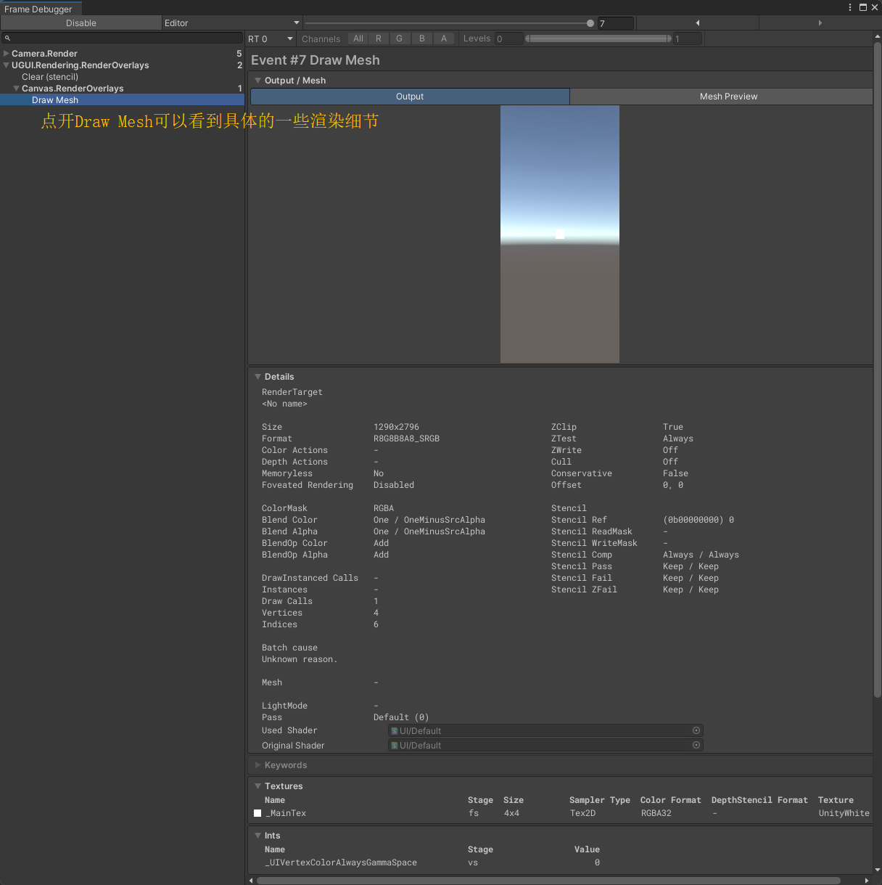

# 1 渲染全流程

在 UGUI 中，这个过程被称为 **Canvas Rebuild (画布重建)**。它是在每一帧渲染之前的 `LateUpdate` 阶段，通过 `Canvas.SendWillRenderCanvases` 统一触发的。

**第一阶段：布局阶段（Layout）**

这一阶段的核心是确定UI大小和位置（处理那些调用`SetLayoutDirty`标记为脏的UI）。

**第二阶段：图形重绘（Graphic Rebuild）**

当位置定死之后，接下来的任务是生成几何数据（处理那些调用 `SetVerticesDirty` （顶点脏） 或 `SetMaterialDirty`（材质脏）标记为脏的UI）。

- **生成网格 (Rebuild Mesh)**：
  - 每个 `Graphic` 组件（如 Image）根据其 `RectTransform` 边界，计算出 4 个顶点坐标、UV 坐标和顶点颜色
  - **文本组件**最特殊：它需要为每一个字符生成一个 4 顶点的矩形面片
    - 原生Text（位图：Bitmap）：它将字体看作一张张“小位图”。每一个字符都是从一张大贴图上采样对应的像素块。因此当缩放Text时，CPU 必须重新生成网格，并请求一套对应字号的新位图。如果字号很大，贴图会变得非常模糊
    - TextMeshPro（SDF-有向距离场）：它存储的不是像素点，而是像素距离字体轮廓的**距离信息**。无论文字放大多少倍，Shader 都可以通过这个距离场计算出平滑的边缘。**优势**：**缩放文字不会触发顶点重建（Vertices Rebuild）**，它只需要修改 Shader 参数或缩放变换。
- **计算裁剪（Clipping)**：如果是被 `Mask` 或 `RectMask2D` 包裹的 UI，此时会计算哪些顶点在显示范围内，剔除范围外的顶点数据

**第三阶段：合批与排序 (Batching & Sorting)**

- **深度排序 (Depth Sorting)**：
  - 为了决定谁盖住谁，UI 会进行深度排序
  - **规则**：层级面板（Hierarchy）里下方的元素通常盖住上方的。如果两个元素重叠且材质/贴图不同，合批就会断开
- **合批 (Batching)**
  - Canvas 会扫描所有可见的 UI 元素
  - **合并标准**：如果连续的多个元素使用**相同的贴图（Atlas）和相同的 Shader 参数**，它们会被合并成一个巨大的 `VBO` (顶点缓冲区对象)
  - **结果**：将成百上千个小 Image 变成一个大网格，从而减少 **DrawCall**

**第四阶段：渲染提交 (Rendering)**

发送DrawCall。

# 2 性能优化

## 2.1 减少Draw Call

**Draw Call**

在Unity里，Draw Call指的是CPU发出的绘制请求，其中包含的数据有：几何数据（我要画什么：Pos、UV、Color...）和渲染状态（我要怎么画：Shader、Textures...）。

在现代硬件中，GPU的处理能力通常很强，假设一个场景有2000个Draw Call，CPU可能需要花20ms才能把这些指令发完，而GPU画完它们只需要5ms。也就是说，Draw Call太多的后果是GPU大部分时间都在等CPU发指令，这时游戏帧率就会卡在CPU提交这一步。

减少Draw Call就是合并请求（合批），以减少CPU在提交命令上花费太多时间。

**Frame Debugger**

分析工具我主要使用的是Unity的Frame Debugger（Window-Analysis-Frame Debugger），这个工具可以在游戏运行时冻结特定帧，并查看用于渲染该帧的各个渲染调用的具体情况。在Frame Debugger里，一个渲染调用称为Draw Mesh，通常就是一个Draw Call。

例外情况：当启用GPU Instancing时，多个相同网格的绘制可能合并为一个Draw Call，但在Frame Debugger中可能仍显示为多个"Draw Mesh"。

**减少Draw Call**

减少Draw Call即尽可能地进行合批，UI合批要求UI在同一个Canvas下，并拥有相同的材质（Material）和纹理（Texture），在Hierarchy里尽量相邻（如果两个满足合批条件的UI之间夹了一个不满足合批条件的UI，它们俩无法合批）。

**相同材质**就是使用相同的材质球。

这里我测试了一下，在场景里放置两个Img，给第一个Img放一个新建的默认材质球，然后复制一份这个材质球，赋给第二个Img，然后用Frame Debugger进行抓帧，发现它们不能合批。这说明了即便材质球的参数一模一样，只要是两个材质球实例，就无法合批。

**相同纹理**则是保证Image.sprite.texture一致。

一般情况下不同Sprite的Texture是不一致的，但Unity提供了一个东西叫做图集（Sprite Atlas），可以把多张小图打包成一张大图，当Sprite被打入同一个图集，那么使用这些Sprite的UI组件最终引用的都是同一张纹理，即可合批。

**另外少用Mask**

Mask实现的具体原理是一个Drawcall来创建Stencil mask(来做像素剔除)，然后画所有子UI，再在最后一个Drawcall移掉Stencil mask。这头尾两个Drawcall无法跟其他UI操作进行Batch，所以表面上看加个Mask就会多2个Drawcall，而且Mask中的UI元素无法与其他batch，所以很多原本可以合并的UI就无法合并了，从而增加DrawCall。

**一个坑**

在使用Frame Debugger的时候我发现Draw Mesh的合并有时候成功有时候失效，后面控制变量找到了原因：我在Prefab编辑页面里运行游戏进行分析，Draw Mesh合并就会失效，要退到Scene里才会恢复正常。

## 2.2 减少UI重建

**什么是UI重建？**

简单来说，当 UI 元素发生改变时，Unity 不会立刻更新它，而是把它标记为“脏（Dirty）”。在每一帧渲染前的 `Canvas.SendWillRenderCanvases` 阶段，Unity 会统一处理这些“脏”元素。

**谁在触发重建？**

| **触发类型**           | **常见操作**                                      | **性能代价**                                                 |
| ---------------------- | ------------------------------------------------- | ------------------------------------------------------------ |
| **布局重建**           | 修改宽/高、锚点、Pivot、**启用/禁用物体**         | **极高**。会引起父节点和子节点的链式反应，尤其是有 `LayoutGroup` 时。 |
| **图形重建**           | 修改 `Text` 内容、更换 `Image` 图片、修改 `color` | **高**。需要重新填充顶点缓冲区（Vertex Buffer）。            |
| **网格重绘 (Rebatch)** | 仅仅修改坐标（Position/Rotation/Scale）           | **中**。不触发 Rebuild，但会触发 Canvas 的重新合批。         |

**如何排查？**

打开Unity的Profiler，找到UI模块，如果 `Canvas.SendWillRenderCanvases` 很高，说明重建太频繁了。

**优化手段：**

- **动静分离**

  - 原理：Canvas是合批和重建的基本单位。如果一个Canvas里有一个图标在闪烁，整个Canvas都会被标记为“脏”并重新计算

  - 做法：把频繁变动的UI（如小地图、血条、倒计时）放在一个Canvas下；把静态的UI（如背景、边框）放在另一个Canvas下
- 慎用layout group

  - 当子物体改变时，它会频繁地进行嵌套递归计算，并调用大量的 `GetComponent`
- 隐藏UI的正确手段

  - 错误写法：`gameObject.SetActive(false)`。这会直接触发整个 Canvas 的布局重建
  - 优化写法
    - 移出屏幕：不会触发重建（Rebuild），但是会触发重绘（Rebatch）
    - Canvas Group：修改 `alpha = 0` 并关闭 `blocksRaycasts`
- 用修改材质属性替代修改`Image.color`
  - 修改`Image.color`
    - UGUI会直接修改存储在内存中的顶点颜色数据，因为网格（Mesh）的顶点属性发生了变化，Unity 必须重新调用 `Graphic.UpdateGeometry()`，把这块包含了新颜色数据的网格重新填充并上传到 GPU，属于典型的图形重建。

  - 通过 `Image.material.SetColor("_Color", myColor)` 或使用 `CanvasRenderer.SetColor` 
    - 它修改的是渲染管线中的**着色器变量**（Uniform 变量），而不是网格本身的顶点，不会触发重建
    - 前者可能会打断合批（产生新的材质实例），后者不会

