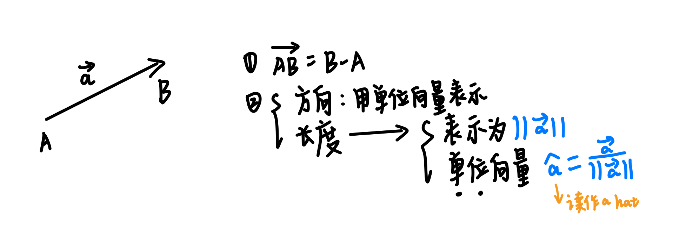
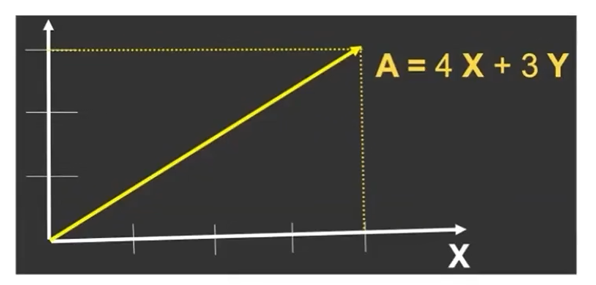
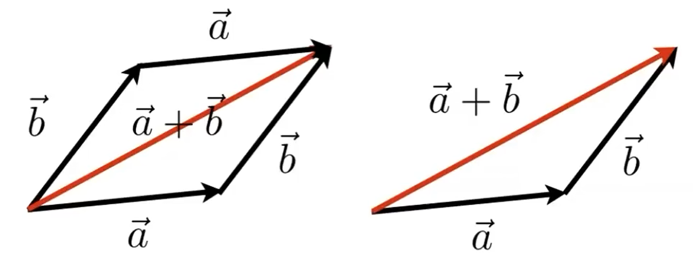
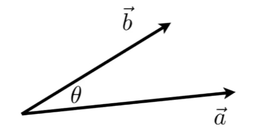
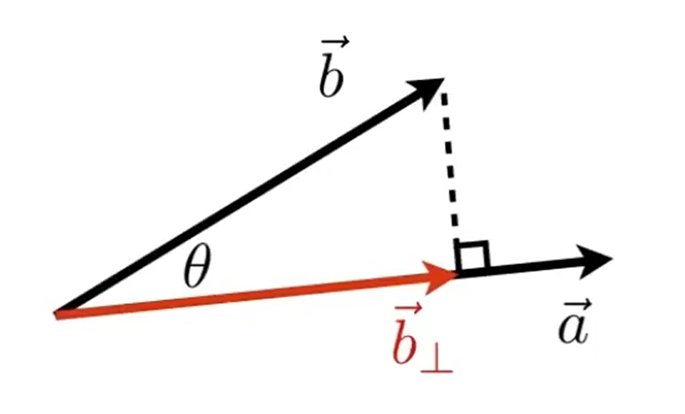
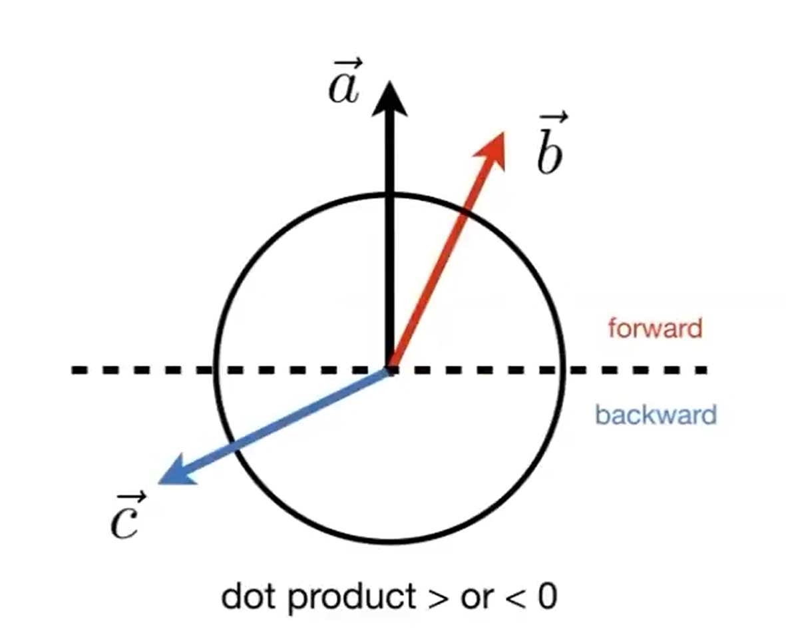
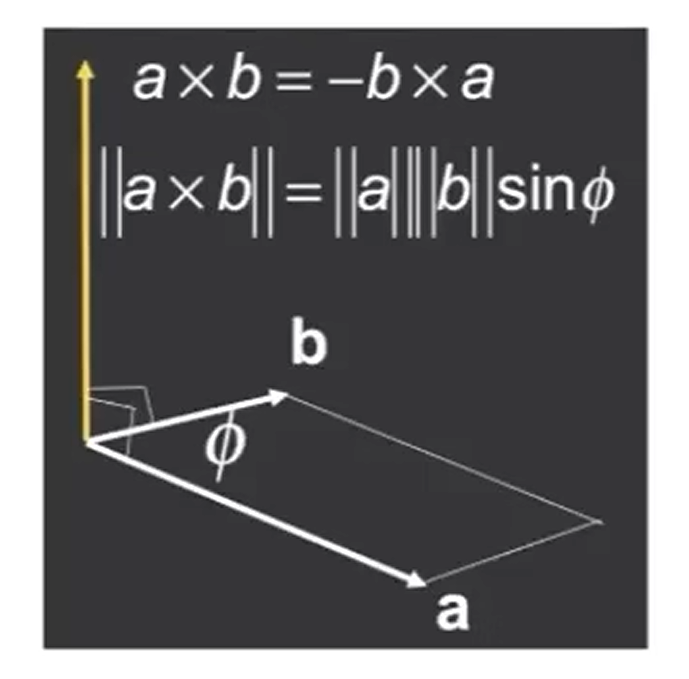

更新中...

之前其实有大概把闫令琪老师的games101过一遍，但最近要开始学shader，又觉得有点忘完了，所以打算再重新学一遍，顺便做一点方便以后查阅的笔记。

# 2 线代基础

## 2.1 向量（Vectors）

### 2.1.1 定义

- 向量的计算公式：$\overrightarrow{AB} = B-A$

- 向量的两个属性

  - 方向

  - 长度

- 向量在笛卡尔坐标系中的描述：$A = \binom{x}{y}$，$A^T = (x,y)$，$||A|| = \sqrt{x^2+y^2}$

### 2.1.2 向量的运算

#### 1 Add-加

平行四边形法则 or 三角形法则

#### 2 Dot Product-点乘

**点乘的计算**

- $\overrightarrow{a}· \overrightarrow{b}= ||\overrightarrow{a}||||\overrightarrow{b}||cosθ$

- $cosθ = \frac{\overrightarrow{a}· \overrightarrow{b}}{||\overrightarrow{a}||||\overrightarrow{b}||}$

- $cosθ = \hat{a}·\hat{b}$
- 满足运算法则：交换律/结合律/分配律

**点乘在笛卡尔坐标系中的运算**

- In 2D：$\overrightarrow{a}· \overrightarrow{b}=\binom{x_a}{y_a}·\binom{x_b}{y_b} = x_ax_b+y_ay_b$
- In 3D：$ \overrightarrow{a}· \overrightarrow{b}= \begin{pmatrix} x_a \\ y_a \\ z_a \end{pmatrix}·\begin{pmatrix} x_b \\ y_b \\ z_b \end{pmatrix} = x_ax_b+y_ay_b+z_az_b$

**点乘的几何意义**

**1.求一个向量在另一个向量上的投影。**

$\text{Proj}_{\vec{a}} \vec{b} = ||\text{Proj}_{\vec{a}} \vec{b}||·\hat{a} = ||\vec{b}||cosθ·\hat{a}$ 

然后cosθ就可以用单位向量的点乘来算。

**2.可以看出两个向量的“前后”关系。**

#### 3 Cross Product-叉乘

两个向量的叉乘会得到一个新的向量，这个向量既垂直于$\vec{a}$，又垂直于$\vec{b}$，方向可以使用**右手定则**得到。

右手定则下：$\vec{x}×\vec{y} = +\vec{z}$

**叉乘在笛卡尔坐标系中的运算**

$\vec{a}×\vec{b} = \begin{pmatrix} y_az_b-y_bz_a \\ z_ax_b-x_az_b \\ x_ay_b-y_ax_b \end{pmatrix}$

**叉乘的几何意义**

①判断左和右 ②判断内与外

