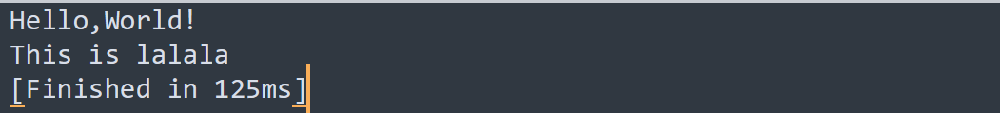
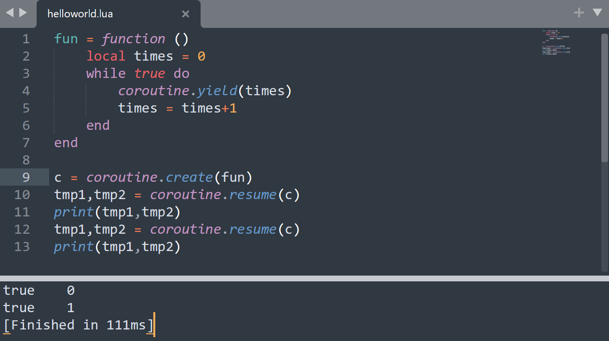
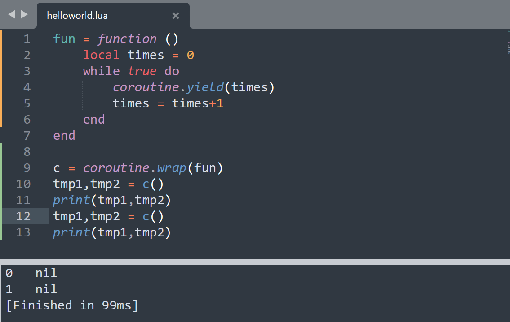

[Lua菜鸟教程](https://www.runoob.com/lua/lua-garbage-collection.html)

# 2 变量

## 2.1 概念

### Lua是一种动态类型语言

Lua中的所有变量申明都不需要申明变量类型，它会自动地识别类型。并且对于lua中的一个变量，可以随便赋值，不会出现C#里会编译错误的情况（因为C#是强类型语言，一个变量一旦被声明类型，就不能更改其类型）。

**Lua**

```lua
a = 1
a = 1.5
```

**C#**

```c#
int a = 1;
a = (int)1.5f;
```

在Lua中可以直接使用没有初始化的变量，默认为nil。

```lua
print(b)
```

### type()

在Lua中我们可以通过type函数获得变量的类型，并且type()返回的其实是一个string类型的数值。

```lua
a = nil
print(type(a))
print(type(type(a)))
```


## 2.2 简单的四种变量类型

### 2.2.1 四种变量类型

- nil：空
- number：数值类型，如：1，1.2...
- string：字符串
- boolean：true/false

### 2.2.2 string

#### 概念

Lua中字符串的声明，使用单引号或双引号包裹，二者没有区别。

```lua
a = '12345'
a = "12345"
```

#### 方法

##### 获取字符串的长度

```lua
-- 使用#获取字符串长度
-- 数字/英文字符长度为1
-- 中文字符长度为3

--打印结果：6
str2 = "中文"
print(#str2)
```

##### 字符串多行打印

1.支持转义字符

```lua
str = "123\n123"
print(str)
```

2.使用[[]]

```lua
str = [[
Hello,
World!
]]
print(str)
```

##### 字符串拼接 

使用 ..

```lua
str1 = "123"
str2 = "456"
print(str1 .. str2)
```

使用string.format

```lua
print(string.format("月亮与%d便士",6))
```

##### 别的类型转字符串

```lua
a = true
-- 其实直接打印也ok
print(tostring(a))
```

##### 其他公共方法

```lua
str = "abcDEF"
-- 小写转大写
print(string.upper(str))
-- 大写转小写
print(string.lower(str))
-- 翻转字符串
print(string.reverse(str))
-- 字符串索引查找 
-- 打印结果是：2 4（会打印起、末两个索引），这里我们会发现Lua的索引是从1开始的
print(string.find(str,"bcD"))
-- 截取字符串
print(string.sub(str,3))     -- cDEF
print(string.sub(str,3,4))   -- cD
-- 字符串重复
print(string.rep(str,2))     -- abcDEFabcDEF
-- 字符串修改
print(string.gsub(str,"cD","**"))   --ab**EF 1 （修改完的字符+修改次数）
-- 字符转ASCII码
print(string.byte("ab",1))   --97 （打印a的ASCII码）
-- ASCII码转字符
print(string.char(97))       --a
```

## 2.3 复杂的四种变量类型

- function：函数
- table：表
- userdata：数据结构
- thread：协同程序（线程）

# 3 运算符

## 3.1 算数运算符（+ - ...）

```lua
-- + - * / % ^
-- 没有自增自减 ++ --
-- 没有复合运算符 += -= ...
```

```lua
print("123"+1)   -- 结果：124，区别于C#，C#里会等于1231
```

```lua
print("2"^2)     -- 结果：4，幂运算，区别于C#，C#里是异或运算符（相同为false，不相同为true）
```

## 3.2 条件运算符（> < ...）

```lua
-- > < ≥ ≤ == ~=（不等于）
```

## 3.3 逻辑运算符（and or not）

### 3.3.1 概念

在lua中，**只有nil和false为假**。

### 3.3.2 逻辑运算符的短路现象

```lua
--在C#中，如果&&前面的条件已经为false，那么不会继续判断后面的条件，这就叫做短路现象
--Lua同理

--此时会打印2，原因：1为true，那么and会继续判断第二个条件是否为true
print(1 and 2)

--此时会打印1，原因：在1为true的情况下，or的结果已经为true，因此不会继续判断第二个条件
print(1 or 2)
```

### 3.3.3 替代三目运算符*

C#里的三目运算符：? : ，我们可以用他们来进行这样的判断：

```c#
var a = 1;
var b = 2;
var max = b>=a? b:a;
```

而在lua里没有三目运算符，我们通过这样的方式实现上面的判断：

```lua
a = 1
b = 2
print(b>=a and b or a)
```

这里的逻辑：

b>=a已经为true，对于and来说，结果取决于 b or a。

而对于or来说，b非false，结果为b。


那么假设b>=a此时为false呢？

那么对于and来说，b>=a and b的结果为false，那么式子演变为：false or a

对于or来说，前面为false，结果取决于a，即结果为a。

# 4 语句

## 4.1 条件分支语句

```lua
-- if语法：if 条件 then....end
a = 4
if a>=5 then
	print("Hello!")
elseif a>=0 then
	print("GoodBye!")
else
	print("HAH!")
end
```

## 4.2 循环语句

### 4.2.1 while

```lua
-- while 条件 do...end
num = 0
while num<=5 do
	print(num)
	num = num+1
end
```

### 4.2.2 repeat...until

```lua
-- repeat...until 结束条件
num = 5
repeat
	print(num)
	num = num-1
until num<=0
```

### 4.2.3 for

```lua
-- for 默认i递增
for i=1,5 do
	print(i)
end
```

如果想修改i的变化

```lua
-- for i+2
for i=1,5,2 do
	print(i)
end
```

# 5 函数（function）

## 5.1 函数

**无参无返回值**

```lua
------------无参无返回值
function F1()
	print("Hello,World!")
end
F1() 

------------另一种写法
F2 = function()
	print("Hello,World!")
end
F2()
```

**有参无返回值**

```lua
------------有参数
F1 = function(a)
	print(a)
end
F1(1)
F1("Hello,World!")
F1(1,2,3)            --打印：1，会把用不上的丢弃
```

**有返回值**

```lua
------------有返回值
function F1(a)
	return a
end
print(F1("Hello,World!"))

------------两个返回值
function F2()
	return "1","2"
end
temp1,temp2 = F2()
print(temp1 .. temp2)
```

## 5.2 变长参数

```lua
------------变长参数
function F1(...)
	arg = {...}
	for i=1,#arg do
		print(arg[i])
	end
end

F1(1,2,3,true,"123")
```

## 5.3 函数嵌套

```lua
------------函数闭包
function F1()
	return function()
		print("Hello,World!")
	end
end

F1()()
```

## 5.4 闭包

通过捕获外部变量的方式改变其生命周期。

```lua
------------函数闭包
function F1(x)
	return function(y)
		return x+y
	end
end

print(F1(1)(2))
```

# 6 表（table）

表是一切复杂数据结构，如数组、字典、类等等的基础，通过表我们可以表示出各种数据结构的特征，**但它们本质上都是表**。

## 6.1 “数组”

### 6.1.1 一维数组

```lua
a = {1,2,3,"Hello",true}
```

### 6.1.2 二维数组

```lua
a = {{1,2,3},{4,5,6}}
```

### 6.1.3 自定义索引

```lua
a = {[0] =1,2,3,4}
```


### 6.1.4 在数组中加入nil

[参考](https://www.runoob.com/w3cnote/lua-table-length.html)

如果数组中某一位为nil，会影响#获取的长度，如下实验所示：


所以一般不在数组中添加nil。

## 6.2 迭代器遍历

迭代器遍历一般是用来遍历表的，因为对于不规则表（如添加了nil或自定义索引的）使用#获得的长度并不准确，导致遍历时并非所有元素都能访问到。

### 6.2.1 ipairs

和#相似，对于不规则表的访问并不准确。

1.访问不到自定义索引值小于等于0的元素。


2.如果从1开始，索引顺序断了，后面的内容也找不到。

例如在这里我们把上面例子里最后的自定义索引改为3。


### 6.2.2 pairs

pairs的访问则较为准确。


## 6.3 “字典”

```lua
------------字典
------------字典就是键值对
a = {["name"] = "manqi"}
print(a["name"])
print(a.name)     --可以用类似.成员变量的形式访问，但不能是数字

------------新增
a["age"] = "99"

------------删除
a["age"] = nil

------------遍历一定要用pairs
for i,k in pairs(a) do
    print(i,k)    --这样打印的时候中间会帮忙空格
end
```

## 6.4 “类”

Lua默认是没有面向对象的。

### 6.4.1 概念

```lua
------------类
------------在Lua中类的表现更像是一个类中有很多静态变量和函数
Student = {
	age = "99",

	Up = function()
		print("我成长了")
	end,

	Study = function(s)
		print(s.age)
	end,
}

------------申明表过后也可以在表外去申明表的变量和方法
Student.name = "manqi"
print(Student.name)
```

### 6.4.2 .和:调用方法的区别

```lua
------------调用 Lua中.和:的区别，冒号调用方法时会默认把调用者作为第一个参数传入
Student.Study(Student)
Student:Study()
```

### 6.4.3 self关键字

```lua
------------self
Student = {
	name = "manqi",
}
--PS：冒号只能是function+名字的形式，且代表方法有一个默认的参数
function Student:F1()
    --表示默认传入的第一个参数
	print(self.name)
end

Student:F1()
```

## 6.5 table的公共操作

### 6.5.1 insert

```lua
t1 = {1,2,3}
t2 = {4,5,6}
-- 结果会变成这样：t1 = {1,2,3,{4,5,6}}
table.insert(t1,t2)
```

### 6.5.2 remove

```lua
t1 = {1,2,3}
-- 结果是{1,2}
table.remove(t1)

t1 = {1,2,3}
-- 结果是{2,3}
table.remove(t1,1)
```

### 6.5.3 sort

```lua
t1 = {3,2,1}
--升序
table.sort(t1)
--降序
table.sort(t1,function(a,b)
	if a>b then
		return true
	end
end)
```

### 6.5.4 concat

```lua
t1 = {"123","456","789"}
str = table.concat( t1, ";")
--结果是123;456;789
print(str)
```

# 7 多Lua脚本执行

## 7.1 全局变量和本地变量

**全局变量**

```lua
--这样声明都是全局变量
a = 1
b = "123"
```

**本地变量（local）**

```lua
--local是本地变量/局部变量的关键字
if true then
	local tmp = "Hello,Wolrd!"
	print(tmp)
end
```

## 7.2 多脚本执行

关键字：require("脚本名")。

**lalala.lua**

```lua
print("This is lalala")
```

**helloworld.lua**

```lua
print("Hello,World!")
require("lalala")
```

**结果**




**--------------------奇怪的用法**

使用require加载脚本时，脚本的本地变量可以return出去给别的脚本用，如：

**lalala.lua**

```lua
local a = 1
return a
```

**helloworld.lua**

```lua
print(require("lalala"))
```

## 7.3 脚本卸载

要解决的问题是：require加载执行的脚本，加载一次后不会再被执行。

```lua
print("Hello,World!")
require("lalala")

--这一次加载没有执行
require("lalala")
```

**package.loaded["脚本名"]**

可以通过这个方法得到指定脚本是否有被加载过。

卸载：

```lua
package.loaded["脚本名"] = nil
```

## 7.4 大G表

大G表是一个总表，它将我们声明的全局变量都存储在其中。

关键字：_G。

```lua
for i,k in pairs(_G) do
	print(k)
end
```

# 8 协程

## 8.1 协程的创建

**coroutine.create(方法)**

```lua
fun = function()
	print("Hello,World")
end
c  = coroutine.create(fun)

print(type(c))   --打印出来是thread
```

**coroutine.wrap(方法)**

```lua
fun = function()
	print("Hello,World")
end
c  = coroutine.wrap(fun)

print(type(c))   --打印出来是function
```

## 8.2 协程的运行

**coroutine.resume(协程)**

```lua
--对应用create创建的协程
fun = function()
	print("Hello,World")
end
c  = coroutine.create(fun)

coroutine.resume(c)
```

**函数调用**

因为用wrap创建的协程本质上是函数，因此可以用函数调用的方式。

```lua
--对应用wrap创建的协程
fun = function()
	print("Hello,World")
end
c  = coroutine.wrap(fun)

c()
```

## 8.3 协程的挂起

**coroutine.yield()**

```lua
fun = function ()
	local times = 0
	while true do
		print("Hello,World")
		times = times+1
		if times>=5 then
			coroutine.yield()      --协程挂起，避免死循环
		end
	end
end

c = coroutine.create(fun)
coroutine.resume(c)
```

另外，yield()里面是可以返回值的。



另外，使用wrap()创建的协程没有默认第一个返回值：



## 8.4 协程的状态

**coroutine.status()**

- dead 结束
- suspended 暂停
- running 执行中

**coroutine.running()**

可以得到当前正在运行的协程的编号。

# 9 元表

## 9.1 设置元表

```lua
--任何一个表变量都可以作为另一个表变量的元表
meta = {}
myTable = {}
setmetatable(myTable,meta)

--得到元表的方法
getmetatable(myTable)
```

## 9.2 特定操作

### 9.2.1 __tostring

当子表要被当作字符串使用时，会默认调用这个元表中的__tostring方法。

```lua
meta = {
	__tostring = function ()
		return "manqi"
	end
}
myTable = {}
setmetatable(myTable,meta)

--结果是manqi
print(myTable)
```

当方法有参数，会默认地把自己传进去。

```lua
meta = {
	__tostring = function (t)
		return t.name
	end
}
myTable = {
	name = "manqi"
}
setmetatable(myTable,meta)

--结果是manqi
print(myTable)
```

### 9.2.2 __call

当子表被当作一个函数来使用时，会默认调用__call方法。

```lua
meta = {
	__call = function()
		print("Hello,World")
	end
}
myTable = {}
setmetatable(myTable,meta)

--打印Hello,World
myTable()
```

### 9.2.3 运算符重载

#### __add

当子表使用+运算符时，会调用该方法。

```lua
meta = {
	__add = function(t1,t2)
		return t1.num + t2.num
	end
}
myTable1 = {
	num = 1
}
setmetatable(myTable1,meta)
myTable2 = {
	num = 2
}

--打印3
print(myTable1+myTable2)
```

#### __sub

当子表使用-运算符时，会调用该方法。

```lua
meta = {
	__sub = function(t1,t2)
		return t1.num - t2.num
	end
}
myTable1 = {
	num = 1
}
setmetatable(myTable1,meta)
myTable2 = {
	num = 2
}

--打印-1
print(myTable1-myTable2)
```

#### 其他

- *：__mul
- /：__div
- %：__mod
- ^：__pow
- ==：__eq（没有~=，直接取反，以下的>和>=同理）
- <：__lt
- <=：__le
- ..：__concat

### 9.2.4 \__index和__newIndex

#### __index

当子表中找不到某一个属性时，会到元表中__index指定的表去找索引。

```lua
meta = {
	__index = {age = 1}
}
myTable = {}
setmetatable(myTable,meta)
print(myTable.age)
```

或者这么写：

```lua
meta = {
	age = 1
}
meta.__index = meta
```

但注意不能这么写：

```lua
meta = {
	age = 1,
	__index = meta
}
```

#### __newIndex

当赋值时，如果赋值一个不存在的索引，那么会把这个值赋值到__newIndex所指的表中，不会修改自己。

```lua
meta = {
	age = 1
}
meta.__index = meta
meta.__newindex = meta
myTable = {}
setmetatable(myTable,meta)
myTable.age = 99
print(myTable.age)
```

#### rawget

该方法会忽略\__index的设置，只会尝试在指定的表中找指定属性。

#### rawset

该方法会忽略__newIndex的设置，它只会修改指定表的变量。

# 10 面向对象

- 封装
- 继承
- 多态

## 10.1 封装

“类”是封装的体现。

```lua
Object = {}
Object.id = 1
Object.Text = function()
	print("Hello,World!")
end

--实现new()方法：实际上是返回了一个空表
function Object:new()
	local obj = {}
	setmetatable(obj,self)
	self.__index = self
	return obj
end

--在指定表中找不到对应的属性时，会到其元表__index指定的表里找
local myObj = Object:new()
print(myObj.id)
print(myObj.Text())
```

## 10.2 继承

```lua
Object = {}
Object.id = 1

function Object:subClass(className)
	--通过大G表申明一个指定名字的公共空表
	_G[className] = {}
	local obj = _G[className]
	setmetatable(obj,self)
	self.__index = self
end

Object:subClass("GameObject")
print(GameObject.id)
```

## 10.3 多态

多态即相同行为不同表现：在这里指的是相同方法不同执行逻辑。

```lua
--忽略前面的new和subclass的方法

function Object:hello()
	print("Hello,Object!")
end

Object:subClass("GameObject")
local obj = GameObject:new()
obj:hello()

--重写
function GameObject:hello()
	print("Hello,GameObject!")
end
obj:hello()
```

以上的逻辑我们确实实现了重写，但与C#不同的是，此时我们想要再调用父类的hello()方法已经不可以了。所以我们应该去实现一个类似于base的概念，让我们在重写后依旧可以调用父类的方法。

```lua
function Object:subClass(className)
	_G[className] = {}
	local obj = _G[className]
	setmetatable(obj,self)
	self.__index = self
	--Add：子类定义一个base属性指向父类
	obj.base = self
end

--...

obj.base:hello()
```

# 11 Lua垃圾回收

**获取当前占用字节数**

```lua
--获取当前占用KB，*1024则是占用字节数
print(collectgarbage("count"))
```

**垃圾回收**

```lua
collectgarbage("collect")
```

