# 1 Hello,World!

**打印**

```lua
-- 语句后面的分号可加可不加
print("Hello,World!")
```

**注释**

```lua
-- 单行注释

--[[
	多行注释1
]]

--[[
	多行注释2
]]--

--[[
	多行注释3
--]]
```

# 2 变量

## 2.1 概念

### Lua是一种动态类型语言

Lua中的所有变量申明都不需要申明变量类型，它会自动地识别类型。并且对于lua中的一个变量，可以随便赋值，不会出现C#里会编译错误的情况（因为C#是强类型语言，一个变量一旦被声明类型，就不能更改其类型）。

**Lua**

```lua
a = 1
a = 1.5
```

**C#**

```c#
int a = 1;
a = (int)1.5f;
```

在Lua中可以直接使用没有初始化的变量，默认为nil。

```lua
print(b)
```

### type()

在Lua中我们可以通过type函数获得变量的类型，并且type()返回的其实是一个string类型的数值。

```lua
a = nil
print(type(a))
print(type(type(a)))
```

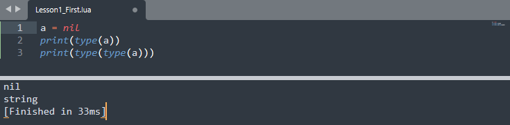

## 2.2 简单的四种变量类型

### 2.2.1 nil

类似于C#中的null。

```lua
a = nil
```

### 2.2.2 number

Lua中所有的数值都是number类型。

```lua
a = 1
a = 1.2
```

### 2.2.3 string

#### 概念

Lua中字符串的声明，使用单引号或双引号包裹，二者没有区别。

```lua
a = '12345'
a = "12345"
```

#### 方法

##### 获取字符串的长度

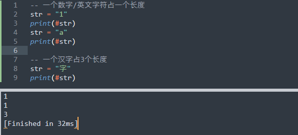

##### 字符串多行打印

1.支持转义字符

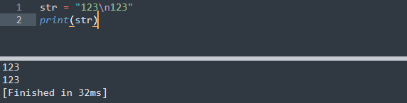

2.使用[[]]

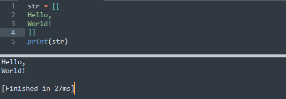

##### 字符串拼接 

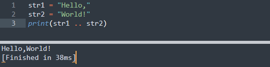

也可以这样：

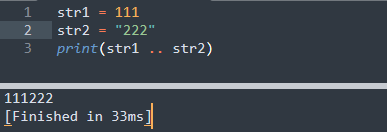

也可以使用string.format

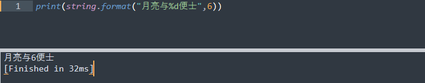

##### 别的类型转字符串

```lua
a = true
-- 其实直接打印也ok
print(tostring(a))
```

##### 其他公共方法

```lua
str = "abcDEF"
-- 小写转大写
print(string.upper(str))
-- 大写转小写
print(string.lower(str))
-- 翻转字符串
print(string.reverse(str))
-- 字符串索引查找 
-- 打印结果是：2 4（会打印起、末两个索引），这里我们会发现Lua的索引是从1开始的
print(string.find(str,"bcD"))
-- 截取字符串
print(string.sub(str,3))     -- cDEF
print(string.sub(str,3,4))   -- cD
-- 字符串重复
print(string.rep(str,2))     -- abcDEFabcDEF
-- 字符串修改
print(string.gsub(str,"cD","**"))   --ab**EF 1 （修改完的字符+修改次数）
-- 字符转ASCII码
print(string.byte("ab",1))   --97 （打印a的ASCII码）
-- ASCII码转字符
print(string.char(97))       --a
```

### 2.2.4 boolean

```lua
a = true
a = false
```

## 2.3 复杂的四种变量类型

- function：函数
- table：表
- userdata：数据结构
- thread：协同程序（线程）

# 3 运算符

## 3.1 算数运算符（+ - ...）

```lua
-- + - * / % ^
-- 没有自增自减 ++ --
-- 没有复合运算符 += -= ...
```

```lua
print("123"+1)   -- 结果：124，区别于C#，C#里会等于1231
```

```lua
print("2"^2)     -- 结果：4，幂运算，区别于C#，C#里是异或运算符（相同为false，不相同为true）
```

## 3.2 条件运算符（> < ...）

```lua
-- > < ≥ ≤ == ~=（不等于）
```

## 3.3 逻辑运算符（and or not）

```lua
-- C#：&& || !
-- Lua：and or not
```

## 3.4 位运算符和三目运算符（Lua不支持）

**位运算符**

```lua
-- C# & |
-- Lua 不支持，需要自己实现
```

**三目运算符**

```lua
-- C# ? : 
-- Lua 不支持
```

# 4 语句

## 4.1 条件分支语句

```lua
-- if语法：if 条件 then....end
a = 4
if a>=5 then
	print("Hello!")
elseif a>=0 then
	print("GoodBye!")
else
	print("HAH!")
end
```

## 4.2 循环语句

### 4.2.1 while

```lua
-- while 条件 do...end
num = 0
while num<=5 do
	print(num)
	num = num+1
end
```

### 4.2.2 repeat...until

```lua
-- repeat...until 结束条件
num = 5
repeat
	print(num)
	num = num-1
until num<=0
```

### 4.2.3 for

```lua
-- for 默认i递增
for i=1,5 do
	print(i)
end
```

如果想修改i的变化

```lua
-- for i+2
for i=1,5,2 do
	print(i)
end
```

# 5 函数（function）

## 5.1 函数

**无参无返回值**

```lua
------------无参无返回值
function F1()
	print("Hello,World!")
end
F1() 

------------另一种写法
F2 = function()
	print("Hello,World!")
end
F2()
```

**有参无返回值**

```lua
------------有参数
F1 = function(a)
	print(a)
end
F1(1)
F1("Hello,World!")
F1(1,2,3)            --打印：1，会把用不上的丢弃
```

**有返回值**

```lua
------------有返回值
function F1(a)
	return a
end
print(F1("Hello,World!"))

------------两个返回值
function F2()
	return "1","2"
end
temp1,temp2 = F2()
print(temp1 .. temp2)
```

## 5.2 变长参数

```lua
------------变长参数
function F1(...)
	arg = {...}
	for i=1,#arg do
		print(arg[i])
	end
end

F1(1,2,3,true,"123")
```

## 5.3 函数嵌套

```lua
------------函数闭包
function F1()
	return function()
		print("Hello,World!")
	end
end

F1()()
```

## 5.4 闭包

通过捕获外部变量的方式改变其生命周期。

```lua
------------函数闭包
function F1(x)
	return function(y)
		return x+y
	end
end

print(F1(1)(2))
```

# 6 表（table）

表是一切复杂数据结构，如数组、字典、类等等的基础，通过表我们可以表示出各种数据结构的特征，**但它们本质上都是表**。

## 6.1 “数组”

### 6.1.1 一维数组

```lua
a = {1,2,3,"Hello",true}
```

### 6.1.2 二维数组

```lua
a = {{1,2,3},{4,5,6}}
```

### 6.1.3 自定义索引

```lua
a = {[0] =1,2,3,4}
```

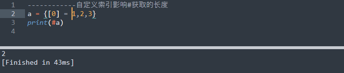

### 6.1.4 在数组中加入nil

[参考](https://www.runoob.com/w3cnote/lua-table-length.html)

如果数组中某一位为nil，会影响#获取的长度，如下实验所示：

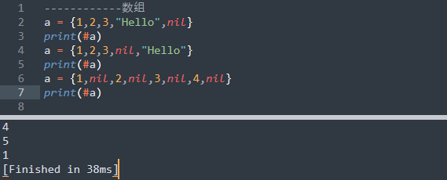

所以一般不在数组中添加nil。

## 6.2 迭代器遍历

迭代器遍历一般是用来遍历表的，因为对于不规则表（如添加了nil或自定义索引的）使用#获得的长度并不准确，导致遍历时并非所有元素都能访问到。

### 6.2.1 ipairs

和#相似，对于不规则表的访问并不准确。

1.访问不到自定义索引值小于等于0的元素。

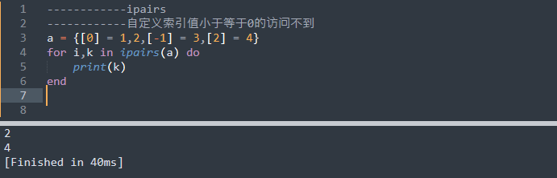

2.如果从1开始，索引顺序断了，后面的内容也找不到。

例如在这里我们把上面例子里最后的自定义索引改为3。

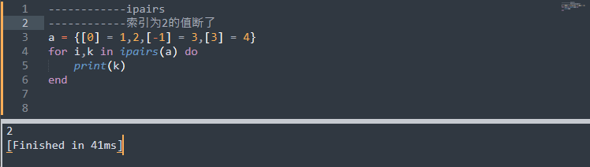

### 6.2.2 pairs

pairs的访问则较为准确。

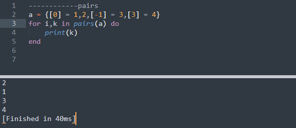

## 6.3 “字典”

```lua
------------字典
------------字典就是键值对
a = {["name"] = "manqi"}
print(a["name"])
print(a.name)     --可以用类似.成员变量的形式访问，但不能是数字

------------新增
a["age"] = "99"

------------删除
a["age"] = nil

------------遍历一定要用pairs
for i,k in pairs(a) do
    print(i,k)    --这样打印的时候中间会帮忙空格
end
```

## 6.4 “类”

Lua默认是没有面向对象的。

### 6.4.1 概念

```lua
------------类
------------在Lua中类的表现更像是一个类中有很多静态变量和函数
Student = {
	age = "99",

	Up = function()
		print("我成长了")
	end,

	Study = function(s)
		print(s.age)
	end,
}

------------申明表过后也可以在表外去申明表的变量和方法
Student.name = "manqi"
print(Student.name)
```

### 6.4.2 .和:调用方法的区别

```lua
------------调用 Lua中.和:的区别，冒号调用方法时会默认把调用者作为第一个参数传入
Student.Study(Student)
Student:Study()
```

### 6.4.3 self关键字

```lua
------------self
Student = {
	name = "manqi",
}
--PS：冒号只能是function+名字的形式，且代表方法有一个默认的参数
function Student:F1()
    --表示默认传入的第一个参数
	print(self.name)
end

Student:F1()
```

## 6.5 table的公共操作

### 6.5.1 insert

```lua
t1 = {1,2,3}
t2 = {4,5,6}
-- 结果会变成这样：t1 = {1,2,3,{4,5,6}}
table.insert(t1,t2)
```

### 6.5.2 remove

```lua
t1 = {1,2,3}
-- 结果是{1,2}
table.remove(t1)

t1 = {1,2,3}
-- 结果是{2,3}
table.remove(t1,1)
```

### 6.5.3 sort

```lua
t1 = {3,2,1}
--升序
table.sort(t1)
--降序
table.sort(t1,function(a,b)
	if a>b then
		return true
	end
end)
```

### 6.5.4 concat

```lua
t1 = {"123","456","789"}
str = table.concat( t1, ";")
--结果是123;456;789
print(str)
```

# 7 多Lua脚本执行

