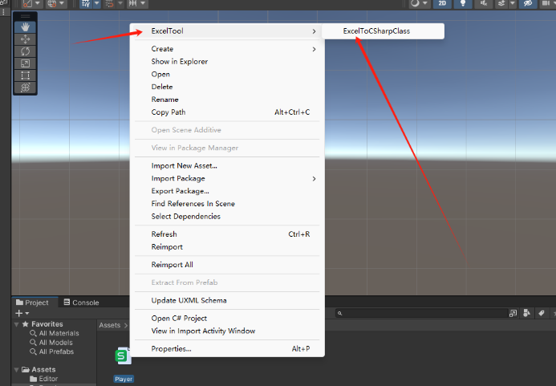

# 0 前言

Excel数据处理是游戏开发中很常见的一个问题，这篇文章实现了：
1.Excel数据转Json数据
2.解析Excel生成对应C#类脚本，并提供读取Json数据存入字典的方法

**Excel数据为什么要转Json数据**（我自己的理解）：
1.方便数据处理：Json有很多第三方库，提供了较为完善的Json数据解析方法，且性能较好。
2.出于加载时的性能考虑：Json相比Excel更加轻量，文件体积较小，数据读取快。


如图，Excel数据文件转为Json之后，大小就变小很多。

另外，可能需要的一些插件：（可以在网上找找，应该都有）


# 1 效果预览

## 使用

**Excel配置**


**使用方法**
右键Excel文件或者在右键文件夹（转换文件夹下的所有Excel文件）



## 结果
**CSharp类**


**JsonData**


**数据读取测试**


# 2 代码

## ExcelConfig.cs

这个脚本主要就是配置一些路径信息。

```c#
using System.Collections;
using System.Collections.Generic;
using System.IO;
using UnityEngine;

public class ExcelConfig
{
    private static string excelDataPath = "/Excel";
    public static string ExcelDataPath {
        get {
            var path = Application.dataPath + excelDataPath;
            if (!Directory.Exists(path)) {
                Directory.CreateDirectory(path);
            }
            return excelDataPath;
        }
    }

    private static string jsonDataPath = "/Scripts/Excel/JsonData";
    public static string JsonDataPath {
        get {
            var path = Application.dataPath + jsonDataPath;
            if (!Directory.Exists(path)) {
                Directory.CreateDirectory(path);
            }
            return jsonDataPath;
        }
    }

    private static string cSharpPath = "/Scripts/Excel/CSharp";
    public static string CSharpPath {
        get {
            var path = Application.dataPath + cSharpPath;
            if (!Directory.Exists(path)) {
                Directory.CreateDirectory(path);
            }
            return cSharpPath;
        }
    }
}
```

## ExcelToCSharpClass.cs

这个脚本实现了转换。

```c#
using Excel;
using Newtonsoft.Json;
using OfficeOpenXml;
using System;
using System.Collections;
using System.Collections.Generic;
using System.Data;
using System.IO;
using System.Text;
using System.Text.RegularExpressions;
using UnityEditor;
using UnityEngine;

public class ExcelToCSharpClass
{
    [MenuItem("Assets/ExcelTool/ExcelToCSharpClass")]
    public static void ExcelToCSharpClassMethod() {
        var selectedObject = Selection.activeObject;
        if (selectedObject == null) {
            Debug.LogError("没有选中需要转换的文件");
            return;
        }
        var assetPath = AssetDatabase.GetAssetPath(selectedObject);
        if (Path.GetExtension(assetPath).Equals(".xlsx", StringComparison.OrdinalIgnoreCase)) {
            //说明选中的是单个Excel文件
            ExcelToCSharpClassMethod(assetPath);
        }
        else if(AssetDatabase.IsValidFolder(assetPath)) {
            //说明选中的是一个文件夹->遍历文件夹下的Excel文件
            var filePaths = Directory.GetFiles(assetPath);
            foreach (var filePath in filePaths) {
                if (Path.GetExtension(filePath).Equals(".xlsx", StringComparison.OrdinalIgnoreCase)) {
                    ExcelToCSharpClassMethod(filePath);
                }
            }
        }
        else {
            Debug.LogError("选中的文件不符合转换要求");
        }
    }


    //表格格式
    //字段描述 序号 名称
    //字段名   ID   Name
    //字段类型 int  string
    public static void ExcelToCSharpClassMethod(string filePath) {

        var file = new FileInfo(filePath);
        using (ExcelPackage package = new ExcelPackage(file)) {
            var worksheet = package.Workbook.Worksheets["Sheet1"];
            if (worksheet == null) {
                Debug.Log($"没有找到路径为{filePath}的工作表");
            }
            else {
                ExceltToJsonData(filePath, worksheet);
            }
            package.Save();
        }
    }

    private static void ExceltToJsonData(string filePath,ExcelWorksheet worksheet) {
        //这里两个List记录了Excel里的字段（字段名和字段类型，一一对应
        var dataNameList = new List<string>();
        var dataTypeList = new List<string>();

        var rowCount = worksheet.Dimension.End.Row;
        var colCount = worksheet.Dimension.End.Column;
        var tableData = new List<Dictionary<string, object>>();
        //从1开始计数
        for (var i = 4; i <= rowCount; i++) {
            var rowData = new Dictionary<string, object>();
            var isRowEmpty = true;
            for (var j = 2; j <= colCount; j++) {
                //添加字段信息
                var dataName = worksheet.Cells[2,j].Value.ToString().Trim();
                var dataType = worksheet.Cells[3,j].Value.ToString().Trim().ToLowerInvariant();
                if (!string.IsNullOrEmpty(dataName) && !string.IsNullOrEmpty(dataType)) {
                    //避免重复添加
                    if (!dataNameList.Contains(dataName)) {
                        dataNameList.Add(dataName);
                        dataTypeList.Add(dataType);
                    }
                }
                else {
                    Debug.LogError($"{i + 1}行{j + 1}列格式有误，终止转换");
                    return;
                }
                //TODO：自行补充需要的数据类型
                var valueStr = worksheet.Cells[i,j].Value.ToString().Trim();
                if (!string.IsNullOrEmpty(valueStr)) {
                    isRowEmpty = false;
                }
                switch (dataType) {
                    case "int":
                        if (string.IsNullOrEmpty(valueStr)) {
                            rowData[dataName] = 0;
                        }
                        else {
                            rowData[dataName] = int.Parse(valueStr);
                        }
                        break;
                    case "float":
                        if (string.IsNullOrEmpty(valueStr)) {
                            rowData[dataName] = 0.0f;
                        }
                        else {
                            rowData[dataName] = float.Parse(valueStr);
                        }
                        break;
                    case "bool":
                        if (string.IsNullOrEmpty(valueStr) || valueStr == "0" || string.Equals(valueStr, "false", StringComparison.OrdinalIgnoreCase)) {
                            rowData[dataName] = false;
                        }
                        else {
                            rowData[dataName] = true;
                        }
                        break;
                    default:
                        rowData[dataName] = valueStr;
                        break;
                }
            }
            if (!isRowEmpty) {
                tableData.Add(rowData);
            }
        }

        //1.生成Json文件
        string json = JsonConvert.SerializeObject(tableData, Formatting.Indented);

        Regex reg = new Regex(@"(?i)\\[uU]([0-9a-f]{4})");             //修复中文乱码
        json = reg.Replace(json, delegate (Match m) { return ((char)Convert.ToInt32(m.Groups[1].Value, 16)).ToString(); });
        string JsonFilePath = Application.dataPath + ExcelConfig.JsonDataPath + "/" + Path.GetFileNameWithoutExtension(filePath) + ".json";
        if (File.Exists(JsonFilePath)) {
            File.Delete(JsonFilePath);
        }
        using (FileStream fileStream = new FileStream(JsonFilePath, FileMode.Create, FileAccess.Write)) {
            using (TextWriter textWriter = new StreamWriter(fileStream, Encoding.GetEncoding("utf-8"))) {
                textWriter.Write(json);
            }
        }
        //2.生成CSharpClass文件
        CreatCSharpForGameData(Path.GetFileNameWithoutExtension(filePath), dataNameList, dataTypeList);
        AssetDatabase.Refresh();
    }


    private static void CreatCSharpForGameData(string name, List<string> dataNameList, List<string> dataTypeList) {
        //创建一个StringBuilder来构建C#脚本
        StringBuilder scriptStr = new StringBuilder();

        //从提供的文件名中提取类名
        string className = new FileInfo(name).Name.Split('.')[0];

        //在脚本开头添加必要的using语句
        scriptStr.AppendLine("using Newtonsoft.Json;");
        scriptStr.AppendLine("using System;");
        scriptStr.AppendLine("using System.Collections.Generic;");
        scriptStr.AppendLine("using System.IO;");
        scriptStr.AppendLine("using System.Linq;");
        scriptStr.AppendLine("using UnityEngine;");

        scriptStr.AppendLine("\n[Serializable]");
        scriptStr.AppendLine("\npublic class " + className);
        scriptStr.AppendLine("{");

        //遍历dataName和dataType列表以生成类的属性
        for (int i = 0; i < dataNameList.Count; ++i) {
            scriptStr.AppendLine($"\tpublic {dataTypeList[i].PadRight(10, ' ')} {dataNameList[i]};");
        }

        //添加一个Json数据转Dictionary字典数据的方法
        scriptStr.AppendLine($"\tpublic static Dictionary<int, {className}> LoadJson()");
        scriptStr.AppendLine("\t{");
        string pathToLoad = $"{className}.json";
        scriptStr.AppendLine($"\t\tstring jsonPath = Application.dataPath+ \"{ExcelConfig.JsonDataPath}/\" + \"{pathToLoad}\";");
        scriptStr.AppendLine($"\t\tif (Application.platform == RuntimePlatform.WindowsPlayer || Application.platform == RuntimePlatform.WindowsEditor) {{ jsonPath = jsonPath.Replace('/','\\\\'); }}");
        scriptStr.AppendLine($"\t\tstring jsonContent = File.ReadAllText(jsonPath, System.Text.Encoding.UTF8);");
        scriptStr.AppendLine($"\t\tList<{className}> classInfo = JsonConvert.DeserializeObject<List<{className}>>(jsonContent);");
        scriptStr.AppendLine($"\t\tDictionary<int, {className}> idClassDict = classInfo.ToDictionary(classInfo => classInfo.ID, classInfo => classInfo);");
        scriptStr.AppendLine($"\t\treturn idClassDict;");
        scriptStr.AppendLine("\t}");

        scriptStr.AppendLine("}");

        string path = $"{ Application.dataPath + ExcelConfig.CSharpPath}/{className}.cs";
        if (File.Exists(path)) {
            File.Delete(path);
        }
        File.WriteAllText(path, scriptStr.ToString());
    }
}
```

