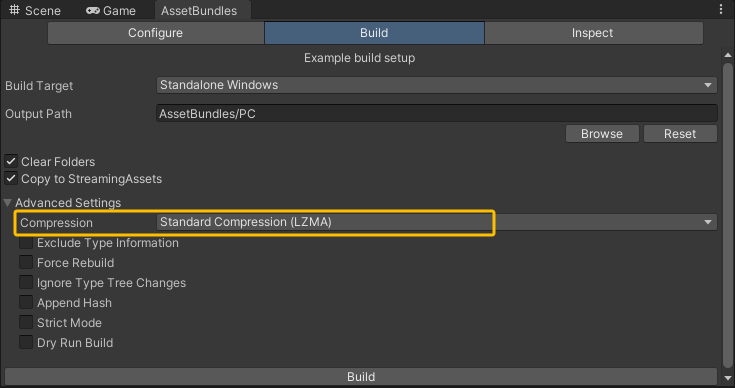

# AssetBundle

## 1 打包面板信息

### 1.1 AB包的压缩格式

- LZMA
  - 默认压缩方式，能使压缩文件达到最小。但由于其压缩方式是基于整个AssetBundle的数据流实现的，因此在对其解压时需将整个流进行解压。
- LZ4
  - 一种基于块的压缩算法，压缩文件比LZMA大，但在解压时只需要解压包含所请求资源的字节的块。
- No Compression
  - 不压缩。

### 1.2 AB包生成的文件

- 对应资源的文件
  - 资源AB包
  - manifest文件
    - 记录了AB包的文件信息
    - 加载时可以用来提供资源信息、资源依赖关系等等
- 关键文件（和定义的output文件同名）
  - 主包
  - manifest文件：记录AB包之间的依赖信息

## 2 加载AB包

