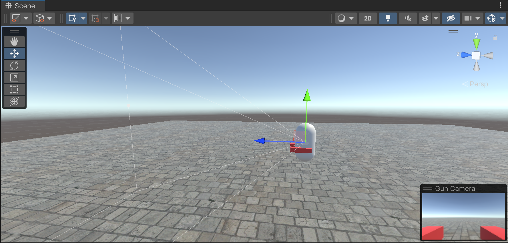

# Day1 人物移动和转向

## 1 人物移动

前提：人物模型上需要增加一个CharacterController组件。

```c#
using System.Collections;
using System.Collections.Generic;
using UnityEngine;

public class PlayerController : MonoBehaviour
{
    private CharacterController characterController;
    private float moveSpeed = 20.0f;
    private Vector3 moveDirction;

    private void Start() {
        characterController = transform.GetComponent<CharacterController>();
    }

    private void Update() {
        Move();
    }
    
    private void Move() {
        var h = Input.GetAxis("Horizontal");
        var v = Input.GetAxis("Vertical");

        moveDirction = (transform.right * h + transform.forward * v).normalized;
        characterController.Move(moveDirction*moveSpeed*Time.deltaTime);
    }
}
```

## 2 人物转向

第一人称视角的实现：把主相机作为人物的子物体，放置在人物身前，朝向人物面向的方向。



人物转向的实现：

- 横向的转向：改变人物的localRotation属性
- 纵向的转向：改变相机的localRotation属性

```c#
using System.Collections;
using System.Collections.Generic;
using UnityEngine;

public class CameraLookAt : MonoBehaviour
{
    private Transform playerTrans;
    private float maxVerticalAngle = 45f;   //纵轴最大旋转角
    private float rotateSpeed = 1000.0f;

    private void Start()
    {
        playerTrans = transform.parent;
    }

    private void Update()
    {
        AdjustCameraLookAt();
    }

    private void AdjustCameraLookAt()
    {
        //玩家绕y轴旋转（横向）
        var mouseX = Input.GetAxis("Mouse X") * rotateSpeed * Time.deltaTime;
        playerTrans.Rotate(Vector3.up * mouseX);

        //镜头绕x轴旋转（纵向）
        var mousePos = (Vector2)Input.mousePosition;
        var screenCenter = new Vector2(Screen.width / 2f, Screen.height / 2f);
        var offset = mousePos - screenCenter;
        var rotationX = (offset.y / (Screen.height / 2)) * maxVerticalAngle;
        transform.localRotation = Quaternion.Euler(-Mathf.Clamp(rotationX,-maxVerticalAngle,+maxVerticalAngle),0f, 0f);
    }
}
```

会发现上面调整角度的方法不太一样，我是这么考虑的：

- 对于左右转身的角度，我们希望当鼠标往左/右移动时，人物会以某个速度向对应的方向旋转。

- 而对于抬头低头的角度，我们发现它其实能够和鼠标在屏幕上的位置形成某种对应关系。

它们的区别：当鼠标位置回到屏幕中间，人物转身的角度不一定能回到初始角度，而人物抬头低头的角度一定回到初始角度。
