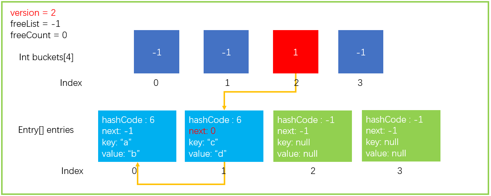

# 数据结构

## 浅析Dictionary

[参考文章](https://www.cnblogs.com/InCerry/p/10325290.html)

[源码](https://referencesource.microsoft.com/#mscorlib/system/collections/generic/dictionary.cs,d3599058f8d79be0)

Dictionary（字典）是C#的一个集合类，它可以通过Key/Value（键值对）的形式存放数据，是C#另一个集合类hashtable（哈希表）的泛型实现。它相对于其他数据结构如Array、List最大的优势是：查找元素的时间复杂度接近O(1)。

### 1 理论

#### 1.1 hash函数

hash函数帮助实现了时间复杂度为O(1)的高效查找。它将任意大小的输入（Key）转换为固定大小的输出（通常是整数），用于确定键值对在哈希表中的存储位置。

#### 1.2 hash碰撞

hash函数的其中一个特点是：不同数据经过hash计算后，其结果可能相同。这种现象称为哈希碰撞/哈希冲突。

#### 1.3 解决hash碰撞

常见的解决冲突的算法有：

- 开放定址法
  - 线性探测法：每次冲突后检查下一个连续的槽位，直到找到一个空槽。
  - 平方探测法：探测序列的间隔不是固定的，而是依次增大，通常按照平方增长。
  - 双重哈希：使用第二个哈希函数计算步长，确保探测序列的分布更均匀。
- **拉链法**（Dictionary采用的方法）
  -  在每个哈希槽位中，存储一个链表，将所有映射到同一槽位的元素存储在这个链表中。
  - 缺点：如果有很多冲突，链表可能变长，查找、插入、删除的平均时间复杂度会增加到O(n)（在最坏情况下）。
  - 优化：使用平衡二叉树（如红黑树）或其他数据结构替代链表，可以在冲突严重时优化性能。
- 再哈希法
  - 发生冲突就再次使用另一个哈希函数计算地址直到找到地址为止。
- 扩展哈希表
  - 当冲突频繁或者哈希表的负载因子过高时，增加哈希表的大小，然后重新哈希所有的元素到新的表中。
- ...

### 2 Dictionary的底层实现

#### 2.1 部分参数

##### 2.1.1 Entry结构体

```c#
private struct Entry {
    public int hashCode;    // 除符号位以外的31位hashCode值, 如果该Entry没有被使用，那么为-1
    public int next;        // 下一个元素的下标索引（辅助实现拉链法），如果没有下一个就为-1
    public TKey key;        // 存放元素的键
    public TValue value;    // 存放元素的值
}
```

##### 2.1.2 其他关键变量

```c#
private int[] buckets;		// Hash桶
private Entry[] entries;	// Entry数组，存放元素
private int count;			// 当前entries的index位置
private int version;		// 当前版本，防止迭代过程中集合被更改
private int freeList;		// 被删除Entry在entries中的下标index，这个位置是空闲的
private int freeCount;		// 有多少个被删除的Entry，有多少个空闲的位置
private IEqualityComparer<TKey> comparer;	// 比较器
private KeyCollection keys;		// 存放Key的集合
private ValueCollection values;		// 存放Value的集合
```

#### 2.2 初始化

```c#
// HashTable中预存的int类型的所有质数
public static readonly int[] primes = 
{3, 7, 11, 17, 23, 29, 37, 47, 59, 71, 89, 107, 131, 163, 197, 239, 293, 353, 431, 521, 631, 761, 919,1103, 1327, 1597, 1931, 2333, 2801, 3371, 4049, 4861, 5839, 7013, 8419, 10103, 12143, 14591,17519, 21023, 25229, 30293, 36353, 43627, 52361, 62851, 75431, 90523, 108631, 130363, 156437,187751, 225307, 270371, 324449, 389357, 467237, 560689, 672827, 807403, 968897, 1162687, 1395263,1674319, 2009191, 2411033, 2893249, 3471899, 4166287, 4999559, 5999471, 7199369};

private void Initialize(int capacity) {
	//调用HashTable的方法获取比字典容量大的最小质数，如果没有手动设置容量，程序会在Insert时以capacity = 0进行初始化，此时容量是0，但得到的size是3
    //选择质数，可以减少对buckets大小取余时哈希冲突的概率
	int size = HashHelpers.GetPrime(capacity);
    buckets = new int[size];
    for (int i = 0; i < buckets.Length; i++){
         buckets[i] = -1;
    }
    entries = new Entry[size];
    freeList = -1;
}
```

#### 2.3 Add

假设当前的Dictionary是这样的：


##### 2.3.1 正常添加

```c#
dict.Add("a","b");
```

接着会进行以下操作（这里的步骤并不完善，这样写是方便理解）：

```c#
//1.根据Key的值，计算对应的hashcode，这里我们假设结果为6
var hashcode = GetHashCode(key);
//2.得到落在桶中的索引
var bucketIndex = hashcode%buckets.Length;
//3.将对应信息存入entries，建立buckets->entries的映射
entries[count] = new Entry(){...};
buckets[bucketIndex] = count;
count++;

//4.集合发生了变化，所以版本需要+1。只有增加、替换和删除元素才会更新版本。
version++;
```

完成以上操作后，Dictionary更新为：


##### 2.3.2 哈希碰撞的解决

我们继续执行Add操作。

```c#
dict.Add("c","d");
```

这里我们假设`GetHashCode("c") = 6`，执行步骤1、2后桶的索引为2，此时buckets[2]!=-1，代表桶中已有数据，哈希碰撞发生。

此时Dictionary会在步骤3时执行这样的操作：

```c#
//...
entries[count] = new Entry(){
	//...
	next = buckets[bucketIndex];   //新数据的next指向此时buckets存放的数据，形成链表
};   
buckets[bucketIndex] = count;      //指向新数据
count++;
//...
```



#### 2.4 Remove

```c#
public bool Remove(TKey key) {
    if(key == null) {
        ThrowHelper.ThrowArgumentNullException(ExceptionArgument.key);
    }

    if (buckets != null) {
        // 1. 通过key获取hashCode
        int hashCode = comparer.GetHashCode(key) & 0x7FFFFFFF;
        // 2. 取余获取bucket位置
        int bucket = hashCode % buckets.Length;
        // last用于确定是否当前bucket的单链表中最后一个元素
        int last = -1;
        // 3. 遍历bucket对应的单链表
        for (int i = buckets[bucket]; i >= 0; last = i, i = entries[i].next) {
            if (entries[i].hashCode == hashCode && comparer.Equals(entries[i].key, key)) {
                // 4. 找到元素后，如果last< 0，代表当前是bucket中最后一个元素，那么直接让bucket内下标赋值为 entries[i].next即可
                if (last < 0) {
                    buckets[bucket] = entries[i].next;
                }
                else {
                    // 4.1 last不小于0，代表当前元素处于bucket单链表中间位置，需要将该元素的头结点和尾节点相连起来,防止链表中断
                    entries[last].next = entries[i].next;
                }
                // 5. 将Entry结构体内数据初始化
                entries[i].hashCode = -1;
                // *5.1 建立freeList单链表
                entries[i].next = freeList;
                entries[i].key = default(TKey);
                entries[i].value = default(TValue);
                // *6. 关键的代码，freeList等于当前的entry位置，下一次Add元素会优先Add到该位置
                freeList = i;
                freeCount++;
                // 7. 版本号+1
                version++;
                return true;
            }
        }
    }
    return false;
}
```

#### 2.5 Resize（扩容）

Dictionary扩容时，会申请新的容量的buckets、entries数组，然后将现有的元素拷贝到新的entries里。

需要注意的是，此时buckets和entries之间的映射丢失，需要重新建立：遍历entries，根据其中的hashcode，重新建立映射，next也需要重新修改。

#### 2.6 version的作用

帮助避免在迭代过程中发生集合修改：


