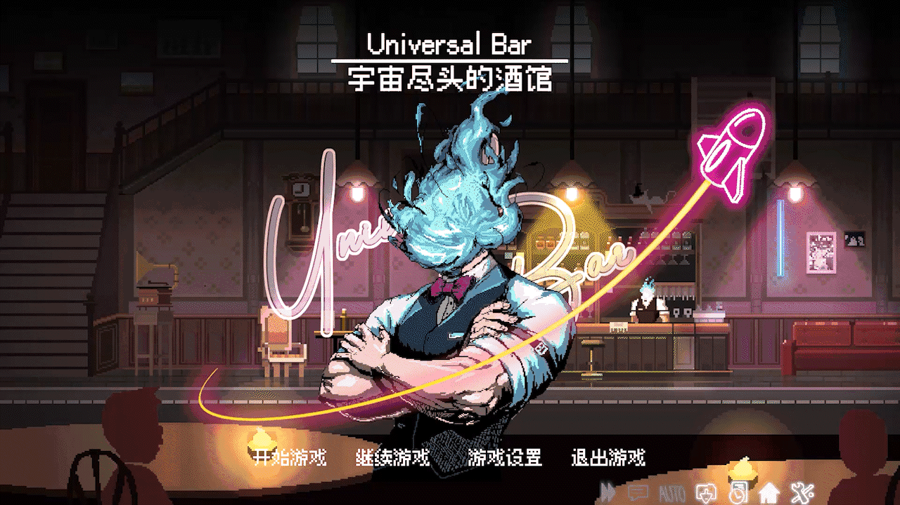
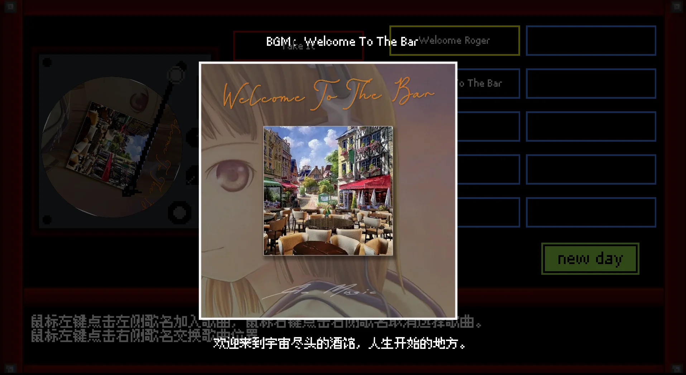
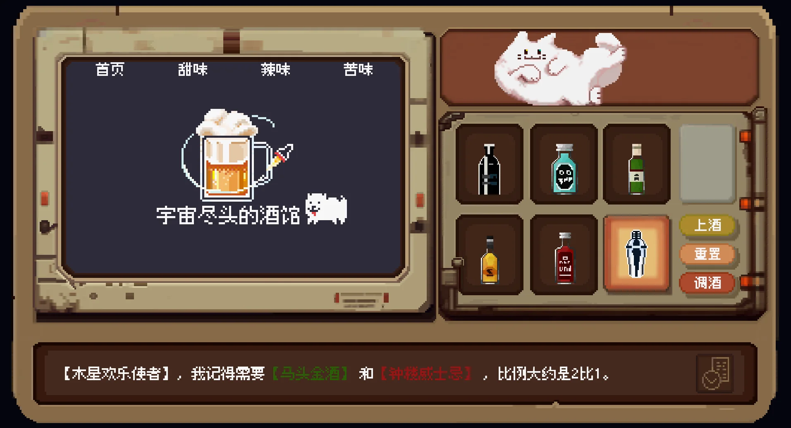
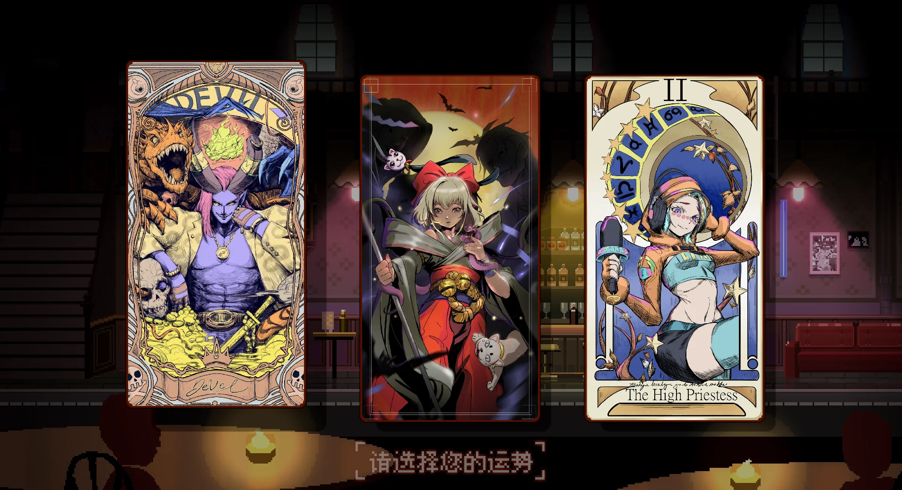
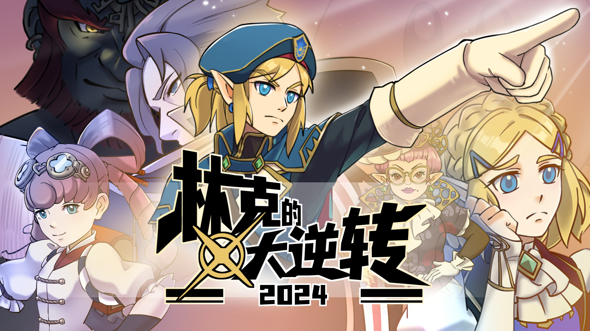
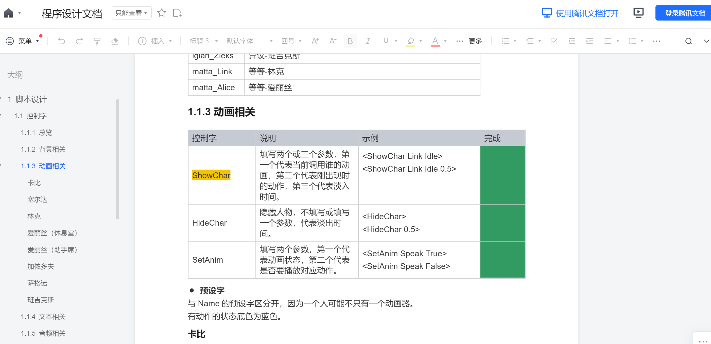
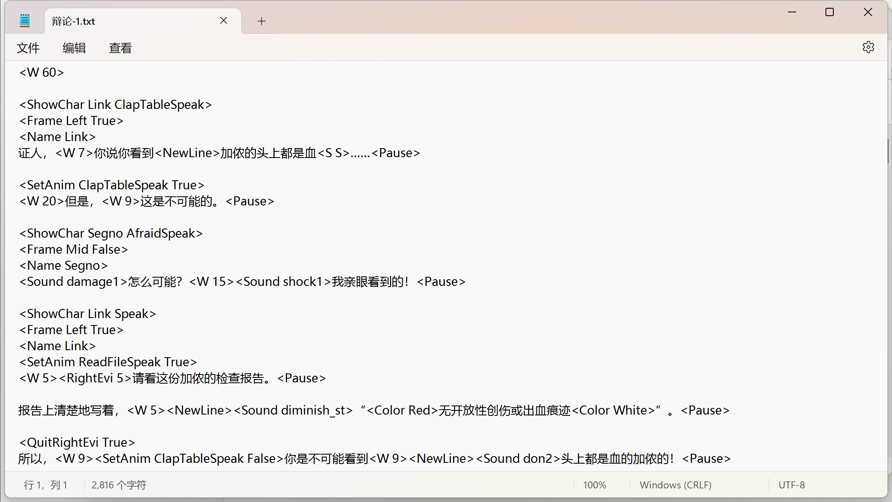
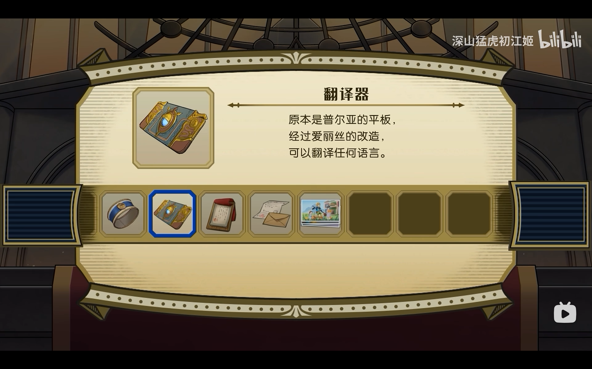
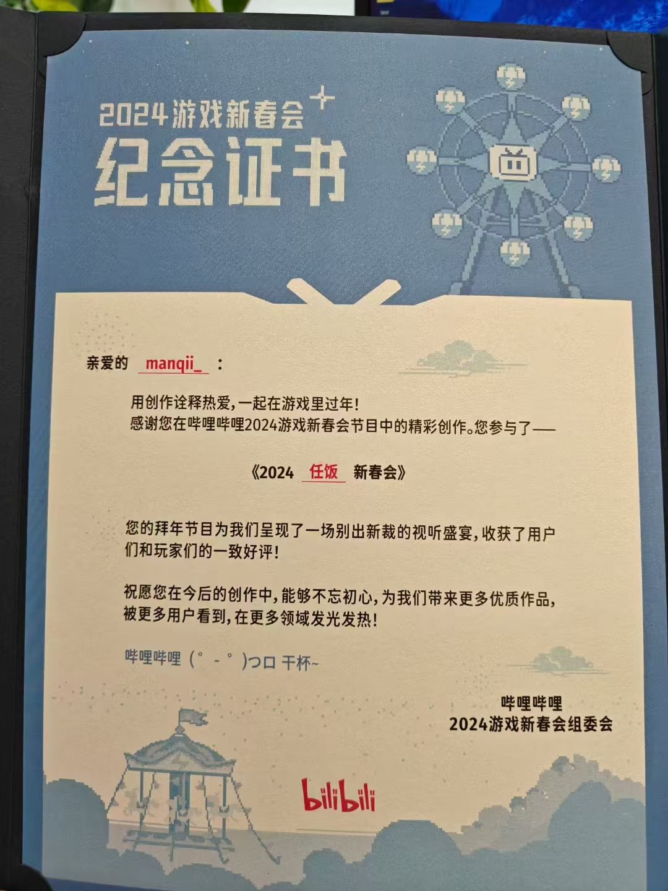
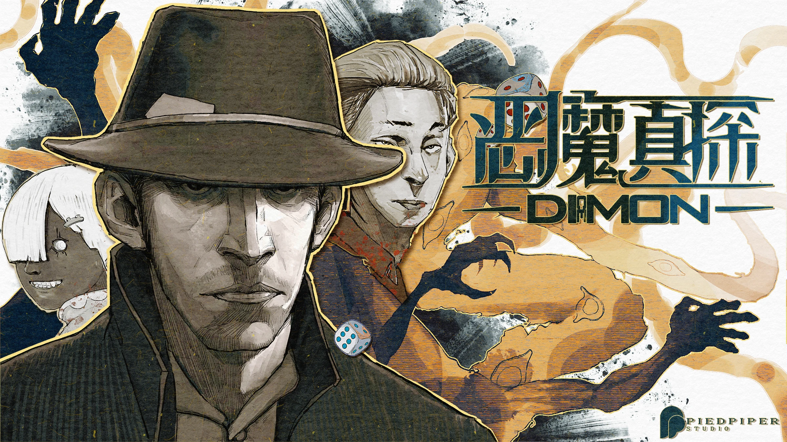

# 2023

## 宇宙尽头的酒馆

**链接**：[宇宙尽头的酒馆](https://www.gcores.com/games/113123)

**制作时间**：2023.9~2023.10

酒馆是我毕业之后做的第一款游戏，本科的时候沉迷于赛博朋克酒保行动，就一直想做一款酒保like游戏，后面当我决定参加机核9月份的BooomJam的时候，我发现机核群里机组的防门老师发了制作招募，定睛一看居然就是我想做的酒保like，于是我毫不犹豫地加入了。

整个游戏的制作过程非常愉快，身为制作人的防门老师有多次的制作经验，带领我们井然有序地结束了整个游戏的制作，程序组的小伙伴们也非常靠谱，我们各司其职，算得上是稳稳地完成了整个游戏的开发（这也为后面我们又一次合作参与了防门老师下一款游戏的程序制作埋下了伏笔：[第二次合作：少女奇旅](https://www.gcores.com/games/125872)）。

不过我在这次游戏的制作中负责的程序内容不多，主要是完成了小模块【音乐盒】的开发，主要功能是选择新一天需要轮询播放的音乐、预听音乐、查看音乐专辑的一些信息。

虽然工作比较简单，但我还是很享受的，音乐老师做的音乐真的很好听！:D

顺便再放点游戏内图片：

## 林克的大逆转2024

**链接**：[林克的大逆转2024](https://www.bilibili.com/video/BV1iB421z7ih/?spm_id_from=333.999.0.0&vd_source=d1cd7437519192c36dc659c247e8160e)

**制作日期**：2023.10~2024.1

林克的大逆转这个项目算是包圆了我23年剩余的时间。

一开始是在空间看到了任天堂新春会的招募海报。以前一般这种同人制作活动，我是完全搭不上关系的，毕竟我不懂cos，也不懂视频制作，总之就是没什么能端得上台面的才艺。但这次却不一样，我在招募海报里居然发现他们正在招募游戏程序。“终于轮到我大展身手了吗？”我心里想着这句话，狠狠点击加入群聊。

加入后我总算知道他们为什么要招募，因为23年春节的时候，他们也做了一个23年版的林克的大逆转，当时把视频制作的老师累得半死，后面他们寻思像这种逆转like，可能做成游戏会更省事一点，于是就开始找游戏程序。

这次制作让我懂得了一些AVG的制作流程（奇怪的技能点增加了），在AVG的制作中，有【脚本】这个概念，AVG的制作者会设计很多控制字，像写演出脚本一样，编写游戏的剧情逻辑。

当时的一些控制字设计和最终的脚本：

而我的工作，就是编写一个“自动化工具”，让它能够直接读取脚本，生成游戏程序。

经过组里大家的共同努力，项目稳稳落地，在春节的时候顺利播出。我也被这帮搞同人的震惊到，到底是有多热爱才能做到对游戏里的各种情节、角色、甚至是设计细节如数家珍的？（~~而我玩一个忘一个~~）

照例放点项目图片吧~

还有我的证书！

咱也算为老任的同人社区做出了一点贡献了，老任，我爱你啊！任天堂，我爱你啊！

# 2024

## 恶魔真探DICEMON

**链接**：[恶魔真探DICEMON](https://www.gcores.com/games/126397)

**制作日期**：2024.4~2024.5

