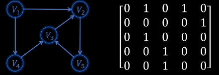
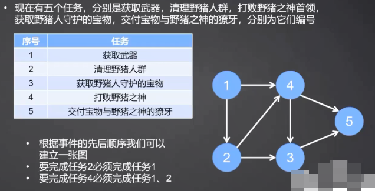
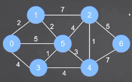
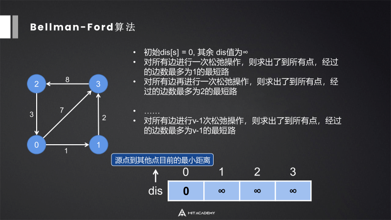
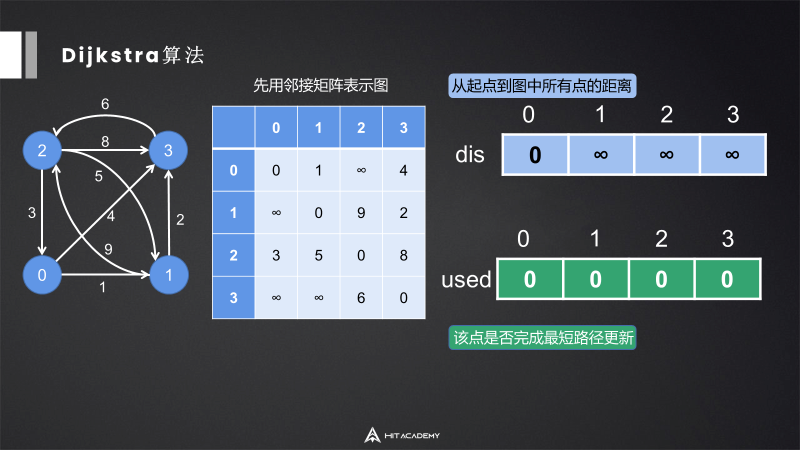
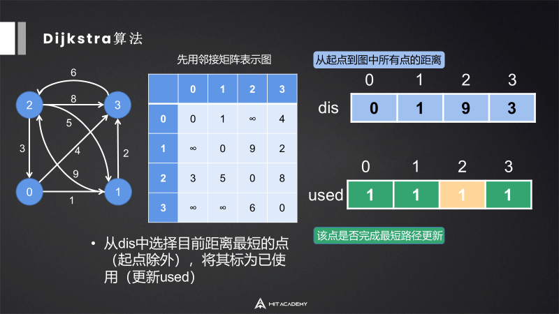

# 0 前言

[参考视频](https://www.bilibili.com/video/BV18C4y1A7JC?spm_id_from=333.788.videopod.sections&vd_source=befd430066becbcfc1acfbc4c2c0749c)

# 1 图的存储

## 1.1 邻接矩阵



**代码实现**

```c++
int matrix[n][m]; 
```

**优点**

- 容易判断两个顶点间是否有边
- 容易计算顶点的度

## 1.2 邻接表

```C++
// 定义一个vector数组
std::vector<int> adj[n];

//如果是带权图
std::vector<std::pair<int, int>> adj[n];
```

## 1.3 对比

degree是度的意思。

| **存储方案** | **空间复杂度** | **判断 i→j 是否有边** | **遍历所有邻居**   | **适用场景**       |
| ------------ | -------------- | --------------------- | ------------------ | ------------------ |
| **邻接矩阵** | $O(n^2)$       | **$O(1)$**            | $O(n)$             | 顶点数较少、稠密图 |
| **邻接表**   | **$O(n + e)$** | $O(degree(i))$        | **$O(degree(i))$** | 顶点数较多、稀疏图 |

# 2 图的遍历

## 2.1 深度优先搜索（DFS）

深度优先搜索 (Depth First Search, DFS) 是一种用于遍历或搜索树或图的算法。它的核心思想是“不撞南墙不回头”：从起始节点开始，沿着一条路径尽可能深地探索下去，直到无法继续（到达叶子节点或已访问节点），然后回溯到上一个节点，继续尝试探索其他分支。

DFS 遵循“深度优先”策略。在访问一个起始顶点 $v$ 后，它会依次从 $v$ 未被访问的邻接点出发，进行深度优先遍历。

- **数据结构**：DFS 本质上是利用了**栈 (Stack)** 的后进先出 (LIFO) 特性。在代码实现中，通常使用**递归**（隐式使用系统栈）或显式定义的 `std::stack`
- **状态标记**：为了防止在图中陷入死循环（环路），必须维护一个 `visited` 数组来记录哪些节点已经被访问过

## 2.2 广度优先搜索（BFS）

广度优先搜索 (Breadth First Search, BFS) 是一种按“层”推进的遍历算法。它从起始节点开始，先访问所有距离为 1 的邻居，再访问所有距离为 2 的邻居，以此类推。

BFS 遵循“横向扩展”策略。它会先均匀地向四周探索，只有当这一层的所有节点都被访问过后，才会进入下一层。

- **数据结构**：BFS 核心是利用了**队列 (Queue)** 的先进先出 (FIFO) 特性
- **状态标记**：与 DFS 一样，必须使用 `visited` 数组记录已访问节点，防止死循环
- **最短路径性质**：在**无权图**中，BFS 第一次到达某个节点时，所经过的路径长度一定是该节点到起点的**最短路径**

# 3 回路

## 3.1 欧拉回路

从一个点出发，刚好**经过每条边一次**，然后回到原点，每个点要有进有出，即每个点的度必须是偶数。

eg：一笔画问题。

## 3.2 汉密尔顿回路

从一个点出发，沿着边走，刚好**经过每个顶点一次**，之后回到出发点。

# 4 拓扑排序

有向无环图里所有顶点的线性序列，其中：

- 所有顶点出现且只出现一次
- 若存在一条A->B的路径，序列中A一定在B前面



如何找拓扑排序：

- 从图里选择一个没有前驱（入度为0）的顶点
- 从该图中删除该顶点和以它为起点的有向边

每个有向无环图有一个或多个拓扑排序。

# 5 最小生成树

最小生成树使图联通并且所有边的权值之和最小。



## 5.1 Prim算法

普利姆算法。

- 从任意节点出发来寻找最小生成树
- 某个点加入到被选取的点中后，解锁这个点出发的所有新的边
- 在所有解锁的边中选最小的边，然后看看这个边会不会形成环
- 如果会，不要当前边，继续考察剩下解锁的边中最小的边，重复3）
- 如果不会，要当前边，将该边的指向点加入到被选取的点中，重复2
- 当所有点都被选取，最小生成树就得到了

## 5.2 Kruskal算法

克鲁斯卡尔算法。

- 总是从权值最小的边开始考虑，依次考察权值依次变大的边
- 当前的边要么进入最小生成树的集合，要么丢弃
- 如果当前的边进入最小生成树的集合中不会形成环，就要当前边
- 如果当前的边进入最小生成树的集合中会形成环，就不要当前边
- 考察完所有边之后，最小生成树的集合也得到了

# 6 最短路径

某点到某点的最短路径。

## 6.1 Floyd算法

弗洛伊德算法。

特点：多源算法，一次性计算出所有点之间相互的最短距离，可以处理负权边。

Floyd算法的核心是动态规划，阐述为：i到j的最短距离要么等于i直接到j的距离，要么等于i间接到j的距离。

即：
$$
dis[i][j] = Math.Min(dis[i][j],dis[i][k]+dis[k][j]);
$$

```c#
for(int k=0;k<n;k++){
	for(int i=0;i<n;i++){
		for(int j=0;j<n;j++){
			if(dis[i][k]+dis[k][j]<dis[i][j]){
                dis[i][j] = dis[i][k]+dis[k][j];
                path[i][j] = path[k][j];
            }
		}
	}
}
```

path[0,4] = 3。

path[0,3] = 0，结束，那么路径为0->3->4。

## 6.2 Bellman-Ford算法

特点：单源算法，动态规划，可以处理负权边。

松弛操作：只经过一条边可以到达哪些点。



## 6.3 Dijkstra算法

迪杰斯特拉算法。

单源算法，不可以处理负权边，因为dijkstra的本质是贪心，如果出现负权边，那么已经完成过最短路径更新的点可能被推翻。

不断选择离已经相连的点最近的点。





## 6.4 区别

|              | **Floyd**              | **Bellman-Ford**       | **Dijkstra**           |
| ------------ | ---------------------- | ---------------------- | ---------------------- |
| 时间复杂度   | $O(V^3)$               | $O(V*E)$               | $O(V^2)$               |
| 空间复杂度   | $O(V^2)$               | $O(V)$                 | $O(V^2)$               |
| 源数         | 多源                   | 单源                   | 单源                   |
| 负权处理能力 | 负权边  √  负权回路  × | 负权边  √  负权回路  × | 负权边  ×  负权回路  × |

## 6.4 A*算法

[视频](https://www.bilibili.com/video/BV1bv411y79P/?spm_id_from=333.337.search-card.all.click&vd_source=befd430066becbcfc1acfbc4c2c0749c)

核心：代价公式$f(n) = g(n) + h(n)$

这是 A* 的灵魂，决定了算法下一步该往哪走：

- **$g(n)$**：**实际代价**。从起点到当前节点 $n$ 的真实距离（已经走过的路）
- **$h(n)$**：**启发代价**（Heuristic）。从当前节点 $n$ 到终点的**估计**距离（还没走但预测要走的路）
- **$f(n)$**：**综合代价**。A* 每次都会挑选 $f(n)$ 最小的节点进行扩展

三种常见的启发函数（在不同的地图下，我们要选择不同的启发函数）：

- 曼哈顿距离

  - 场景：只能上下左右走

  - 公式：$|x_1 - x_2| + |y_1 - y_2|$

- 对角距离

  - 场景：八向走位
  - 假设 $dx = |x_2 - x_1|$，$dy = |y_2 - y_1|$
  - 公式：$$h(n) = \sqrt{2} \cdot \min(dx, dy) + 1 \cdot |dx - dy|$$

- 欧几里得距离

  - 场景：可以任意角度飞行（直线距离）

  - 公式：$\sqrt{(x_1-x_2)^2 + (y_1-y_2)^2}$


