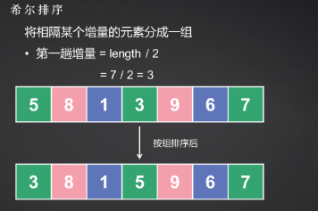
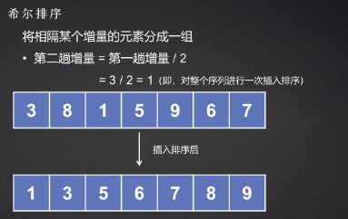
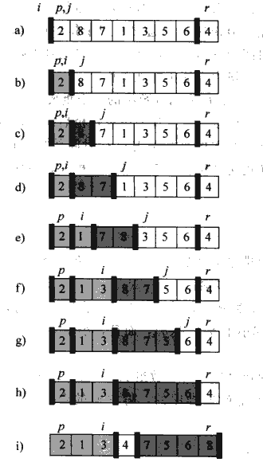
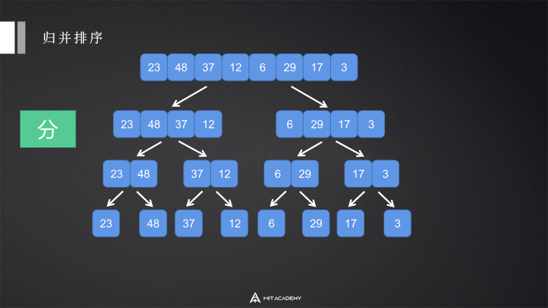
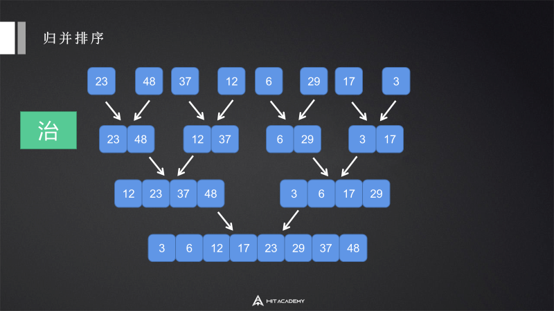
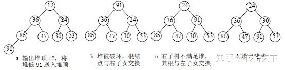
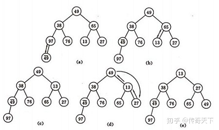
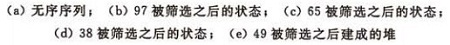

# 0 前言

本文代码部分主要基于C++语言，因为我平时用C#比较多，所以也增加了部分C#知识点。

# 1 稳定性

排序算法的稳定性指的是：对于两个相等的数据，它们的先后顺序在排序结束后依旧保持原样。

# 2 插入排序 insertionSort

## 2.1 描述

它的工作原理很像我们平时打扑克牌时整理手牌的过程：每摸到一张新牌，都会将其插入到左手已经排好序的牌堆中，直至所有的牌都在手里排列整齐。

```C++
std::array<int,3> temp = {2,3,1};
// 假设{}内为已排序部分
// 初始 {2},3,1
// 一次 {2,3},1
// 二次 {1,2,3}
```

## 2.2 实现

```c++
#include <vector>
void insertionSort(std::vector<int>& arr) {
    int n = arr.size();
    for (int i = 1; i < n; ++i) {
        int key = arr[i];
        int j=i;
        while(j>=1&&arr[j-1]>key){
            arr[j] = arr[j-1];
            --j;
        }
        arr[j] = key;
    }
}
```

## 2.3 评价

- 稳定
- 时间复杂度
  - $1+2+3+...+(n-1)=\frac{n^2}{2}=O(n^2)$
- 空间复杂度
  - $O(1)$

# 3 希尔排序 shellSort

## 3.1 描述

希尔排序也称“缩小增量排序”，是插入排序的一种更高效的改进版本，是第一批突破$O(n^2)$时间复杂度的排序算法之一。

它的核心思想是“远距离的插入排序”。传统的插入排序每次只能将元素移动 **1** 位。如果一个很小的数在数组末尾，它必须经过多次比较和移动才能到达开头。希尔排序通过引入**增量（gap）**的概念，让元素可以“跳跃式”地移动：

- 将整个序列按照一定的间隔（增量）分成若干子序列
- 对每个子序列进行插入排序
- 逐渐缩小增量，重复步骤
- 最后当增量为1时，对全体元素进行一次标准插入排序

**增量（Gap）**的概念：

希尔排序的关键在于**增量序列**。常用的增量定义是 $gap = \lfloor length/2 \rfloor$，每轮减半，直到 $gap = 1$。





## 3.2 实现

```c++
#include <vector>
void shellSort(std::vector<int>& arr) {
    int n = arr.size();
    for(int gap=n/2;gap>=1;gap/=2){
        // 可以看出，里层是增量改为gap的插入排序
        for(int i=gap;i<n;++i){
            int key = arr[i];
            int j=i;
            while(j>=gap&&arr[j-gap]>key){
                arr[j] = arr[j-gap];
                j-=gap;
            }
            arr[j] = key;
        }
    }
}
```

## 3.3 评价

- 不稳定
- 时间复杂度
  - $O(n^{1.3...2})$（取决于增量选择）
- 空间复杂度
  - $O(1)$

## 3.4 优化：不同的增量选择

希尔排序的效率几乎完全取决于**增量序列（Gap Sequence）**的选择。

希尔最初建议的序列（$N/2, N/4, \dots, 1$）虽然简单，但在最坏情况下仍会退化到 $O(n^2)$。这是因为这种序列的项之间往往不是互质的，导致较小的增量可能在重复排序之前已经处理过的元素。

### 1 Hibbard 增量序列

- 公式：$1, 3, 7, \dots, 2^k - 1$ (即 $gap_i = 2^i - 1$)
- 最坏时间复杂度：$O(n^{1.5})$
- 特点：这个序列避免了希尔增量中“偶数位置元素在最后一步前从不交换”的问题。因为相邻项互质，它能比原始序列更早地让序列变得“基本有序”

### 2 Knuth 增量序列

- 公式：$1, 4, 13, \dots, \frac{3^k - 1}{2}$ (即 $gap_{i+1} = 3 \cdot gap_i + 1$)
- 最坏时间复杂度：$O(n^{1.5})$
- 特点：这是计算机科学家 Donald Knuth 推荐的序列。在实际应用中，它在中小规模数据上的表现非常出色

### 3 Sedgewick 增量序列（目前已知最优之一）

- 公式：通过两个公式交替生成：
  - $9 \cdot 4^i - 9 \cdot 2^i + 1$
  - $4^i - 3 \cdot 2^i + 1$
- 序列值：1, 5, 19, 41, 109, 209...
- 最坏时间复杂度：$O(n^{1.3})$
- 特点：这是目前最常用的高性能序列之一。实验证明，在 $n$ 达到数万时，它的性能表现优于以上所有序

如何在代码里应用？以Knuth序列为例：

```c++
void shellSortKnuth(std::vector<int>& arr) {
    int n = arr.size();
    int gap = 1;
    
    // 1. 生成初始增量：1, 4, 13, 40... 找到不大于 n/3 的最大值
    while (gap < n / 3) {
        gap = 3 * gap + 1;
    }

    // 2. 开始排序
    while (gap >= 1) {
        for (int i = gap; i < n; i++) {
            int key = arr[i];
            int j = i;
            while (j >= gap && arr[j - gap] > key) {
                arr[j] = arr[j - gap];
                j -= gap;
            }
            arr[j] = key;
        }
        // 3. 按照 Knuth 规律缩小增量
        gap /= 3;
    }
}
```

# 4 冒泡排序 bubbleSort

## 4.1 描述

冒泡排序通过**相邻元素的比较和交换**，使较大的元素逐渐向后移动。

- **一次冒泡**：从左到右比较相邻的两个元素。如果左边比右边大，就交换位置。
- **重复进行**：每进行一轮冒泡，当前未排序部分中“最大”的元素就会被推到最后的位置。

## 4.2 实现

```c++
#include <utility>
#include <vector>
void bubbleSort(std::vector<int>& arr){
    int n = arr.size();
    for(int i=0;i<n-1;++i){
        bool isSwap = false;
        for(int j=0;j<arr.size()-1-i;++j){
            if(arr[j]>arr[j+1]){
                std::swap(arr[j],arr[j+1]);
                isSwap = true;
            }
        }
        // 如果本轮没有发生交换，说明提前有序，直接退出排序
        if(!isSwap){
            break;
        }
    }
}
```

## 4.3 评价

- 稳定
- 时间复杂度
  - $O(n^2)$
- 空间复杂度
  - $O(1)$

# 5 快速排序 quickSort

## 5.1 描述

**快速排序是冒泡排序的改进**（本质上都是交换排序），但快速排序通过引入跳跃式交换和分治，彻底解决了冒泡排序的核心痛点。

怎么理解改进：

- 从相邻交换到跨度交换
  - 冒泡排序只能相邻两个元素进行比较和交换，如果要让一个极小的数从数组末尾回到开头，它必须像“气泡”一样，一格一格地游过去。每一轮遍历只能确保一个元素到达正确位置
  - 快速排序通过选择一个基准（pivot），一次性将所有比基准小的数交换到左边，右边留下比基准大的数，这种跨距离交换大大减少了总的交换次数
- 消除冗余比较
  - 冒泡排序每一轮扫描都很盲目，即便某些区域已经局部有序，由于它缺少全局视角，仍然需要重复进行相邻比较
  - 快速排序则利用了分治策略，一旦基准点确定，左右区域彻底隔离，左边的数永远不需要和右边的数再进行比较

快速排序的核心在于“分区”操作，它的逻辑如下：

- 挑选基准（pivot）：从数组中选出一个元素作为基准
- 分区：重新排列数组，把比基准**小**的元素挪到它左边，比基准**大**的挪到它右边
- 递归：对基准左边和右边的子数组分别重复上述过程，直到子数组长度为 1 或 0



## 5.2 实现

```c++
#include <utility>
#include <vector>
//分区
int partition(std::vector<int>& arr,int low,int high){
    int pivot = arr[high];   //选最后一个元素作为基准值
    int i=low-1;
    for(int j=low;j<high;++j){
        if(arr[j]<pivot){
            ++i;
            std::swap(arr[j],arr[i]);
        }
    }
    //把基准值换到中间
    std::swap(arr[high],arr[i+1]);
    return i+1;
}
void quickSort(std::vector<int>& arr,int low,int high){
    if(low<high){
        int pi = partition(arr, low, high);
        //递归处理
        quickSort(arr, low, pi-1);
        quickSort(arr, pi+1, high);
    }
}
```

## 5.3 评价

- 不稳定
  - 举例：例如$5_a$ $5_b$ 1这个例子，以1为基准值，完成一次排序后变为：1 $5_b$ $5_a$
- 时间复杂度
  - $O(nlogn)$
- 空间复杂度
  - 原地排序，但递归有额外空间消耗
  - $O(logn)$（快速排序的递归树像一棵平衡二叉树，深度为$log_2n$，如果选择基准不当导致最坏情况，二叉树会呈一条直线，空间复杂度退化到$O(n^2)$）

## 5.4 优化

主要目的是为了解决快排在面临近乎有序的数组时，性能退化到$O(n^2)$的问题（递归树长度增加）。

### 5.4.1 基准值选择优化

#### 1 随机基准

```C++
void selectPivotRandomly(vector<int>& nums,int low,int high){
	int randomIndex = low+rand()%(high-low+1);
    swap(nums[randomIndex],nums[high]);
}
```

#### 2 三数取中法

```c++
void selectMidOfThree(std::vector<int>& arr, int low, int high) {
    int mid = low + (high - low) / 2;
    
    // 将三者排序：arr[low] <= arr[mid] <= arr[high]
    if (arr[low] > arr[mid]) std::swap(arr[low], arr[mid]);
    if (arr[low] > arr[high]) std::swap(arr[low], arr[high]);
    if (arr[mid] > arr[high]) std::swap(arr[mid], arr[high]);
    
    // 此时 arr[mid] 变成了三数里的中位数
    // 习惯上将其换到 high-1 或 high 位置，方便后续 partition
    std::swap(arr[mid], arr[high]);
}
```

### 5.4.2 分区方法优化

我们上面使用的分区方法是单路划分，在数组中全是重复元素时会退化到$O(n^2)$。

#### 1 双指针分区

它通过两个指针从区间的两端向中间靠拢，当左侧指针遇到比pivot大的元素，右侧指针遇到比pivot小的元素时，进行交换。关键点是即使遇到和pivot相等的元素也进行交换。

这样首先可以减少不必要的交换：

对于单路划分来说，每遇到一个比基准值（pivot）小的元素，都要进行一次 `Swap`。即便这个元素已经在正确的位置上了，它还是可能被无意义地交换。

但是如果是双指针分区，它只有在左边发现一个“大的”且右边发现一个“小的”时，才进行一次交换。这意味着它跨越了很长的距离才动一次手，交换次数显著减少。

其次，对重复元素的处理也更优：

单路划分：如果数组中有很多重复元素（比如全是 `1`），单路划分会将所有元素都划分到 pivot 的同一侧。这会导致递归树极度倾斜，复杂度直接从 $O(n \log n)$ 退化到 **$O(n^2)$**。

双指针分区：在实现得当的情况下（即遇到等于 pivot 的值也停止移动指针并交换），它能强行将重复元素均匀地分配到左右两边（主要是可以让指针遇到大部分重复元素时能停到中间部分）。

```c++
int partition(vector<int>& nums, int low, int high) {
    // 1. 优化：随机选取基准值并换到 high 位置
    int randomIndex = low + rand() % (high - low + 1);
    swap(nums[high], nums[randomIndex]);
    
    int pivot = nums[high]; // 基准值选在末尾
    int i = low;            // 左指针从起点开始
    int j = high - 1;       // 右指针从基准值前一个位置开始

    while (true) {
        // 2. 左指针向右移，找大于或等于 pivot 的数
        while (i <= j && nums[i] < pivot) i++;
        
        // 3. 右指针向左移，找小于或等于 pivot 的数
        while (i <= j && nums[j] > pivot) j--;

        // 4. 指针相遇或越界，结束循环
        if (i >= j) break;

        // 5. 交换并移动指针
        swap(nums[i], nums[j]);
        i++;
        j--;
    }

    // 6. 将基准值换到 i 的位置
    // 此时 nums[i] 是一定大于或等于 pivot 的数（或是 i 越过了 j）
    swap(nums[high], nums[i]);
    return i;
}
```

#### 2 三路划分

重复元素处理王者。

普通的划分（如单向或双指针）只能将数组分为“小于等于”和“大于”两部分，而三路划分能直接将数组切分为三个区间：小于基准值、等于基准值、大于基准值。

我们需要三个指针来维持这个结构：

- **`lt` (less than)**：指向“等于区”的第一个元素
- **`gt` (greater than)**：指向“等于区”的最后一个元素
- **`i` (iterator)**：当前扫描的元素

具体操作逻辑：

- 如果 `nums[i] > pivot`：将 `nums[i]` 与 `nums[lt]` 交换，`i` 和 `lt` 同时向右移动一位。（*注：此处以升序为例，若降序则逻辑反转*）
- 如果 `nums[i] < pivot`：将 `nums[i]` 与 `nums[gt]` 交换，`gt` 向左移动一位，但 **`i` 不动**（因为从右边换过来的数还没检查过）。
- 如果 `nums[i] == pivot`：不需要交换，直接 `i++`。

```c++
void quickSort3Way(vector<int>& nums, int low, int high) {
    if (low >= high) return;

    // 1. 随机化并交换到末尾
    swap(nums[high], nums[low + rand() % (high - low + 1)]);
    int pivot = nums[high];

    // 2. 初始化三路指针
    int lt = low;      // 小于区的待填入位置
    int i = low;       // 扫描指针
    int gt = high - 1; // 大于区的待填入位置（避开 high 位置的 pivot）

    while (i <= gt) {
        if (nums[i] < pivot) {
            // 小于基准：换到左边，lt 和 i 同时右移
            swap(nums[i++], nums[lt++]);
        } else if (nums[i] > pivot) {
            // 大于基准：换到右边，gt 左移，i 不动（检查换过来的数）
            swap(nums[i], nums[gt--]);
        } else {
            // 等于基准：直接跳过
            i++;
        }
    }

    // 3. 将基准值从末尾换到“等于区”的右边界
    // 此时 i 指向的是第一个大于 pivot 的元素，或是越过了 gt
    swap(nums[high], nums[i]);
    
    // 此时区间分布：
    // [low, lt-1] < pivot
    // [lt, i] == pivot  (注意此处 i 已经换回了 pivot，所以等于区终点是 i)
    // [i+1, high] > pivot

    // 4. 递归处理
    quickSort3Way(nums, low, lt - 1);
    quickSort3Way(nums, i + 1, high);
}
```

# 6 归并排序 mergeSort

## 6.1 描述

归并排序是一种基于分治的排序算法。





## 6.2 实现

```c++
#include <vector>

void merge(std::vector<int>& arr, int left, int mid, int right) {
    std::vector<int> temp(right - left + 1);
    int i = left;
    int j = mid + 1;
    int k = 0;

    while (i <= mid && j <= right) {
        if (arr[i] <= arr[j]) {
            temp[k++] = arr[i++];
        } else {
            temp[k++] = arr[j++];
        }
    }

    while (i <= mid) temp[k++] = arr[i++];
    while (j <= right) temp[k++] = arr[j++];

    for (int p = 0; p < temp.size(); ++p) {
        arr[left + p] = temp[p];
    }
}

void mergeSort(std::vector<int>& arr, int left, int right) {
    if (left >= right) return;
    int mid = left + (right - left) / 2;
    mergeSort(arr, left, mid);
    mergeSort(arr, mid + 1, right);
    merge(arr, left, mid, right);
}
```

## 6.3 评价

- 稳定
- 时间复杂度
  - 始终为$O(nlogn)$
- 空间复杂度
  - $O(n)$（需要一个和原数组一样大的辅助空间）

# 7 选择排序 selectSort

## 7.1 描述

核心思想是不断地从“未排序序列”中找最小或者最大的元素，放到“已排序序列”的末尾。

## 7.2 实现

```c++
#include <utility>
#include <vector>
void selectSort(std::vector<int>& arr){
    int n = arr.size();
    for(int i=0;i<n-1;++i){
        int min = i;
        for(int j=i+1;j<arr.size();++j){
            if(arr[j]<arr[min]){
                min = j;
            }
        }
        if(min!=i){
            std::swap(arr[i],arr[min]);
        }
    }
}
```

## 7.3 评价

- 不稳定
  - 例如$5_a$ $5_b$ 1，排序后变为 1 $5_b$ $5_a$
- 时间复杂度
  - $O(n^2)$
- 空间复杂度
  - $O(1)$

## 7.4 选择排序VS冒泡排序

一般选择排序更快一点，因为每一次排序里，冒泡排序每一对相邻元素不满足条件都要进行交换，交换频率很高，而选择排序只需要交换一次。

# 8 堆排序 heapSort

## 8.1 描述

堆排序是选择排序的极高效进化，在选择排序中，我们为了找最小值需要遍历整个数组（$O(n)$），但堆排序利用了一种特殊的数据结构，将找最小值的时间缩短到了$O(logn)$。

堆对应一棵完全二叉树，且所有非叶结点的值均不大于（或不小于）其子女的值，根结点（堆顶元素）的值是最小（或最大）的，每次都取堆顶的元素，将其放在序列最后面，然后将剩余的元素重新调整为最小（大）堆，依次类推，最终得到排序的序列。

堆排序分为大顶堆和小顶堆排序。**大顶堆**：堆对应一棵完全二叉树，且所有非叶结点的值均不小于其子女的值，**根结点（堆顶元素）的值是最大的**。而**小顶堆**正好相反，小顶堆：堆对应一棵完全二叉树，且所有非叶结点的值均不大于其子女的值，**根结点（堆顶元素）的值是最小的。**

实现堆排序需解决两个问题：

- 如何将n个待排序的数建成堆?
- 输出堆顶元素后，怎样调整剩余n-1个元素，使其成为一个新堆?

首先讨论第二个问题：输出堆顶元素后，怎样对剩余n-1元素重新建成堆？

调整**小顶堆**的方法：

- 设有m 个元素的堆，输出堆顶元素后，剩下m-1 个元素。将堆底元素送入堆顶（（最后一个元素与堆顶进行交换），堆被破坏，其原因仅是根结点不满足堆的性质。
- 将根结点与左、右子树中较小元素的进行交换。
- 若与左子树交换：如果左子树堆被破坏，即左子树的根结点不满足堆的性质，则重复方法 （2）.
- 若与右子树交换，如果右子树堆被破坏，即右子树的根结点不满足堆的性质。则重复方法 （2）.
- 继续对不满足堆性质的子树进行上述交换操作，直到叶子结点，堆被建成。

　　称这个自根结点到叶子结点的调整过程为筛选。如图：



再讨论第一个问题，如何将n 个待排序元素初始建堆？建堆方法：对初始序列建堆的过程，就是一个反复进行筛选的过程。

- n 个结点的完全二叉树，则最后一个结点是第n/2个结点的子树。

- 筛选从第n/2个结点为根的子树开始，该子树成为堆。
- 之后向前依次对各结点为根的子树进行筛选，使之成为堆，直到根结点。

　　如图建堆初始过程：无序序列：（49，38，65，97，76，13，27，49）






## 8.2 实现

升序数组用大顶堆排序。

实现步骤：

- 建堆：将一个无序数组调整为大顶堆
- 交换：将堆顶元素（最大值）放置数组末端（从堆中去除），此时，最大值已经回到了它最终应该在的位置
- 重建堆：由于第二步交换将数组末端的数交换到了堆顶，破坏了原来的堆结构，因此我们需要对剩余部分进行堆重建
- 重复2/3，直至堆大小变为1

```c++
#include <utility>
#include <vector>
#include <algorithm>

//下沉指定值
void adjustHeap(std::vector<int>& arr,int start,int last){
    int root = start;
    int temp = arr[root]; // 先把父节点存起来，腾出一个“空穴”
    int child = root * 2 + 1;

    while (child <= last) {
        // 在左右子节点中找较大的那个
        if (child + 1 <= last && arr[child] < arr[child + 1]) {
            ++child;
        }

        // 如果较大的子节点比“空穴”里的值大
        if (arr[child] > temp) {
            arr[root] = arr[child]; // 子节点向上覆盖，空穴下移到 child 位置
            root = child;
            child = root * 2 + 1;
        } else {
            // 父节点的值已经大于等于子节点，找到位置了
            break;
        }
    }
    arr[root] = temp; // 最后将最初的父节点值填入最终的空穴
}

void createHeap(std::vector<int>& arr){
    int lastIndex = arr.size()-1;
    int lastParentIndex = (lastIndex-1)/2; // 最后一个非叶子节点
    for(int i=lastParentIndex;i>=0;--i){
        adjustHeap(arr,i,lastIndex);
    }
}

void heapSort(std::vector<int>& arr) {
    if(arr.size()<=1){
        return;
    }

    // 建堆
    createHeap(arr);
    // 交换&重建
    for(int i=arr.size()-1;i>0;--i){
        // 把最大值交换到末尾
        std::swap(arr[0],arr[i]);
        adjustHeap(arr, 0, i-1);
    }
}
```

## 8.3 评价

- 不稳定
- 时间复杂度
  - 始终为$O(nlogn)$，建堆是$O(n)$，n-1次调整是$O(nlogn)$
- 空间复杂度
  - $O(1)$

# 9 常用排序方法比对表

| **算法名称** | **平均时间复杂度** | **最坏时间复杂度** | **空间复杂度** | **稳定性** |
| ------------ | ------------------ | ------------------ | -------------- | ---------- |
| **插入排序** | $O(n^2)$           | $O(n^2)$           | $O(1)$         | **稳定**   |
| **希尔排序** | $O(n^{1.3})$       | $O(n^2)$           | $O(1)$         | 不稳定     |
| **冒泡排序** | $O(n^2)$           | $O(n^2)$           | $O(1)$         | **稳定**   |
| **选择排序** | $O(n^2)$           | $O(n^2)$           | $O(1)$         | 不稳定     |
| **快速排序** | $O(n \log n)$      | $O(n^2)$           | $O(\log n)$    | 不稳定     |
| **归并排序** | $O(n \log n)$      | $O(n \log n)$      | $O(n)$         | **稳定**   |
| **堆排序**   | $O(n \log n)$      | $O(n \log n)$      | $O(1)$         | 不稳定     |
| **内省排序** | $O(n \log n)$      | $O(n \log n)$      | $O(\log n)$    | 不稳定     |

# 10 C++里的排序工具

## 10.1 std::sort()

**内省排序，不稳定，时间复杂度为$O(nlogn)$。**它是一个“三位一体”的混合算法，旨在平衡快排的速度和堆排的稳定性。

底层

- 第一阶段：快速排序 (Quick Sort)
  - 默认使用快排。为了避免 $O(n^2)$ 的最坏情况，它通常采用 “三数取中法”（取首、尾、中三个数的中位数作为基准）来平衡分区
- 第二阶段：堆排序 (Heap Sort) 作为保底
  - 这是 sort 聪明的地方。它会维护一个递归深度计数器。如果递归层数超过了 $\log N$ 的某个倍数，它认为当前的快排分区效率太低（可能退化），于是立刻切换到 堆排序。因为堆排序在最坏情况下也能保证 $O(n \log n)$
- 第三阶段：插入排序 (Insertion Sort) 收尾
  - 当分区缩小到一定阈值（通常是 16 个元素以内）时，算法停止递归，转而使用 插入排序。因为在小规模数据下，插入排序没有递归开销且缓存友好，速度反而是最快的

**使用**

```c++
vector<int> v = {3, 1, 4, 1, 5, 9};
// 默认升序
sort(v.begin(), v.end()); 
// 自定义降序 (使用 Lambda)
sort(v.begin(), v.end(), [](int a, int b) { 
    // 当a和b满足什么条件时，a会排在b前面
    // 这里规定了当a大于b时，a会排在b前面，因此时降序
    return a > b; 
}); 
```

## 10.2 std::stable_sort()

**归并排序的变体，稳定，时间复杂度为$O(nlogn)$。**

底层

- 主算法
  - 归并排序，它会尝试申请一块和原数组一样大的辅助空间进行归并

- 自适应策略

  - **内存充足**：执行标准的 $O(nlog n)$ 归并

  - **内存不足**：如果系统无法分配辅助空间，它会退而求其次，改用一种复杂的、在原地进行的归并算法，虽然不需要额外空间，但时间复杂度会退化到 $O(nlog^2 n)$

- 优化
  - 在子区间很小时，它同样会切换到插入排序来提升性能

## 10.3 只要前K名：std::partial_sort

**底层使用堆排序，不稳定，时间复杂度为$O(nlogk)$。**它会将前 $k$ 个最小元素排好序放在数组开头，剩下的元素乱序留在后面。

底层

- 取原数组的前K个元素，建立一个大顶堆
- 遍历剩余的n-K个元素
  - 如果当前元素比堆顶（当前最大的元素）小，替换堆顶，执行adjustHeap
- 遍历结束后，数组的前K个位置存放的就是最小的K个数（但目前在大顶堆里是乱序的）
- 对前K个数执行堆排序的后半部分（不断交换并adjustHeap）

```c++
// 把前 3 小的元素排在最前面
partial_sort(v.begin(), v.begin() + 3, v.end());
```

## 10.4 只要第K个元素：std::nth_element

**基于快速排序，不稳定，平均时间复杂度为$O(n)$。**它不关心前 $k$ 个是否有序，只保证**第 $n$ 位置上的元素是正确的**，且左边的都比它小，右边的都比它大。

底层

- 使用某种快排的改进算法

- **区别**：

  - 快排在分区后，会对左右两个子区间都进行递归

  - 快速选择在分区后，会检查第 $n$ 个位置在哪个区间里。它只对包含第 $n$ 个位置的**那一个子区间**进行递归，另一个区间直接丢弃

```c++
// 运行后，v[k] 位置上的就是整个数组第 k 小的数
nth_element(v.begin(), v.begin() + k, v.end());
```

## 10.5 基于vector建堆

```C++
make_heap(v.begin(), v.end()); // 把 vector 变成堆
pop_heap(v.begin(), v.end());  // 把最大的挪到末尾，剩下的重新成堆
v.pop_back();                  // 真正删除末尾
```

## 10.6 自定义比较逻辑

**需要注意，比较逻辑必须严格遵循a==b时返回false。**

### 10.6.1 使用Lambda表达式

```c++
#include <vector>
#include <algorithm>

std::vector<int> v = {1, 4, 2, 8, 5};

// 使用 Lambda 表达式
std::sort(v.begin(), v.end(), [](int a, int b) {
    return a > b; //满足此条件时，a排在b前面
});
```

### 10.6.2 greater实现简单降序

```c++
#include <vector>
#include <algorithm>
#include <functional> // 记得包含这个头文件

std::vector<int> v = {1, 3, 2, 5, 4};

// 使用 std::greater<类型>() 即可
std::sort(v.begin(), v.end(), std::greater<int>());
```

# 11 C#里的排序工具

## 11.1 Array.Sort()和List\<T\>.Sort()

底层实现和C++里的sort一致。

## 11.2 Enumerable.OrderBy（LINQ）

稳定，底层通常采用一种快速排序的变体或归并排序的实现，以保证排序算法的稳定性。

```c#
using System.Linq;

var sorted = list.OrderBy(x => x).ToList(); // 升序
var sortedDesc = list.OrderByDescending(x => x); // 降序
// 多级排序（先按年龄排，再按姓名排）
var complexSort = users.OrderBy(u => u.Age).ThenBy(u => u.Name);
```

## 11.2 自定义比较逻辑

### 11.2.1 Lambda表达式

```c#
List<int> list = new List<int> { 1, 4, 2, 8, 5 };

// 标准升序是 a.CompareTo(b)
// 降序只需写成 b.CompareTo(a)
list.Sort((a, b) => b.CompareTo(a));
```

**为什么a.CompareTo(b)是升序？**

实际上是a-b，如果a小于b，则返回负数。

而sort方法实际上是接收一个整数，负数时，第一个参数在左边，正数时，第二个参数在左边。

因此当a小于b时，a-b<0，结果为负数，a排在左边，为升序。

### 11.2.2 Enumerable.OrderBy（LINQ）

稳定，底层是快排变体或归并排序，以保证相同元素的顺序。

```c#
using System.Linq;

var sorted = list.OrderBy(x => x).ToList(); // 升序
var sortedDesc = list.OrderByDescending(x => x); // 降序
// 多级排序（先按年龄排，再按姓名排）
var complexSort = users.OrderBy(u => u.Age).ThenBy(u => u.Name);
```

### 11.2.3 实现IComparer\<T\>

实现 IComparer\<T\> 接口是 C# 中定义排序逻辑最“正统”的方式。相比 Lambda 表达式，它虽然写起来多几行代码，但在**复杂逻辑复用**和**极端性能优化**方面具有绝对优势。

```c#
public class IntDescendingComparer : IComparer<int>
{
    public int Compare(int a, int b)
    {
        return b.CompareTo(a); 
    }
}
```

```c#
List<int> numbers = new List<int> { 1, 5, 3, 9, 2 };
// 实例化你的比较器
IntDescendingComparer descComparer = new IntDescendingComparer();
// 传入 Sort 方法
numbers.Sort(descComparer);
```

### 11.2.4 Span\<T\>.Sort()

现代 .NET（.NET Core 2.1+ 及 .NET 5/6/7/8+）中性能最顶级的排序手段。它之所以被称为“黑科技”，是因为它在保持高性能的同时，实现了对内存的绝对掌控。

优势

- 零分配：它直接在内存块上操作。无论数据是在堆上、栈上、还是非托管内存中，它都不需要创建多余的对象。
- 泛型特化：针对基本类型（如 `int`, `double`），它在底层有特殊的实现，能够极大地利用 CPU 指令集优化。
- 内存安全：它提供了指针级别的速度，但受到运行时边界检查的保护，不会像 C++ 裸指针那样容易导致崩溃。

```c#
int[] arr = { 5, 2, 8, 1, 9 };
Span<int> span = arr.AsSpan(); // 获取 Span
span.Sort(); // 默认升序
```

Span\<T\>.Sort 有一个非常特殊的重载，它接受 IComparer\<T\>。 如果你传入一个 struct（结构体）实现的接口，编译器可以实现完全的内联，速度几乎等同于手写代码。

```c#
// 定义一个结构体比较器
public struct DescendingComparer : IComparer<int>
{
    public int Compare(int x, int y) => y.CompareTo(x);
}

// 调用
var comparer = new DescendingComparer();
span.Sort(comparer); // 此时性能极高，因为编译器知道具体的类型
```

### 11.2.5* C#里Lambda性能

在 C# 中，Lambda 表达式不仅仅是“简写的函数”，它在底层涉及到了**委托**、**闭包和即时编译（JIT）优化**。

理解 Lambda 的性能，需要将其拆解为三个层面：**调用开销**、**内存分配（GC 压力）和编译器黑魔法**。

#### 1 调用开销：委托

当你将 Lambda 传给 List\<T\>.Sort 时，它本质上被包装成了一个 Comparison\<T\> 委托。

- 委托调用：在底层，委托调用比直接调用方法（或 C++ 的内联 Lambda）慢一些。因为委托是一个对象，调用它需要通过一次间接寻址
- 无法内联：在 C++ 中，`std::sort` 会在编译时把 Lambda 逻辑直接嵌入。但在 C# 中，JIT 编译器通常很难跨委托进行内联优化。这意味着每比较一次，都要产生一次方法调用的成本

#### 2 内存分配：闭包的陷阱

这是影响 C# Lambda 性能最关键的因素。Lambda 是否“捕获”了外部变量，性能天差地别。

**无变量捕获**

如果你写的 Lambda 只依赖参数：

```C#
list.Sort((a, b) => b.CompareTo(a));
```

C# 编译器非常聪明。它会生成一个静态字段来缓存这个委托实例。这意味着除了第一次，后续调用完全零内存分配。

**捕获外部变量（闭包）**

如果你在 Lambda 里用到了外部的变量：

```c#
int offset = 10;
list.Sort((a, b) => (b + offset).CompareTo(a)); // 捕获了 offset
```

此时，编译器必须创建一个隐藏的类（DisplayClass），把 offset放进去，并在堆上实例化这个类。后果：每次调用这段代码，都会在堆上产生一个新的对象。在海量数据排序或高频循环中，这会产生大量的 GC压力，导致程序卡顿。

#### 3 性能杀手：LINQ 中的 Lambda

虽然 list.OrderBy(x => x) 写起来很爽，但它的性能通常比 list.Sort() 慢 5-10 倍。

- 包装层数多：LINQ 内部会有多次迭代器转换
- 装箱：如果处理的是值类型（如 int、struct），LINQ 有时会发生装箱操作，极大损耗 CPU
- 通用性代价：LINQ 为了支持各种数据源，放弃了针对特定结构的底层优化

#### 4 极端优化：如何跑得跟 C++ 一样快？

如果你在写游戏引擎或高性能组件，觉得 Lambda 慢，有几种进阶方案：

- 方案 A：使用 struct 实现 IComparer\<T\>
  - 在 C# 中，如果 Sort 接收一个 struct 类型的比较器，JIT 往往能进行泛型特化，从而实现类似 C++ 的内联，消除调用开销
- 方案 B：Span<T>.Sort
  - 在 .NET Core 及后续版本中，使用 Span\<T\> 配合内置排序，可以避开很多委托开销，性能极佳

#### 5 性能排名

| **排名** | **方法**                       | **性能特点**                   |
| -------- | ------------------------------ | ------------------------------ |
| 1 (最快) | `Span<T>.Sort` 或 `Array.Sort` | 接近硬件极限，零分配。         |
| 2        | `List<T>.Sort` (不捕获变量)    | 只有委托调用开销，无 GC 压力。 |
| 3        | `List<T>.Sort` (捕获变量)      | 有 GC 压力，高频调用需警惕。   |
| 4 (最慢) | `LINQ OrderBy`                 | 开发快，运行慢，内存占用高。   |

# 12 练习

## 215 数组中第K个最大元素

### 堆排序

```C++
#include <utility>
#include <vector>
using namespace std;
class Solution {
public:
    // 下沉指定值（因为这是大顶堆，小的数要往下交换）
    void adjustHeap(vector<int>& nums, int start, int last) {
        int root = start;
        int temp = nums[root];  // 腾出一个空位置
        int child = root * 2 + 1;
        while (child <= last) {
            if (child + 1 <= last && nums[child + 1] > nums[child]) {
                ++child;
            }
            if (temp < nums[child]) {
                nums[root] = nums[child];
                root = child;
                child = root * 2 + 1;
            } else {
                // 找到位置了
                break;
            }
        }
        nums[root] = temp;
    }
    void createHeap(vector<int>& nums) {
        int lastIndex = nums.size() - 1;
        int lastParentIndex = (lastIndex - 1) / 2;
        for (int i = lastParentIndex; i >= 0; i--) {
            adjustHeap(nums, i, lastIndex);
        }
    }
    int findKthLargest(vector<int>& nums, int k) {
        if (nums.size() == 1) {
            return nums[0];
        }
        createHeap(nums);
        int last = nums.size() - 1;
        // 执行k-1次交换
        for (int i = 0; i < k - 1; ++i) {
            swap(nums[0], nums[last - i]);
            adjustHeap(nums, 0, last - i - 1);
        }
        return nums[0];
    }
};
```

### 快排

要避免快排因为退化到$O(n^2)$过不了，所以用了三路划分。

```c++
#include <cstdlib>
#include <utility>
#include <vector>
using namespace std;
class Solution {
public:
    // 改为降序
    void quickSort3Way(vector<int>& nums, int low, int high, int k) {
        if (low >= high) {
            return;
        }
        int randomIndex = low + rand() % (high - low + 1);
        swap(nums[high], nums[randomIndex]);
        int pivot = nums[high];
        int lt = low;       // 大于区的待填入位置
        int i = low;        // 扫描指针
        int gt = high - 1;  // 小于区的待填入位置（避开 high 位置的 pivot）

        while (i <= gt) {
            // 比pivot大，填到左边
            if (nums[i] > pivot) {
                swap(nums[i++], nums[lt++]);
            }
            // 比pivot小，填到右边
            else if (nums[i] < pivot) {
                swap(nums[i], nums[gt--]);
            } else {
                i++;
            }
        }

        swap(nums[i], nums[high]);

        if (k - 1 <= lt - 1) {
            quickSort3Way(nums, low, lt - 1, k);
        } else if (k - 1 >= i + 1) {
            quickSort3Way(nums, i + 1, high, k);
        }
    }
    int findKthLargest(vector<int>& nums, int k) {
        quickSort3Way(nums, 0, nums.size() - 1, k);
        return nums[k - 1];
    }
};
```

