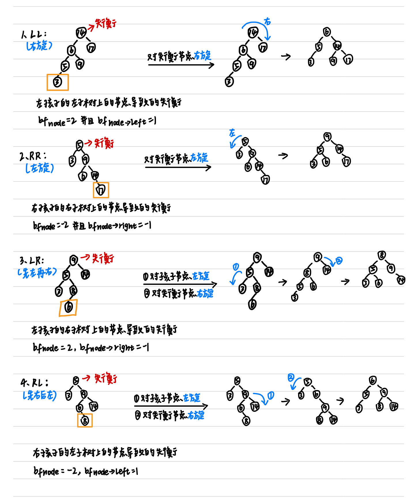
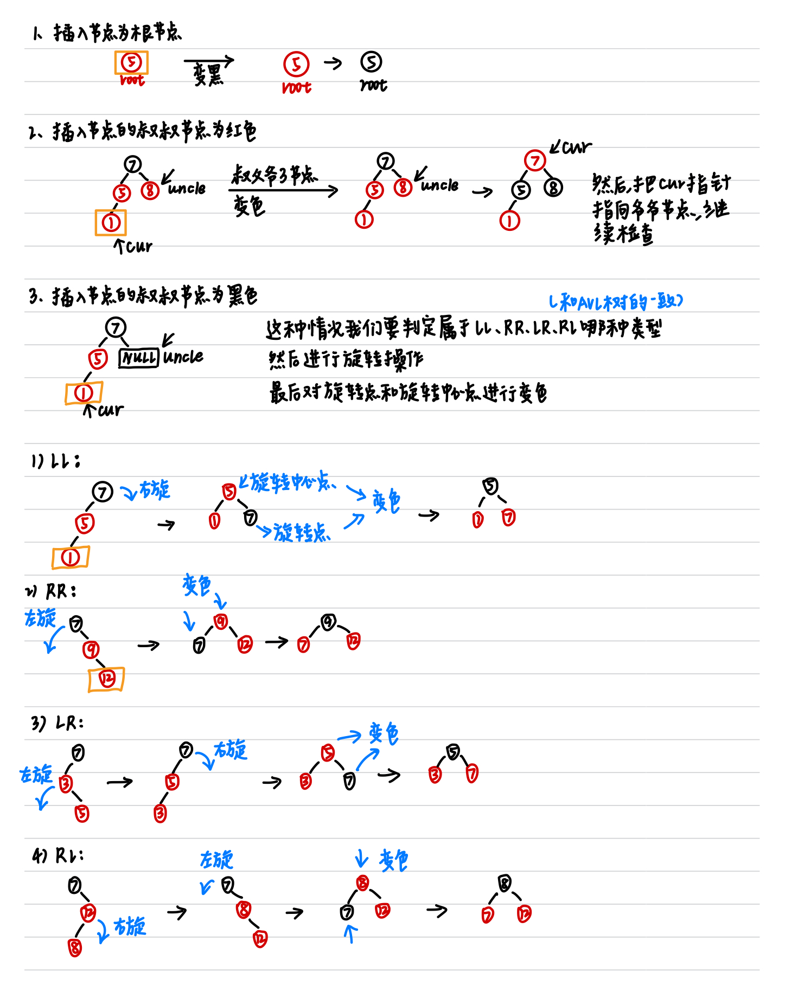

# 0 前言

辅助学习视频：[视频地址](https://www.bilibili.com/video/BV1gt421a7Cq?spm_id_from=333.788.videopod.sections&vd_source=befd430066becbcfc1acfbc4c2c0749c)

# 1 二分查找 binarySearch

## 1.1 基础

二分查找（Binary Search）是一种在**有序数组**中查找特定元素的极其高效的算法。

它的核心思想是“折半”：每次通过比较中间元素和目标值，直接排除掉一半的数据范围，从而迅速缩小搜索区间。

时间复杂度为$O(logn)$。

```c++
#include <vector>
//前提条件：数组本身是有序的
//假设这是一个升序数组
int binarySearch(const std::vector<int>& nums,int target){
    if(nums.empty()){
        return -1;
    }
    int left = 0;
    int right = nums.size()-1;
    while(left<=right){
        int mid = left+(right-left)/2;
        if(nums[mid]==target){
            return mid;
        }
        else if(nums[mid]<target){
            left = mid+1;
        }
        else{
            right = mid-1;
        }
    }
    return -1;  //没找到
}
```

## 1.2 变体

### 1.2.1 插值查找 interpolationSearch

二分法总是从 $1/2$ 处切分，而插值查找会**预测**目标的位置。 例如：在一本 1000 页的字典里找 "Apple"，你会直接翻开前几页，而不是从第 500 页开始二分。

主要更改在mid公式的更新，改为：$$mid = left + \frac{target - nums[left]}{nums[right] - nums[left]} \times (right - left)$$

主要适用在数据量大且分布均匀的有序数组。

### 1.2.2 斐波那契查找 fibonacciSearch

与二分查找的“折半”不同，它利用斐波那契数列的特性来分割区间。

它的核心逻辑是将区间长度设为一个斐波那契数 $F_k$，然后将其分为 $F_{k-1}$ 和 $F_{k-2}$ 两部分。

**数学原理**

斐波那契数列的特性是：$F_k = F_{k-1} + F_{k-2}$。

如果我们把数组的长度看作 $F_k - 1$，那么它可以被拆分为：$(F_{k-1} - 1) + 1 + (F_{k-2} - 1)$

其中：

- **$F_{k-1} - 1$**：左半部分的长度。
- **$1$**：分割点（即黄金分割点附近）。
- **$F_{k-2} - 1$**：右半部分的长度。

为什么要这么做？

从计算角度看，二分查找涉及除法（/ 2），而斐波那契查找只涉及加减法。在早期的计算机架构中，加减法的运算速度远快于除法。

**实现步骤**

- 构建斐波那契数列：生成一个足够长的数列 $F = [1, 1, 2, 3, 5, 8, 13, ...]$

- 补齐数组长度：查找数组长度 $n$ 在斐波那契数列中的位置，找到第一个大于等于 $n$ 的 $F_k$。由于原数组长度可能不刚好等于 $F_k-1$，需要将原数组扩展到 $F_k-1$ 的长度（多出来的位通常用原数组最后一个元素填充）

- 确定分割点：计算 $mid = left + F_{k-1} - 1$

- 递归/循环查找：

  - 若 `target < nums[mid]`：说明在左段，区间长度变为 $F_{k-1}-1$，对应的下标减 1（$k = k - 1$）

  - 若 `target > nums[mid]`：说明在右段，区间长度变为 $F_{k-2}-1$，对应的下标减 2（$k = k - 2$）

  - 若相等：找到目标。注意如果 `mid` 超过了原数组长度，返回原数组最后一个下标

**代码**

```c++
#include <algorithm>
#include <vector>
// 构建一个斐波那契数列
std::vector<int> getFibonacciTable(int n) {
    std::vector<int> f = {1, 1};
    // 核心逻辑：我们需要 F[k]-1 >= n，即 F[k] >= n + 1
    while (f.back() < n + 1) {
        f.push_back(f[f.size() - 1] + f[f.size() - 2]);
    }
    return f;
}
int fibonacciSearch(std::vector<int>& nums, int target) {
    int n = nums.size();
    if (n == 0) return -1;
    if (n == 1) return nums.back() == target ? 0 : -1;

    // 构建斐波那契数列
    // f[k]-1=n -> f[k]=n+1
    std::vector<int> f = getFibonacciTable(n);
    int k = f.size() - 1;

    // 查找
    int low = 0;
    while (k > 0) {
        int mid = low + (f[k - 1] - 1);
        int val = mid < n ? nums[mid] : nums[n - 1];
        if (target < val) {
            // target位于左半区
            k = k - 1;
        } else if (target > val) {
            // target位于右半区
            k = k - 2;
            low = mid + 1;
        } else {
            // 找到target了
            return std::min(mid, n - 1);
        }
    }
    return -1;  // 没找到
}
```

# 2 查找树

树形结构在处理频繁插入和删除时效率更高。

## 2.1 二叉搜索树（Binary Search Tree，BST）

### 2.1.1 描述

二叉搜索树的核心特性是：对于任意节点，其左子树的值都小于它，右子树的值都大于它。

### 2.1.2 节点的插入

只要在插入时满足1描述就可以。

```C++
// 递归插入
BSTNode* insert(BSTNode* node, int val) {
    if (!node) return new BSTNode(val);
    if (val < node->val)
        node->left = insert(node->left, val);
    else if (val > node->val)
        node->right = insert(node->right, val);
    return node;
}
```

###  2.1.3 节点的删除

BST节点的删除比较复杂，一般分为三种情况：

- 待删除节点是叶子节点
  - 直接销毁该节点，并将其父节点指向它的指针设为`nullptr`
- 待删除节点只有一个孩子
  - 将该节点的子节点（左或者右）直接提升到当前位置。类似于链表的节点删除
- **待删除节点有两个孩子（最难）**
  - 为了保持树的顺序，我们不能随便找个节点顶替。我们需要找到一个最接近该节点值的替代者
  - 方式A
    - 找左子树的最大值
    - 找右子树的最小值，也叫**中序后继**。 通常我们选择这种方式。将后继节点的值覆盖到当前节点，然后删除这个节点

```C++
// 辅助函数：找最小节点
BSTNode* getMinValNode(BSTNode* node) {
    BSTNode* cur = node;
    while (cur && cur->left) cur = cur->left;
    return cur;
}

// 删除节点
BSTNode* remove(BSTNode* node, int val) {
    if (!node) return nullptr;
    if (val < node->val) {
        node->left = remove(node->left, val);
        return node;
    } else if (val > node->val) {
        node->right = remove(node->right, val);
        return node;
    } else {
        // 找到目标节点了
        // 情况1：为叶子节点
        if (!node->left && !node->right) {
            delete node;
            return nullptr;
        }
        // 情况2：1个孩子节点
        else if (!node->left || !node->right) {
            BSTNode* temp = node->left ? node->left : node->right;
            delete node;
            return temp;
        }
        // 情况3：2个孩子节点
        else {
            // 找到右子树的最小节点
            BSTNode* temp = getMinValNode(node->right);
            node->val = temp->val;
            node->right = remove(node->right, temp->val);
            return node;
        }
    }
}
```

### 2.1.4 实现

```c++
#include <corecrt_math.h>
struct BSTNode {
    int val;
    BSTNode* left;
    BSTNode* right;
    BSTNode(int x) : val(x), left(nullptr), right(nullptr) {}
};

class BinarySearchTree {
public:
    BinarySearchTree() : root(nullptr) {}
    ~BinarySearchTree() { destroyTree(root); }

    // 插入节点
    void insert(int val) { root = insert(root, val); }

    // 删除节点
    void remove(int val) { root = remove(root, val); }

    // 查找节点
    bool search(int val) {
        BSTNode* cur = root;
        while (cur) {
            if (cur->val == val) return true;
            cur = val < cur->val ? cur->left : cur->right;
        }
        return false;
    }

private:
    BSTNode* root;

    // 递归插入
    BSTNode* insert(BSTNode* node, int val) {
        if (!node) return new BSTNode(val);
        if (val < node->val)
            node->left = insert(node->left, val);
        else if (val > node->val)
            node->right = insert(node->right, val);
        return node;
    }

    // 辅助函数：找最小节点
    BSTNode* getMinValNode(BSTNode* node) {
        BSTNode* cur = node;
        while (cur && cur->left) cur = cur->left;
        return cur;
    }

    // 删除节点
    BSTNode* remove(BSTNode* node, int val) {
        if (!node) return nullptr;
        if (val < node->val) {
            node->left = remove(node->left, val);
            return node;
        } else if (val > node->val) {
            node->right = remove(node->right, val);
            return node;
        } else {
            // 找到目标节点了
            // 情况1：为叶子节点
            if (!node->left && !node->right) {
                delete node;
                return nullptr;
            }
            // 情况2：1个孩子节点
            else if (!node->left || !node->right) {
                BSTNode* temp = node->left ? node->left : node->right;
                delete node;
                return temp;
            }
            // 情况3：2个孩子节点
            else {
                // 找到右子树的最小节点
                BSTNode* temp = getMinValNode(node->right);
                node->val = temp->val;
                node->right = remove(node->right, temp->val);
                return node;
            }
        }
    }

    void destroyTree(BSTNode* node) {
        if (!node) return;
        destroyTree(node->left);
        destroyTree(node->right);
        delete node;  // 释放内存
    }
};
```

## 2.2 二叉平衡搜索树：AVL树

### 2.2.1 描述

 二叉搜索树虽可以提升查找的效率，但如果数据有序或接近有序时二叉搜索树将退化为单支树（类似链表），查找元素相当于在顺序表中搜索元素，效率低下（退化到$O(n)$）。因此数学家提出了AVL树（最早提出的平衡二叉搜索树之一）。

搜索、添加、删除的时间复杂度是$O(logn)$。

在C++中实现 AVL 树，本质上是在维护 BST（二叉搜索树）的基础上，增加一个“**自动修整**”机制。

AVL树的核心是“平衡因子”。每一节点都会额外存储一个属性：高度。通过高度，我们可以计算平衡因子：
$$
BalanceFactor = Height(LeftSubtree) - Height(RightSubtree)
$$
**标准**：$|BalanceFactor| \le 1$。


### 2.2.2 4种失衡状态和对应的调整策略

AVL树的平衡调整通过旋转操作完成。当AVL树失衡时，我们要找到最小不平衡子树，判断其属于哪种失衡状态，通过对应的旋转操作来进行调整。



```C++
int getHeight(AVLNode* node) { return node ? node->height : 0; }

int getBalanceFactor(AVLNode* node) {
    if (!node) return 0;
    int lHeight = getHeight(node->left);
    int rHeight = getHeight(node->right);
    return lHeight - rHeight;
}

void updateHeight(AVLNode* node) {
    if (!node) return;
    int lHeight = getHeight(node->left);
    int rHeight = getHeight(node->right);
    node->height = 1 + std::max(lHeight, rHeight);
}

// 右旋
AVLNode* rotateRight(AVLNode* node) {
    AVLNode* childL = node->left;      // 左孩子节点上提
    AVLNode* childLR = childL->right;  // 处理左孩子节点的右节点
    childL->right = node;
    node->left = childLR;
    updateHeight(node);
    updateHeight(childL);
    return childL;
}

// 左旋
AVLNode* rotateLeft(AVLNode* node) {
    AVLNode* childR = node->right;    // 右孩子节点上提
    AVLNode* childRL = childR->left;  // 处理右孩子节点的左节点
    childR->left = node;
    node->right = childRL;
    updateHeight(node);
    updateHeight(childR);
    return childR;
}
```

### 2.2.3 节点的插入

插入的步骤：

- **递归向下搜索**：按照二叉搜索树（BST）的规则，找到新节点应该插入的位置，并 `new` 出节点。

- **回溯更新高度**：在递归返回的过程中，更新沿途每个节点的高度（Height）。

- **失衡检测与旋转**：计算每个节点的**平衡因子（BF = 左子树高度 - 右子树高度）**。如果 $|BF| > 1$，则根据失衡类型进行旋转。

```C++
// 插入
AVLNode* insert(AVLNode* node, int val) {
    if (!node) return new AVLNode(val);

    if (val < node->val)
        node->left = insert(node->left, val);
    else if (val > node->val)
        node->right = insert(node->right, val);
    else
        return node;  // 不允许重复值

    updateHeight(node);

    // bf>1 向左孩子节点的子树插入了；bf<-1 向右孩子节点的子树插入了
    int bf = getBalanceFactor(node);

    // 向左孩子节点的左子树插入了（LL->右旋）
    if (bf > 1 && val < node->left->val) {
        return rotateRight(node);
    }

    // 向左孩子节点的右子树插入了（LR->先左旋左孩子节点，再右旋节点）
    if (bf > 1 && val > node->left->val) {
        node->left = rotateLeft(node->left);
        return rotateRight(node);
    }

    // 向右孩子节点的右子树插入了（RR->左旋）
    if (bf < -1 && val > node->right->val) {
        return rotateLeft(node);
    }

    // 向右孩子节点的左子树插入了（RL->先右旋右孩子节点，再左旋节点）
    if (bf < -1 && val < node->right->val) {
        node->right = rotateRight(node->right);
        return rotateLeft(node);
    }

    return node;
}
```

### 2.2.4 节点的删除

AVL树节点删除的核心逻辑是：**先执行标准 BST 的删除，然后沿着搜索路径“溯流而上”，对每个经过的节点进行平衡检查和修复。**

```c++
AVLNode* getMinValNode(AVLNode* node) {
    AVLNode* cur = node;
    while (cur && cur->left) {
        cur = cur->left;
    }
    return cur;
}

// 删除
AVLNode* remove(AVLNode* node, int val) {
    // 先执行标准BST的删除
    if (!node) return nullptr;
    if (val < node->val) {
        node->left = remove(node->left, val);
    } else if (val > node->val) {
        node->right = remove(node->right, val);
    } else {
        if (!node->left && !node->right) {
            // 删除的是叶子节点
            delete node;
            return nullptr;
        } else if (!node->left || !node->right) {
            // 只有一个孩子节点
            AVLNode* temp = node->left ? node->left : node->right;
            delete node;
            return temp;
        } else {
            // 有两个孩子节点
            AVLNode* temp = getMinValNode(node->right);
            node->val = temp->val;
            node->right = remove(node->right, temp->val);
        }
    }

    if (!node) return nullptr;

    // 进入平衡修复
    updateHeight(node);

    int bf = getBalanceFactor(node);

    if (bf > 1) {
        if (getBalanceFactor(node->left) >= 0) {
            // LL型，右旋
            return rotateRight(node);
        } else {
            // LR型，先左旋左孩子节点再右旋
            node->left = rotateLeft(node->left);
            return rotateRight(node);
        }
    }

    if (bf < -1) {
        if (getBalanceFactor(node->right) <= 0) {
            // RR型，左旋
            return rotateLeft(node);
        } else {
            // RL型，先右旋右孩子节点再左旋
            node->right = rotateRight(node->right);
            return rotateLeft(node);
        }
    }

    return node;
}
```

### 2.2.5 完整实现

```c++
#include <algorithm>
struct AVLNode {
    int val;
    int height;
    AVLNode* left;
    AVLNode* right;
    AVLNode(int x) : val(x), height(1), left(nullptr), right(nullptr) {}
};

class AVLTree {
public:
    AVLTree() : root(nullptr) {}
    ~AVLTree() { destroyTree(root); }

    // 插入
    void insert(int val) { root = insert(root, val); }

    // 删除
    void remove(int val) { root = remove(root, val); }

    // 查找
    bool search(int val) {
        AVLNode* cur = root;
        while (cur) {
            if (cur->val == val) {
                return true;
            }
            cur = val < cur->val ? cur->left : cur->right;
        }
        return false;
    }

private:
    AVLNode* root;

    int getHeight(AVLNode* node) { return node ? node->height : 0; }

    int getBalanceFactor(AVLNode* node) {
        if (!node) return 0;
        int lHeight = getHeight(node->left);
        int rHeight = getHeight(node->right);
        return lHeight - rHeight;
    }

    void updateHeight(AVLNode* node) {
        if (!node) return;
        int lHeight = getHeight(node->left);
        int rHeight = getHeight(node->right);
        node->height = 1 + std::max(lHeight, rHeight);
    }

    // 右旋
    AVLNode* rotateRight(AVLNode* node) {
        AVLNode* childL = node->left;      // 左孩子节点上提
        AVLNode* childLR = childL->right;  // 处理左孩子节点的右节点
        childL->right = node;
        node->left = childLR;
        updateHeight(node);
        updateHeight(childL);
        return childL;
    }

    // 左旋
    AVLNode* rotateLeft(AVLNode* node) {
        AVLNode* childR = node->right;    // 右孩子节点上提
        AVLNode* childRL = childR->left;  // 处理右孩子节点的左节点
        childR->left = node;
        node->right = childRL;
        updateHeight(node);
        updateHeight(childR);
        return childR;
    }

    // 插入
    AVLNode* insert(AVLNode* node, int val) {
        if (!node) return new AVLNode(val);

        if (val < node->val)
            node->left = insert(node->left, val);
        else if (val > node->val)
            node->right = insert(node->right, val);
        else
            return node;  // 不允许重复值

        updateHeight(node);

        // bf>1 向左孩子节点的子树插入了；bf<-1 向右孩子节点的子树插入了
        int bf = getBalanceFactor(node);

        // 向左孩子节点的左子树插入了（LL->右旋）
        if (bf > 1 && val < node->left->val) {
            return rotateRight(node);
        }

        // 向左孩子节点的右子树插入了（LR->先左旋左孩子节点，再右旋节点）
        if (bf > 1 && val > node->left->val) {
            node->left = rotateLeft(node->left);
            return rotateRight(node);
        }

        // 向右孩子节点的右子树插入了（RR->左旋）
        if (bf < -1 && val > node->right->val) {
            return rotateLeft(node);
        }

        // 向右孩子节点的左子树插入了（RL->先右旋右孩子节点，再左旋节点）
        if (bf < -1 && val < node->right->val) {
            node->right = rotateRight(node->right);
            return rotateLeft(node);
        }

        return node;
    }

    AVLNode* getMinValNode(AVLNode* node) {
        AVLNode* cur = node;
        while (cur && cur->left) {
            cur = cur->left;
        }
        return cur;
    }

    // 删除
    AVLNode* remove(AVLNode* node, int val) {
        // 先执行标准BST的删除
        if (!node) return nullptr;
        if (val < node->val) {
            node->left = remove(node->left, val);
        } else if (val > node->val) {
            node->right = remove(node->right, val);
        } else {
            if (!node->left && !node->right) {
                // 删除的是叶子节点
                delete node;
                return nullptr;
            } else if (!node->left || !node->right) {
                // 只有一个孩子节点
                AVLNode* temp = node->left ? node->left : node->right;
                delete node;
                return temp;
            } else {
                // 有两个孩子节点
                AVLNode* temp = getMinValNode(node->right);
                node->val = temp->val;
                node->right = remove(node->right, temp->val);
            }
        }

        if (!node) return nullptr;

        // 进入平衡修复
        updateHeight(node);

        int bf = getBalanceFactor(node);

        if (bf > 1) {
            if (getBalanceFactor(node->left) >= 0) {
                // LL型，右旋
                return rotateRight(node);
            } else {
                // LR型，先左旋左孩子节点再右旋
                node->left = rotateLeft(node->left);
                return rotateRight(node);
            }
        }

        if (bf < -1) {
            if (getBalanceFactor(node->right) <= 0) {
                // RR型，左旋
                return rotateLeft(node);
            } else {
                // RL型，先右旋右孩子节点再左旋
                node->right = rotateRight(node->right);
                return rotateLeft(node);
            }
        }

        return node;
    }

    void destroyTree(AVLNode* node) {
        if (!node) return;
        destroyTree(node->left);
        destroyTree(node->right);
        delete node;
    }
};
```

## 2.3 二叉平衡搜索树：红黑树（Red-Black Tree）

### 2.3.1 描述

C++里的map和set底层就是红黑树。

红黑树的提出同样是为了解决二叉搜索树在某些情况下效率会退化到$O(n)$的问题，是另一种平衡二叉搜索树。相比AVL树只是对平衡的定义和策略有所不同。


对比AVL树的平衡条件和红黑树的平衡条件，我们发现AVL树对于平衡的要求更加严苛，因此AVL树普遍上树高更矮，在查询上更高效。但也因为AVL树的平衡要求更高，在插入和删除节点后，AVL树的调整操作相对更加频繁，因此，在插入和删除上，红黑树更高效（不过都是$O(logn)$级别）。

红黑树的几个条件（当我们在红黑树中提到叶子节点，指的是NULL节点）：

- 前提：二叉搜索树
- 根和叶子（NULL）都是黑色
- 不存在连续的两个红色结点
- 任一节点到任一叶子节点的路径上，黑色节点数量相同

**重要结论：对于红黑树，根节点到叶子节点的最长路径不会超过最短路径的2倍**。

推断过程：

1）从第四点：任一节点到任一叶子节点的路径上，黑色节点的数量相同。也就是说，从根节点出发到叶子节点的最长路径上的黑色节点数和最短路径的黑色节点数相同。即：
$$
num_{最短路径上的黑色节点数}=num_{最长路径上的黑色节点数}
$$
我们把这个值缩略为$N$。

2）接着从第三点可知：不存在连续的两个红色节点，以及第一点可知，路径首尾都是黑色，即红色节点最多的情况下，是夹在首尾两个黑色节点中间间隔分布，即红色节点数最多时数量等于路径上的黑色节点数-1。

3）如果希望最长路径和最短路径相差长度上相差够大，极端情况是最短路径仅有黑色节点，而最长路径拥有相等量的黑色节点的同时，增加如（2）所示数量的红色节点。即：
$$
len_{最短}=N-1
$$

$$
len_{最长}=N+(N-1)-1=2*N-2=2*(N-1) 
$$

由此可得在极端情况下：
$$
len_{最长}=2*len_{最短}
$$
因此我们可得结论：**对于红黑树，根节点到叶子节点的最长路径不会超过最短路径的2倍**。

红黑树以此来保持平衡。

### 2.3.2 插入时的调整策略

红黑树默认插入的节点为红色节点（保证插入时满足所有路径黑色节点数相同），插入后判断树是否处于失衡状态，如果是，进行调整。

一共有三种调整情况：



