# 0 前言

辅助学习视频：[视频地址](https://www.bilibili.com/video/BV1gt421a7Cq?spm_id_from=333.788.videopod.sections&vd_source=befd430066becbcfc1acfbc4c2c0749c)

# 1 顺序查找

略。

# 2 二分查找 binarySearch

## 2.1 基础

二分查找（Binary Search）是一种在**有序数组**中查找特定元素的极其高效的算法。

它的核心思想是“折半”：每次通过比较中间元素和目标值，直接排除掉一半的数据范围，从而迅速缩小搜索区间。

时间复杂度为$O(logn)$。

```c++
#include <vector>
//前提条件：数组本身是有序的
//假设这是一个升序数组
int binarySearch(const std::vector<int>& nums,int target){
    if(nums.empty()){
        return -1;
    }
    int left = 0;
    int right = nums.size()-1;
    while(left<=right){
        int mid = left+(right-left)/2;
        if(nums[mid]==target){
            return mid;
        }
        else if(nums[mid]<target){
            left = mid+1;
        }
        else{
            right = mid-1;
        }
    }
    return -1;  //没找到
}
```

## 2.2 变体

### 2.2.1 插值查找 interpolationSearch

二分法总是从 $\frac{1}{2}$ 处切分，而插值查找会**预测**目标的位置。 例如：在一本 1000 页的字典里找 "Apple"，你会直接翻开前几页，而不是从第 500 页开始二分。

主要更改在mid公式的更新，改为：$$mid = left + \frac{target - nums[left]}{nums[right] - nums[left]} \times (right - left)$$

主要适用在数据量大且分布均匀的有序数组。

### 2.2.2 斐波那契查找 fibonacciSearch

与二分查找的“折半”不同，它利用斐波那契数列的特性来分割区间。

它的核心逻辑是将区间长度设为一个斐波那契数 $F_k$，然后将其分为 $F_{k-1}$ 和 $F_{k-2}$ 两部分。

**数学原理**

斐波那契数列的特性是：$$F_k = F_{k-1} + F_{k-2}$$。

如果我们把数组的长度看作 $F_k - 1$，这个公式可以被拆分为：

$$
(F_{k-1} - 1) + 1 + (F_{k-2} - 1)
$$
其中：

- **$F_{k-1} - 1$**：左半部分的长度
- **$1$**：分割点（即黄金分割点附近）
- **$F_{k-2} - 1$**：右半部分的长度

为什么要这么做？

从计算角度看，二分查找涉及除法（/ 2），而斐波那契查找只涉及加减法。在早期的计算机架构中，加减法的运算速度远快于除法。

**实现步骤**

- 构建斐波那契数列：生成一个足够长的数列 $F = [1, 1, 2, 3, 5, 8, 13, ...]$

- 补齐数组长度：查找数组长度 $n$ 在斐波那契数列中的位置，找到第一个大于等于 $n$ 的 $F_k$。由于原数组长度可能不刚好等于 $F_k-1$，需要将原数组扩展到 $F_k-1$ 的长度（多出来的位通常用原数组最后一个元素填充）

- 确定分割点：计算 $mid = left + F_{k-1} - 1$

- 递归/循环查找：

  - 若 `target < nums[mid]`：说明在左段，区间长度变为 $F_{k-1}-1$，对应的下标减 1（$k = k - 1$）

  - 若 `target > nums[mid]`：说明在右段，区间长度变为 $F_{k-2}-1$，对应的下标减 2（$k = k - 2$）

  - 若相等：找到目标。注意如果 `mid` 超过了原数组长度，返回原数组最后一个下标

**代码**

```c++
#include <algorithm>
#include <vector>
// 构建一个斐波那契数列
std::vector<int> getFibonacciTable(int n) {
    std::vector<int> f = {1, 1};
    // 核心逻辑：我们需要 F[k]-1 >= n，即 F[k] >= n + 1
    while (f.back() < n + 1) {
        f.push_back(f[f.size() - 1] + f[f.size() - 2]);
    }
    return f;
}
int fibonacciSearch(std::vector<int>& nums, int target) {
    int n = nums.size();
    if (n == 0) return -1;
    if (n == 1) return nums.back() == target ? 0 : -1;

    // 构建斐波那契数列
    // f[k]-1=n -> f[k]=n+1
    std::vector<int> f = getFibonacciTable(n);
    int k = f.size() - 1;

    // 查找
    int low = 0;
    while (k > 0) {
        int mid = low + (f[k - 1] - 1);
        int val = mid < n ? nums[mid] : nums[n - 1];
        if (target < val) {
            // target位于左半区
            k = k - 1;
        } else if (target > val) {
            // target位于右半区
            k = k - 2;
            low = mid + 1;
        } else {
            // 找到target了
            return std::min(mid, n - 1);
        }
    }
    return -1;  // 没找到
}
```

# 3 查找树

树形结构在处理频繁插入和删除时效率更高。

## 3.1 二叉搜索树（Binary Search Tree，BST）

### 3.1.1 描述

二叉搜索树的核心特性是：对于任意节点，其左子树的值都小于它，右子树的值都大于它。

### 3.1.2 节点的插入

只要在插入时满足1描述就可以。

```C++
// 递归插入
BSTNode* insert(BSTNode* node, int val) {
    if (!node) return new BSTNode(val);
    if (val < node->val)
        node->left = insert(node->left, val);
    else if (val > node->val)
        node->right = insert(node->right, val);
    return node;
}
```

###  3.1.3 节点的删除

BST节点的删除比较复杂，一般分为三种情况：

- 待删除节点是叶子节点
  - 直接销毁该节点，并将其父节点指向它的指针设为`nullptr`
- 待删除节点只有一个孩子
  - 将该节点的子节点（左或者右）直接提升到当前位置。类似于链表的节点删除
- **待删除节点有两个孩子（最难）**
  - 为了保持树的顺序，我们不能随便找个节点顶替。我们需要找到一个最接近该节点值的替代者
  - 方式A
    - 找左子树的最大值
  - 方式B
    - 找右子树的最小值，也叫**中序后继**。 通常我们选择这种方式。将后继节点的值覆盖到当前节点，然后删除这个节点

```C++
// 辅助函数：找最小节点
BSTNode* getMinValNode(BSTNode* node) {
    BSTNode* cur = node;
    while (cur && cur->left) cur = cur->left;
    return cur;
}

// 删除节点
BSTNode* remove(BSTNode* node, int val) {
    if (!node) return nullptr;
    if (val < node->val) {
        node->left = remove(node->left, val);
        return node;
    } else if (val > node->val) {
        node->right = remove(node->right, val);
        return node;
    } else {
        // 找到目标节点了
        // 情况1：为叶子节点
        if (!node->left && !node->right) {
            delete node;
            return nullptr;
        }
        // 情况2：1个孩子节点
        else if (!node->left || !node->right) {
            BSTNode* temp = node->left ? node->left : node->right;
            delete node;
            return temp;
        }
        // 情况3：2个孩子节点
        else {
            // 找到右子树的最小节点
            BSTNode* temp = getMinValNode(node->right);
            node->val = temp->val;
            node->right = remove(node->right, temp->val);
            return node;
        }
    }
}
```

### 3.1.4 实现

```c++
#include <corecrt_math.h>
struct BSTNode {
    int val;
    BSTNode* left;
    BSTNode* right;
    BSTNode(int x) : val(x), left(nullptr), right(nullptr) {}
};

class BinarySearchTree {
public:
    BinarySearchTree() : root(nullptr) {}
    ~BinarySearchTree() { destroyTree(root); }

    // 插入节点
    void insert(int val) { root = insert(root, val); }

    // 删除节点
    void remove(int val) { root = remove(root, val); }

    // 查找节点
    bool search(int val) {
        BSTNode* cur = root;
        while (cur) {
            if (cur->val == val) return true;
            cur = val < cur->val ? cur->left : cur->right;
        }
        return false;
    }

private:
    BSTNode* root;

    // 递归插入
    BSTNode* insert(BSTNode* node, int val) {
        if (!node) return new BSTNode(val);
        if (val < node->val)
            node->left = insert(node->left, val);
        else if (val > node->val)
            node->right = insert(node->right, val);
        return node;
    }

    // 辅助函数：找最小节点
    BSTNode* getMinValNode(BSTNode* node) {
        BSTNode* cur = node;
        while (cur && cur->left) cur = cur->left;
        return cur;
    }

    // 删除节点
    BSTNode* remove(BSTNode* node, int val) {
        if (!node) return nullptr;
        if (val < node->val) {
            node->left = remove(node->left, val);
            return node;
        } else if (val > node->val) {
            node->right = remove(node->right, val);
            return node;
        } else {
            // 找到目标节点了
            // 情况1：为叶子节点
            if (!node->left && !node->right) {
                delete node;
                return nullptr;
            }
            // 情况2：1个孩子节点
            else if (!node->left || !node->right) {
                BSTNode* temp = node->left ? node->left : node->right;
                delete node;
                return temp;
            }
            // 情况3：2个孩子节点
            else {
                // 找到右子树的最小节点
                BSTNode* temp = getMinValNode(node->right);
                node->val = temp->val;
                node->right = remove(node->right, temp->val);
                return node;
            }
        }
    }

    void destroyTree(BSTNode* node) {
        if (!node) return;
        destroyTree(node->left);
        destroyTree(node->right);
        delete node;  // 释放内存
    }
};
```

## 3.2 AVL树（二叉平衡搜索树）

### 3.2.1 描述

 二叉搜索树虽可以提升查找的效率，但如果数据有序或接近有序时二叉搜索树将退化为单支树（类似链表），查找元素相当于在顺序表中搜索元素，效率低下（退化到$O(n)$）。因此数学家提出了AVL树（最早提出的平衡二叉搜索树之一）。

搜索、添加、删除的时间复杂度是$O(logn)$。

在C++中实现 AVL 树，本质上是在维护 BST（二叉搜索树）的基础上，增加一个“**自动修整**”机制。

AVL树的核心是“平衡因子”。每一节点都会额外存储一个属性：高度。通过高度，我们可以计算平衡因子：
$$
BalanceFactor = Height(LeftSubtree) - Height(RightSubtree)
$$
**标准**：$|BalanceFactor| \le 1$。

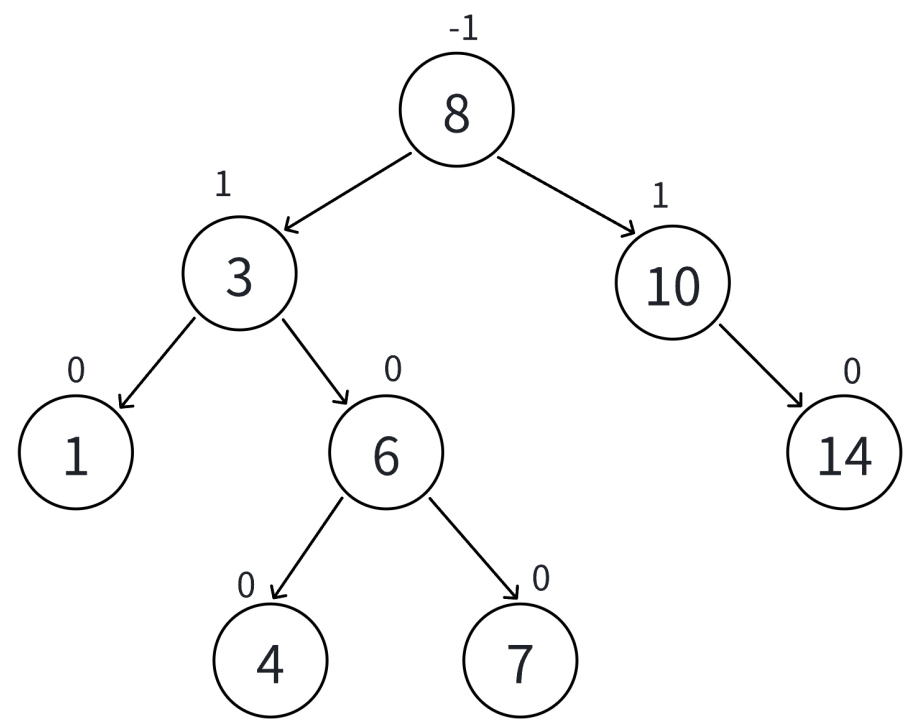

### 3.2.2 4种失衡状态和对应的调整策略

AVL树的平衡调整通过旋转操作完成。当AVL树失衡时，我们要找到最小不平衡子树，判断其属于哪种失衡状态，通过对应的旋转操作来进行调整。

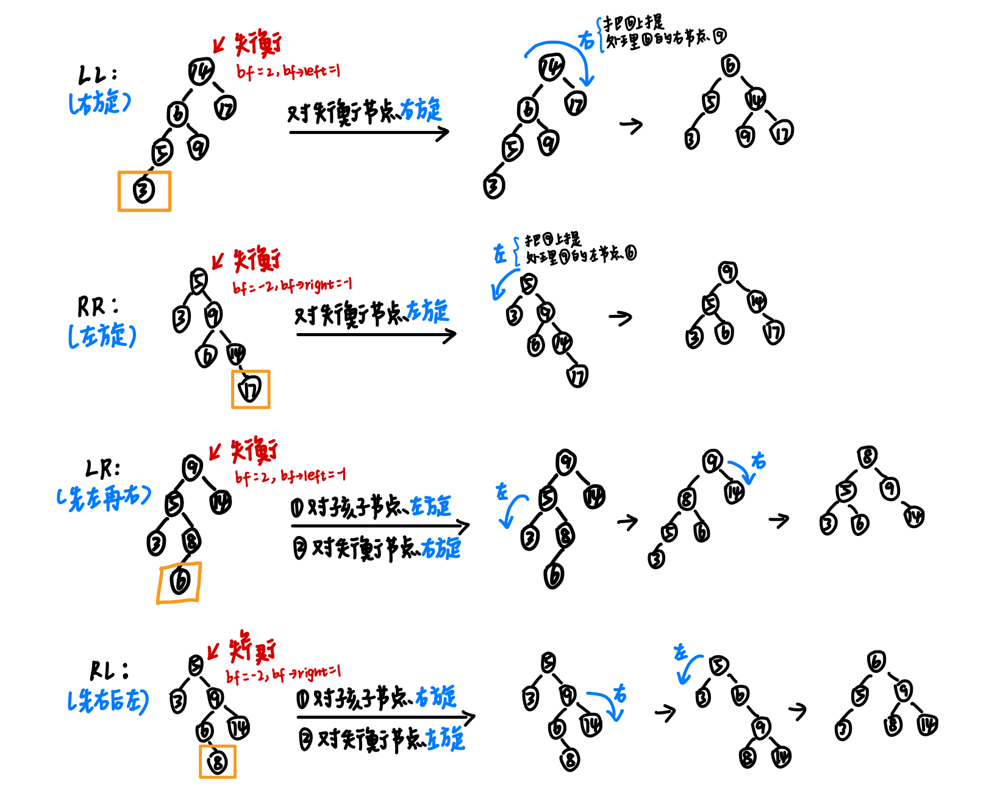

### 3.2.3 节点的插入

插入的步骤

- **递归向下搜索**：按照二叉搜索树（BST）的规则，找到新节点应该插入的位置，并 `new` 出节点。

- **回溯更新高度**：在递归返回的过程中，更新沿途每个节点的高度（Height）。

- **失衡检测与旋转**：计算每个节点的**平衡因子（BF = 左子树高度 - 右子树高度）**。如果 $|BF| > 1$，则根据失衡类型进行旋转。

```c++
// 插入
AVLNode* insert(AVLNode* node, int val) {
    if (!node) return new AVLNode(val);

    if (val < node->val)
        node->left = insert(node->left, val);
    else if (val > node->val)
        node->right = insert(node->right, val);
    else
        return node;  // 不允许重复值

    updateHeight(node);

    // bf>1 向左孩子节点的子树插入了；bf<-1 向右孩子节点的子树插入了
    int bf = getBalanceFactor(node);

    // 向左孩子节点的左子树插入了（LL->右旋）
    if (bf > 1 && val < node->left->val) {
        return rotateRight(node);
    }

    // 向左孩子节点的右子树插入了（LR->先左旋左孩子节点，再右旋节点）
    if (bf > 1 && val > node->left->val) {
        node->left = rotateLeft(node->left);
        return rotateRight(node);
    }

    // 向右孩子节点的右子树插入了（RR->左旋）
    if (bf < -1 && val > node->right->val) {
        return rotateLeft(node);
    }

    // 向右孩子节点的左子树插入了（RL->先右旋右孩子节点，再左旋节点）
    if (bf < -1 && val < node->right->val) {
        node->right = rotateRight(node->right);
        return rotateLeft(node);
    }

    return node;
}
```

### 3.2.4 节点的删除

AVL树节点删除的核心逻辑是：**先执行标准 BST 的删除，然后沿着搜索路径“溯流而上”，对每个经过的节点进行平衡检查和修复。**

```c++
AVLNode* getMinValNode(AVLNode* node) {
    AVLNode* cur = node;
    while (cur && cur->left) {
        cur = cur->left;
    }
    return cur;
}

// 删除
AVLNode* remove(AVLNode* node, int val) {
    // 先执行标准BST的删除
    if (!node) return nullptr;
    if (val < node->val) {
        node->left = remove(node->left, val);
    } else if (val > node->val) {
        node->right = remove(node->right, val);
    } else {
        if (!node->left && !node->right) {
            // 删除的是叶子节点
            delete node;
            return nullptr;
        } else if (!node->left || !node->right) {
            // 只有一个孩子节点
            AVLNode* temp = node->left ? node->left : node->right;
            delete node;
            return temp;
        } else {
            // 有两个孩子节点
            AVLNode* temp = getMinValNode(node->right);
            node->val = temp->val;
            node->right = remove(node->right, temp->val);
        }
    }

    if (!node) return nullptr;

    // 进入平衡修复
    updateHeight(node);

    int bf = getBalanceFactor(node);

    if (bf > 1) {
        if (getBalanceFactor(node->left) >= 0) {
            // LL型，右旋
            return rotateRight(node);
        } else {
            // LR型，先左旋左孩子节点再右旋
            node->left = rotateLeft(node->left);
            return rotateRight(node);
        }
    }

    if (bf < -1) {
        if (getBalanceFactor(node->right) <= 0) {
            // RR型，左旋
            return rotateLeft(node);
        } else {
            // RL型，先右旋右孩子节点再左旋
            node->right = rotateRight(node->right);
            return rotateLeft(node);
        }
    }

    return node;
}
```

**为什么失衡节点子节点平衡因子的判定条件包含了==0的情况？**

以LL型失衡为例，这种子节点平衡因子==0的情况只会在删除时出现（删掉了失衡节点右支上的节点，导致左支偏重，这种情况下，==0是有可能存在的），所以我们也需要对这种情况进行处理。

### 3.2.5 完整代码实现

```c++
#include <algorithm>
struct AVLNode {
    int val;
    int height;
    AVLNode* left;
    AVLNode* right;
    AVLNode(int x) : val(x), height(1), left(nullptr), right(nullptr) {}
};

class AVLTree {
public:
    AVLTree() : root(nullptr) {}
    ~AVLTree() { destroyTree(root); }

    // 插入
    void insert(int val) { root = insert(root, val); }

    // 删除
    void remove(int val) { root = remove(root, val); }

    // 查找
    bool search(int val) {
        AVLNode* cur = root;
        while (cur) {
            if (cur->val == val) {
                return true;
            }
            cur = val < cur->val ? cur->left : cur->right;
        }
        return false;
    }

private:
    AVLNode* root;

    int getHeight(AVLNode* node) { return node ? node->height : 0; }

    int getBalanceFactor(AVLNode* node) {
        if (!node) return 0;
        int lHeight = getHeight(node->left);
        int rHeight = getHeight(node->right);
        return lHeight - rHeight;
    }

    void updateHeight(AVLNode* node) {
        if (!node) return;
        int lHeight = getHeight(node->left);
        int rHeight = getHeight(node->right);
        node->height = 1 + std::max(lHeight, rHeight);
    }

    // 右旋
    AVLNode* rotateRight(AVLNode* node) {
        if (!node || !node->left) {
            return node;
        }
        AVLNode* childL = node->left;      // 左孩子节点上提
        AVLNode* childLR = childL->right;  // 处理左孩子节点的右节点
        childL->right = node;
        node->left = childLR;
        updateHeight(node);
        updateHeight(childL);
        return childL;
    }

    // 左旋
    AVLNode* rotateLeft(AVLNode* node) {
        if (!node || !node->right) {
            return node;
        }
        AVLNode* childR = node->right;    // 右孩子节点上提
        AVLNode* childRL = childR->left;  // 处理右孩子节点的左节点
        childR->left = node;
        node->right = childRL;
        updateHeight(node);
        updateHeight(childR);
        return childR;
    }

    // 插入
    AVLNode* insert(AVLNode* node, int val) {
        if (!node) return new AVLNode(val);

        if (val < node->val)
            node->left = insert(node->left, val);
        else if (val > node->val)
            node->right = insert(node->right, val);
        else
            return node;  // 不允许重复值

        updateHeight(node);

        // bf>1 向左孩子节点的子树插入了；bf<-1 向右孩子节点的子树插入了
        int bf = getBalanceFactor(node);

        // 向左孩子节点的左子树插入了（LL->右旋）
        if (bf > 1 && val < node->left->val) {
            return rotateRight(node);
        }

        // 向左孩子节点的右子树插入了（LR->先左旋左孩子节点，再右旋节点）
        if (bf > 1 && val > node->left->val) {
            node->left = rotateLeft(node->left);
            return rotateRight(node);
        }

        // 向右孩子节点的右子树插入了（RR->左旋）
        if (bf < -1 && val > node->right->val) {
            return rotateLeft(node);
        }

        // 向右孩子节点的左子树插入了（RL->先右旋右孩子节点，再左旋节点）
        if (bf < -1 && val < node->right->val) {
            node->right = rotateRight(node->right);
            return rotateLeft(node);
        }

        return node;
    }

    AVLNode* getMinValNode(AVLNode* node) {
        AVLNode* cur = node;
        while (cur && cur->left) {
            cur = cur->left;
        }
        return cur;
    }

    // 删除
    AVLNode* remove(AVLNode* node, int val) {
        // 先执行标准BST的删除
        if (!node) return nullptr;
        if (val < node->val) {
            node->left = remove(node->left, val);
        } else if (val > node->val) {
            node->right = remove(node->right, val);
        } else {
            if (!node->left && !node->right) {
                // 删除的是叶子节点
                delete node;
                return nullptr;
            } else if (!node->left || !node->right) {
                // 只有一个孩子节点
                AVLNode* temp = node->left ? node->left : node->right;
                delete node;
                return temp;
            } else {
                // 有两个孩子节点
                AVLNode* temp = getMinValNode(node->right);
                node->val = temp->val;
                node->right = remove(node->right, temp->val);
            }
        }

        if (!node) return nullptr;

        // 进入平衡修复
        updateHeight(node);

        int bf = getBalanceFactor(node);

        if (bf > 1) {
            if (getBalanceFactor(node->left) >= 0) {
                // LL型，右旋
                return rotateRight(node);
            } else {
                // LR型，先左旋左孩子节点再右旋
                node->left = rotateLeft(node->left);
                return rotateRight(node);
            }
        }

        if (bf < -1) {
            if (getBalanceFactor(node->right) <= 0) {
                // RR型，左旋
                return rotateLeft(node);
            } else {
                // RL型，先右旋右孩子节点再左旋
                node->right = rotateRight(node->right);
                return rotateLeft(node);
            }
        }

        return node;
    }

    void destroyTree(AVLNode* node) {
        if (!node) return;
        destroyTree(node->left);
        destroyTree(node->right);
        delete node;
    }
};
```

## 3.3 红黑树（Red-Black Tree，二叉平衡搜索树）

### 3.3.1 描述

C++里的`std::map`和`std::set`底层就是红黑树（注意：区别于`std::unordered_map`和`std::unordered_set`，这俩底层是散列表）。

红黑树的提出同样是为了解决二叉搜索树在某些情况下效率会退化到$O(n)$的问题，是另一种平衡二叉搜索树。相比AVL树只是对平衡的定义和策略有所不同。

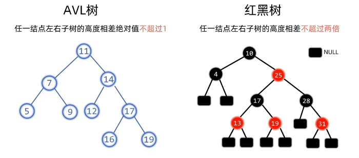

对比AVL树的平衡条件和红黑树的平衡条件，我们发现AVL树对于平衡的要求更加严苛，因此AVL树普遍上树高更矮，在查询上更高效。但也因为AVL树的平衡要求更高，在插入和删除节点后，AVL树的调整操作相对更加频繁，因此，在插入和删除上，红黑树更高效（不过都是$O(logn)$级别）。

红黑树的几个条件（当我们在红黑树中提到叶子节点，指的是NULL节点）：

- 前提：二叉搜索树
- 根和叶子（NULL）都是黑色
- 不存在连续的两个红色结点
- 任一节点到任一叶子节点的路径上，黑色节点数量相同

**重要结论：对于红黑树，根节点到叶子节点的最长路径不会超过最短路径的2倍**。

推断过程：

1）从第四点：任一节点到任一叶子节点的路径上，黑色节点的数量相同。也就是说，从根节点出发到叶子节点的最长路径上的黑色节点数和最短路径的黑色节点数相同。即：
$$
num_{最短路径上的黑色节点数}=num_{最长路径上的黑色节点数}
$$
我们把这个值缩略为$N$。

2）接着从第三点可知：不存在连续的两个红色节点，以及第一点可知，路径首尾都是黑色，即红色节点最多的情况下，是夹在首尾两个黑色节点中间间隔分布，即红色节点数最多时数量等于路径上的黑色节点数-1。

3）如果希望最长路径和最短路径相差长度上相差够大，极端情况是最短路径仅有黑色节点，而最长路径拥有相等量的黑色节点的同时，增加如（2）所示数量的红色节点。即：
$$
len_{最短}=N-1
$$

$$
len_{最长}=N+(N-1)-1=2*N-2=2*(N-1) 
$$

由此可得在极端情况下：
$$
len_{最长}=2*len_{最短}
$$
因此我们可得结论：**对于红黑树，根节点到叶子节点的最长路径不会超过最短路径的2倍**。

红黑树以此来保持平衡。

### 3.3.2 节点插入导致失衡时的调整策略（3种失衡状态）

这里有一个前提，即我们默认插入节点为红色节点。这样是为了在插入时不违反路径上黑色节点数相同的原则，减少失衡概率。

#### 1 插入节点为根节点导致的失衡

当插入节点为根节点时，因为插入节点默认为红色，违反了根节点必须为黑色的原则，导致了失衡。

应对策略：**将插入节点变为黑色**。


#### 2 插入节点的父节点为红色，叔叔节点为红色

当插入节点的父节点为红色节点时，违反了红色节点不相邻的原则，这个时候有两种失衡情况，第一种情况为插入节点的叔叔节点为红色。

应对策略：**将父节点、叔叔节点、爷爷节点做变色操作，然后将当前指针指向爷爷节点，往上继续进行失衡检查**。

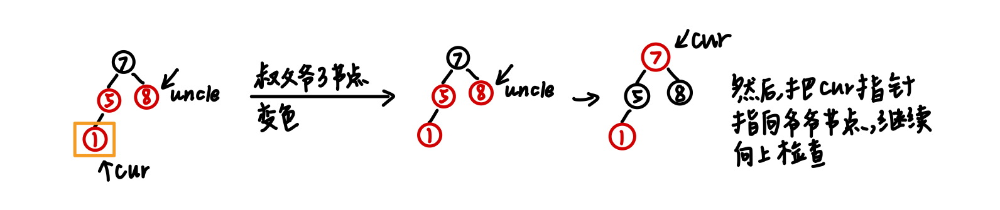

#### 3 插入节点的父节点为红色，叔叔节点为黑色

当插入节点的父节点为红色节点时，违反了红色节点不相邻的原则，除了2之外的另一种失衡情况为插入节点的叔叔节点为黑色（注意：NULL节点也算黑色节点）。

应对策略：**进一步判定当前失衡状态属于LL/RR/LR/RL的哪种，对其进行旋转操作，最后，对旋转点和旋转中心进行变色**。

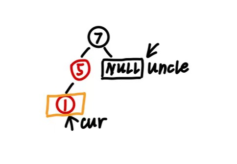

如下：

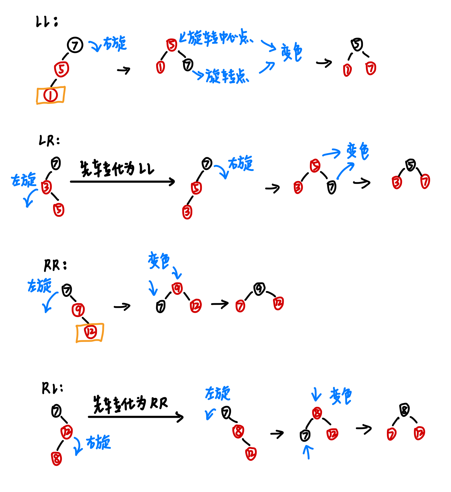

#### 4 代码实现

**插入**

```c++
// 插入
void insert(int val) {
    RBTreeNode* z = new RBTreeNode(val);
    z->left = z->right = NIL;
    if (root == NIL) {
        root = z;
        z->color = Black;
        return;
    }
    RBTreeNode* p = nullptr;
    RBTreeNode* cur = root;
    while (cur != NIL) {
        p = cur;
        if (val < cur->val) {
            cur = cur->left;
        } else if (val > cur->val) {
            cur = cur->right;
        } else {
            delete z;
            return;
        }
    }
    z->parent = p;
    if (z->val < p->val)
        p->left = z;
    else
        p->right = z;
    fixInsert(z);
}
```

**平衡修复**

```c++
// 平衡修复
void fixInsert(RBTreeNode* node) {
    // 父节点为红色才需要调整
    while (node->parent && node->parent->color == Red) {
        RBTreeNode* parent = node->parent;
        RBTreeNode* grandParent = parent->parent;  // p为红，g必然存在且为黑

        if (parent == grandParent->left) {
            RBTreeNode* uncle = grandParent->right;
            if (uncle && uncle->color == Red) {
                // 情况1：叔叔为红色 -> 变色并向上回溯
                parent->color = Black;
                uncle->color = Black;
                grandParent->color = Red;
                node = grandParent;
            } else {
                // 情况2：叔叔为黑色或不存在
                if (node == parent->right) {
                    // LR 型 -> 左旋 
                    node = parent;
                    rotateLeft(node);
                    parent = node->parent;
                }
                // LL 型 -> 右旋 + 变色
                parent->color = Black;
                grandParent->color = Red;
                rotateRight(grandParent);
            }
        } else {
            RBTreeNode* uncle = grandParent->left;
            if (uncle && uncle->color == Red) {
                // 情况1：叔叔为红色 -> 变色并向上回溯
                parent->color = Black;
                uncle->color = Black;
                grandParent->color = Red;
                node = grandParent;
            } else {
                // 情况2：叔叔为黑色或不存在
                if (node == parent->left) {
                    // RL 型 -> 右旋
                    node = parent;
                    rotateRight(node);
                    parent = node->parent;
                }
                // RR 型 -> 左旋 + 变色
                parent->color = Black;
                grandParent->color = Red;
                rotateLeft(grandParent);
            }
        }
    }
    root->color = Black;  // 确保根节点始终为黑
}
```

### 3.3.3 节点删除导致失衡时的调整策略

红黑树的删除也是基于二叉搜索树的删除实现的。

- 删除的节点是叶子节点->直接删除
- 删除的节点有一个子节点->子节点替代掉删除节点
- 删除的节点有两个子节点
  - 为了保持树的顺序，我们不能随便找个节点顶替。我们需要找到一个最接近该节点值的替代者
  - 方式A
    - 找左子树的最大值
  - 方式B
    - 找右子树的最小值，也叫**中序后继**。 通常我们选择这种方式。将后继节点的值覆盖到当前节点，然后删除这个节点

**在第三种情况中我们会发现，在完成值覆盖后的节点删除阶段，实际上又退化到了前两种情况，所以我们只需要考虑前两种删除情况导致失衡的调整策略。**

#### 1 删除的节点只有一个子节点

由于红黑树自身性质的约束，当删除的节点只有一个子节点时，只可能存在于图示这两种树形情况：

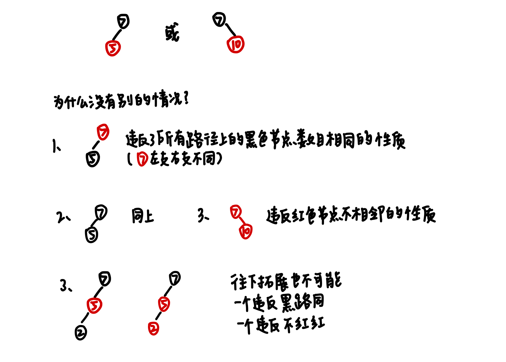

因此当我们删除掉这个节点时，我们发现节点所在路径上的黑色节点数减少1个，违反了黑路同的原则，我们只需要替代过来的子节点变成黑色就可以了。

#### 2 删除的节点没有子节点

直接删除，无需任何调整。

#### 3* 删除的节点没有子节点，且为黑色节点（最复杂）

在这里我们引入一个“**双黑节点**”的概念辅助理解。

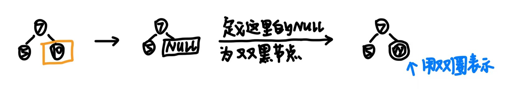

双黑节点的定义是，经过该节点的路径，黑色节点数-1。

这样我们的调整任务就变成了消除双黑节点，或者将双黑节点变成单黑节点。

此时我们要看双黑节点的兄弟节点的情况。

##### ① 兄弟节点为红色节点

兄父变色，然后父节点朝双黑节点旋转。接着对新的兄弟节点继续进行检查。

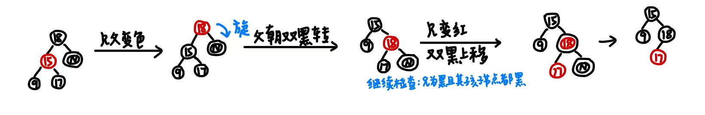

##### ② 兄弟节点为黑色节点

**Ⅰ 兄弟节点的孩子节点均为黑色节点（注意：孩子为空节点也属于这种情况）**

此时只需要将兄弟变红，然后将双黑上移，继续对新的兄弟节点进行检查。

注意，当双黑节点落在红色节点上，红色节点改为单黑节点，也就是黑色节点。

**Ⅱ 兄弟节点有至少一个红色孩子节点**

此时我们要分析父节点、兄弟节点、兄弟节点的这个孩子节点属于LL/RR/LR/RL哪种状态，并进行对应调整，调整策略如下图：

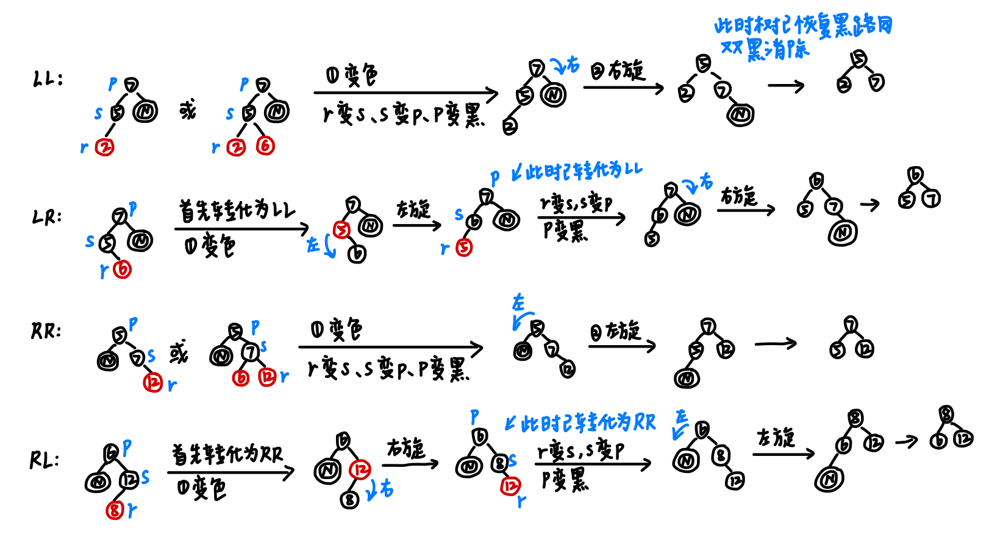

#### 4 代码实现

**节点删除**

```c++
void remove(int val) {
    RBTreeNode* z = root;
    while (z != NIL && z->val != val) {
        if (val < z->val)
            z = z->left;
        else
            z = z->right;
    }
    if (z == NIL) return;

    RBTreeNode* y = z;
    RBTreeNode* x;  // 接替删除节点的节点
    Color y_original_color = y->color;

    if (z->left == NIL) {
        // 同时包含了z有0个子节点的情况
        x = z->right;
        transplant(z, z->right);
    } else if (z->right == NIL) {
        x = z->left;
        transplant(z, z->left);
    } else {
        y = getMin(z->right);
        y_original_color = y->color;
        x = y->right;
        if (y->parent == z) {
            x->parent = y;
        } else {
            transplant(y, y->right);
            y->right = z->right;
            y->right->parent = y;
        }
        transplant(z, y);
        y->left = z->left;
        y->left->parent = y;
        y->color = z->color;
    }

    delete z;
    if (y_original_color == Black) fixDelete(x);
}
```

**平衡修复**

```c++
// 节点删除后的平衡修复->目的是消除双黑节点
void fixDelete(RBTreeNode* x) {
    while (x != root && x->color == Black) {
        if (x == x->parent->left) {
            RBTreeNode* s = x->parent->right;
            if (s->color == Red) {
                // 情况1：兄弟节点为红色->父兄变色，父朝双黑节点旋转，然后继续检查
                s->color = Black;
                x->parent->color = Red;
                rotateLeft(x->parent);
                s = x->parent->right;
            }
            // 情况2：兄弟节点为黑色
            if (s->left->color == Black && s->right->color == Black) {
                // 兄弟节点的孩子节点均为黑色->兄弟节点变色，双黑上移
                s->color = Red;
                x = x->parent;
            } else {
                // 兄弟节点至少拥有一个红色子节点->判定属于LL/RR/LR/RL哪种，进行变色和旋转
                // 此时：RR/RL
                if (s->right->color == Black) {
                    // RL->先转换为RR
                    s->left->color = Black;
                    s->color = Red;
                    rotateRight(s);
                    s = x->parent->right;
                }
                s->color = x->parent->color;
                x->parent->color = Black;
                s->right->color = Black;
                rotateLeft(x->parent);
                x = root;
            }
        } else {  // 镜像情况
            RBTreeNode* s = x->parent->left;
            if (s->color == Red) {
                s->color = Black;
                x->parent->color = Red;
                rotateRight(x->parent);
                s = x->parent->left;
            }
            if (s->right->color == Black && s->left->color == Black) {
                s->color = Red;
                x = x->parent;
            } else {
                if (s->left->color == Black) {
                    s->right->color = Black;
                    s->color = Red;
                    rotateLeft(s);
                    s = x->parent->left;
                }
                s->color = x->parent->color;
                x->parent->color = Black;
                s->left->color = Black;
                rotateRight(x->parent);
                x = root;
            }
        }
    }
    // 双黑节点无论是落在root节点还是Red节点上，均变为单黑节点
    x->color = Black;
}
```

### 3.3.4 完整代码实现

```c++
#include <system_error>
enum Color {
    Red,
    Black,
};

struct RBTreeNode {
    int val;
    Color color;
    RBTreeNode* left;
    RBTreeNode* right;
    RBTreeNode* parent;
    RBTreeNode(int x)
        : val(x), color(Red), left(nullptr), right(nullptr), parent(nullptr) {}
};

class RBTree {
public:
    RBTree() {
        NIL = new RBTreeNode(0);
        NIL->color = Black;
        NIL->left = NIL->right = NIL;
        root = NIL;
    }
    ~RBTree() {
        destroy(root);
        delete NIL;
    }

    // 插入
    void insert(int val) {
        RBTreeNode* z = new RBTreeNode(val);
        z->left = z->right = NIL;
        if (root == NIL) {
            root = z;
            z->color = Black;
            return;
        }
        RBTreeNode* p = nullptr;
        RBTreeNode* cur = root;
        while (cur != NIL) {
            p = cur;
            if (val < cur->val) {
                cur = cur->left;
            } else if (val > cur->val) {
                cur = cur->right;
            } else {
                delete z;
                return;
            }
        }
        z->parent = p;
        if (z->val < p->val)
            p->left = z;
        else
            p->right = z;
        fixInsert(z);
    }

    void remove(int val) {
        RBTreeNode* z = root;
        while (z != NIL && z->val != val) {
            if (val < z->val)
                z = z->left;
            else
                z = z->right;
        }
        if (z == NIL) return;

        RBTreeNode* y = z;   
        RBTreeNode* x;       //接替删除节点的节点
        Color y_original_color = y->color;

        if (z->left == NIL) {
            // 同时包含了z有0个子节点的情况
            x = z->right;
            transplant(z, z->right);
        } else if (z->right == NIL) {
            x = z->left;
            transplant(z, z->left);
        } else {
            y = getMin(z->right);
            y_original_color = y->color;
            x = y->right;
            if (y->parent == z) {
                x->parent = y;
            } else {
                transplant(y, y->right);
                y->right = z->right;
                y->right->parent = y;
            }
            transplant(z, y);
            y->left = z->left;
            y->left->parent = y;
            y->color = z->color;
        }

        delete z;
        if (y_original_color == Black) fixDelete(x);
    }

private:
    RBTreeNode* root;
    RBTreeNode* NIL;  // 哨兵节点

    // 辅助函数：用子树v代替子树u
    void transplant(RBTreeNode* u, RBTreeNode* v) {
        if (u->parent == nullptr)
            root = v;
        else if (u == u->parent->left)
            u->parent->left = v;
        else
            u->parent->right = v;

        v->parent = u->parent;
    }

    RBTreeNode* getMin(RBTreeNode* node) {
        while (node->left != NIL) node = node->left;
        return node;
    }

    // 左旋：右节点上提，处理右节点的左孩子节点
    void rotateLeft(RBTreeNode* node) {
        RBTreeNode* r = node->right;
        node->right = r->left;
        if (r->left != NIL) r->left->parent = node;
        r->parent = node->parent;
        if (!node->parent)
            root = r;
        else if (node == node->parent->left)
            node->parent->left = r;
        else
            node->parent->right = r;
        r->left = node;
        node->parent = r;
    }

    // 右旋：左节点上提，处理左节点的右孩子节点
    void rotateRight(RBTreeNode* node) {
        RBTreeNode* l = node->left;
        node->left = l->right;
        if (l->right != NIL) l->right->parent = node;
        l->parent = node->parent;
        if (!node->parent)
            root = l;
        else if (node == node->parent->left)
            node->parent->left = l;
        else
            node->parent->right = l;
        l->right = node;
        node->parent = l;
    }

    void destroy(RBTreeNode* node) {
        if (node == NIL || !node) return;
        destroy(node->left);
        destroy(node->right);
        delete node;
    }

    void fixInsert(RBTreeNode* node) {
        while (node->parent && node->parent->color == Red) {
            RBTreeNode* p = node->parent;
            RBTreeNode* g = p->parent;
            if (p == g->left) {
                RBTreeNode* u = g->right;
                if (u != NIL && u->color == Red) {
                    // 情况1：叔叔节点是红色->父、叔、爷变色，从爷继续向上检查
                    p->color = Black;
                    u->color = Black;
                    // 因为原来的父节点是红色，不存在相邻红色节点，因此祖父节点是黑色，所以变红
                    g->color = Red;
                    node = g;

                } else {
                    // 情况2：叔叔节点是黑色->判断当前失衡情况属于LL/RR/LR/RL哪种，然后进行旋转，最后对旋转中心和旋转点进行变色
                    // 当前父为左节点，说明属于LL/LR
                    if (node == p->right) {
                        // LR->左旋
                        // 左旋完了之后原来的父节点就是node
                        node = p;
                        rotateLeft(node);
                        p = node->parent;
                    }
                    // LL->右旋
                    // 此时的父节点是最初的插入节点，插入节点默认为红色，所以变黑
                    p->color = Black;
                    // 因为原来的父节点是红色，不存在相邻红色节点，因此祖父节点是黑色，所以变红
                    g->color = Red;
                    rotateRight(g);
                }
            } else {
                RBTreeNode* u = g->left;
                if (u != NIL && u->color == Red) {
                    p->color = Black;
                    u->color = Black;
                    g->color = Red;
                    node = g;
                } else {
                    // RR/RL
                    if (node == p->left) {
                        // RL->右旋
                        node = p;
                        rotateRight(node);
                        p = node->parent;
                    }
                    // RR->左旋
                    p->color = Black;
                    g->color = Red;
                    rotateLeft(g);
                }
            }
        }
        root->color = Black;
    }

    // 节点删除后的平衡修复->目的是消除双黑节点
    void fixDelete(RBTreeNode* x) {
        while (x != root && x->color == Black) {
            if (x == x->parent->left) {
                RBTreeNode* s = x->parent->right;
                if (s->color == Red) {
                    // 情况1：兄弟节点为红色->父兄变色，父朝双黑节点旋转，然后继续检查
                    s->color = Black;
                    x->parent->color = Red;
                    rotateLeft(x->parent);
                    s = x->parent->right;
                }
                // 情况2：兄弟节点为黑色
                if (s->left->color == Black && s->right->color == Black) {
                    // 兄弟节点的孩子节点均为黑色->兄弟节点变色，双黑上移
                    s->color = Red;
                    x = x->parent;
                } else {
                    // 兄弟节点至少拥有一个红色子节点->判定属于LL/RR/LR/RL哪种，进行变色和旋转
                    // 此时：RR/RL
                    if (s->right->color == Black) {
                        // RL->先转换为RR
                        s->left->color = Black;
                        s->color = Red;
                        rotateRight(s);
                        s = x->parent->right;
                    }
                    s->color = x->parent->color;
                    x->parent->color = Black;
                    s->right->color = Black;
                    rotateLeft(x->parent);
                    x = root;
                }
            } else {  // 镜像情况
                RBTreeNode* s = x->parent->left;
                if (s->color == Red) {
                    s->color = Black;
                    x->parent->color = Red;
                    rotateRight(x->parent);
                    s = x->parent->left;
                }
                if (s->right->color == Black && s->left->color == Black) {
                    s->color = Red;
                    x = x->parent;
                } else {
                    if (s->left->color == Black) {
                        s->right->color = Black;
                        s->color = Red;
                        rotateLeft(s);
                        s = x->parent->left;
                    }
                    s->color = x->parent->color;
                    x->parent->color = Black;
                    s->left->color = Black;
                    rotateRight(x->parent);
                    x = root;
                }
            }
        }
        // 双黑节点无论是落在root节点还是Red节点上，均变为单黑节点
        x->color = Black;
    }
};
```

## 3.4 B树（B-树，多叉平衡搜索树）

### 3.4.1 描述

B树的主要目标是**减少磁盘 I/O 操作**。在磁盘读取中，访问一个节点（一个磁盘块）的开销远大于在内存中处理数据的开销。B树通过让每个节点存储更多的键，极大地降低了树高，减少了查找数据时需要读取磁盘的次数。

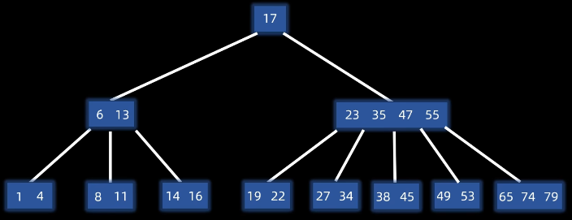

B树的定义

- 平衡
  - B树的所有叶子节点都在同一层
- 有序（搜索树性质）
  - 任意元素的左子树都小于它，右子树都大于它
- 多路（以M阶B树为例）
  - 最多：m个分支，m-1个元素
  - 最少
    - 根节点：2个分支，1个元素
    - 其他节点：$\lceil {\frac{m}{2}} \rceil$个分支，$\lceil {\frac{m}{2}} \rceil-1$个元素（$\lceil  \rceil$为上取整符号）

### 3.4.2 插入（分裂法）

步骤（以三阶B树为例）：

- 将新键按顺序插入到**叶子节点**中

  - 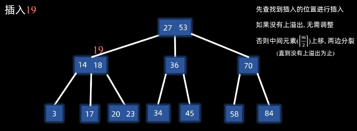
  - 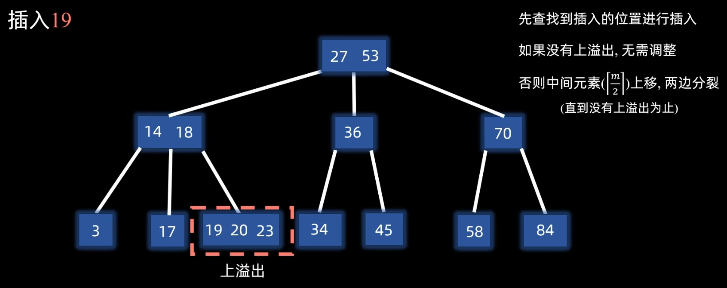

- 如果该叶子节点内键的数量超过了 $M-1$，将第$\lceil {\frac{m}{2}} \rceil$个元素（此时是3/2=1.5=2，第2个元素，也就是20）上提到父节点，原节点左右两半部分分别变成两个新节点

  - 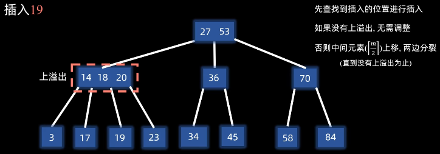

- 如果父节点也满了，继续向上分裂，直到根节点。根节点分裂是B树高度增加的唯一方式

  - 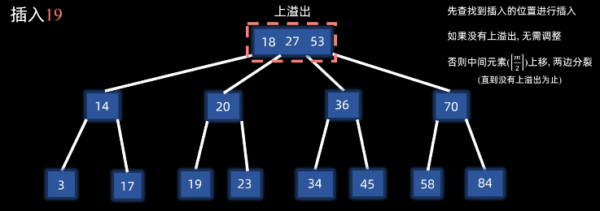

  - 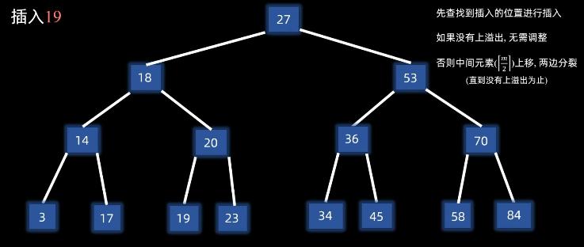

### 3.4.3 删除（合并和借调）

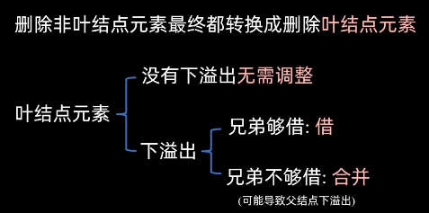

当删除节点后导致键的数量低于 $\lceil M/2 \rceil - 1$ 时：

- **借调**：尝试从相邻的兄弟节点借一个键（需要通过父节点中转）
  - 假设现在我们删除了一个键，导致72这个节点的数量下溢出了，这个时候我们发现它的左右兄弟都够借，我们从左兄弟借
  - 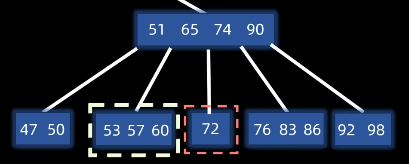
  - 怎么借：把父节点65下移，然后将左兄弟的最后一个键60上移，作为新的父节点
  - 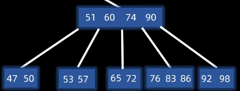
- **合并&检查**：如果左右兄弟都没有多余的键，则将该节点、父节点的分割键以及兄弟节点合并成一个新节点
  - 假设现在我们删除了一个键，导致83这个节点的数量下溢出了，这个时候我们发现它的左右节点都不够借。这个时候我们就需要将它和其中一个兄弟合并，这里我们和左兄弟合并
  - 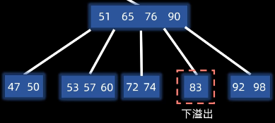
  - 怎么合并：把父节点下移到左兄弟中，再把83合并过来，然后移除掉空的父节点和子树
  - 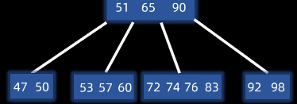
  - **由于父节点下移了一个元素，所以我们还需要继续检查父节点是否下溢出**

### 3.4.4 完整代码实现

```c++
class BTreeNode {
public:
    int* keys;      // 键数组
    int t;          // 最小度数 (t)，节点至少有 t-1 个键，最多有 2t-1 个键
    BTreeNode** C;  // 孩子指针数组
    int n;          // 当前键的数量
    bool leaf;      // 是否为叶子节点

    BTreeNode(int _t, bool _leaf) {
        t = _t;
        leaf = _leaf;
        keys = new int[2 * t - 1];
        C = new BTreeNode*[2 * t];
        n = 0;
    }

    ~BTreeNode() {
        if (!leaf) {
            // 如果不是叶子节点，需要递归销毁所有孩子
            for (int i = 0; i <= n; i++) {
                if (C[i]) {
                    delete C[i];
                    C[i] = nullptr;
                }
            }
        }
        // 释放当前节点的数组内存
        delete[] keys;
        delete[] C;
    }

    void insertNonFull(int k) {
        int i = n - 1;
        if (leaf) {
            // 找到插入位置并移动元素
            while (i >= 0 && keys[i] > k) {
                keys[i + 1] = keys[i];
                i--;
            }
            keys[i + 1] = k;
            n = n + 1;
        } else {
            // 找插入位置
            while (i >= 0 && keys[i] > k) i--;
            // 说明k应该插入到C[i+1]中
            if (C[i + 1]->n == 2 * t - 1) {
                // 如果孩子满了，进行分裂
                splitChild(i + 1, C[i + 1]);
                // 分裂完了，考虑要插入到分裂后两个节点的哪一个，一个是i+1，一个是i+2
                if (keys[i + 1] < k) i++;
            }
            C[i + 1]->insertNonFull(k);
        }
    }

    // 分裂孩子节点->中间键上提
    // i是y这个节点的C数组下标
    void splitChild(int i, BTreeNode* y) {
        // 创建一个新的节点，来保存y的后半部分值（y往右分裂）
        BTreeNode* z = new BTreeNode(y->t, y->leaf);
        z->n = t - 1;

        for (int j = 0; j < t - 1; j++) {
            z->keys[j] = y->keys[t + j];
        }
        if (!y->leaf) {
            for (int j = 0; j < t; j++) {
                z->C[j] = y->C[t + j];
            }
        }
        y->n = t - 1;

        // 移动当前节点的孩子指针，为新节点 z 腾出位置
        for (int j = n; j >= i + 1; j--) C[j + 1] = C[j];
        C[i + 1] = z;

        // 移动当前节点的键，将 y 的中间键上提到当前节点
        for (int j = n - 1; j >= i; j--) keys[j + 1] = keys[j];
        keys[i] = y->keys[t - 1];
        n = n + 1;
    }

private:
};

class BTree {
public:
    BTree(int _t) {
        root = nullptr;
        t = _t;
    }
    ~BTree() {
        if (root) {
            delete root;  // 会触发 BTreeNode 的递归析构
            root = nullptr;
        }
    }

    void insert(int k) {
        if (root == nullptr) {
            root = new BTreeNode(t, true);
            root->keys[0] = k;
            root->n = 1;
        } else {
            // 如果根节点满了，树的高度会增加
            if (root->n == 2 * t - 1) {
                BTreeNode* s = new BTreeNode(t, false);
                s->C[0] = root;
                s->splitChild(0, root);

                // 判断新键应该去两个孩子中的哪一个
                int i = 0;
                if (s->keys[0] < k) i++;
                s->C[i]->insertNonFull(k);
                root = s;
            } else {
                root->insertNonFull(k);
            }
        }
    }

private:
    BTreeNode* root;
    int t;  // 最小度数
};
```

### 3.4.5* B+树

B+ 树是 B 树的一种变形，它是现代数据库索引（如 MySQL 的 InnoDB 引擎）和文件系统的**标准实现**。

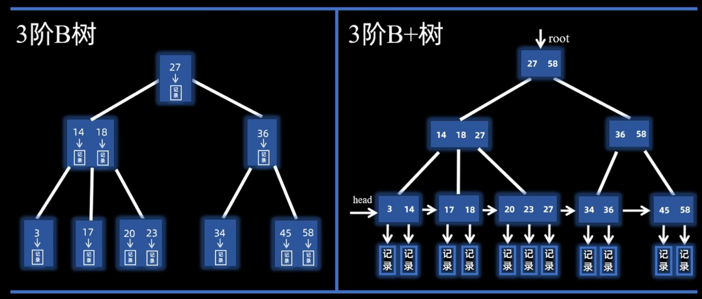

B+ 树通过将“索引”与“数据”分离，实现了更高的查询效率：

- 非叶子节点（索引节点）：只存储键（Key），不存储实际的数据（Value/Data）。它们的作用仅是作为查找的路径向导
- 叶子节点（数据节点）：存储了所有的键以及对应的 实际数据记录
- 叶子节点链表：所有的叶子节点按照键值大小顺序连接，形成一个链表（因此支持顺序查找）

# 4 散列表（哈希表，Hash Table）

散列表，也叫哈希表，是一种通过键（Key）直接访问内存存储位置的数据结构。它通过一个关键的函数——散列函数（Hash Function），将键映射到表中的一个位置，从而实现近乎 $O(1)$ 的查找效率。

## 4.1 基本原理

散列表的核心思想是：利用数组支持按照下标 $O(1)$ 随机访问的特性。

- **存储过程**：`index = hash(key) % table_size`。将键通过哈希函数计算出哈希值，再对数组长度取模，得到存放位置
- **查找过程**：同样通过哈希函数计算位置，直接去数组对应的下标取值

## 4.2 哈希冲突

### 4.2.1 哈希冲突的解决方案

由于哈希函数的输出范围有限，而输入数据几乎是无限的，不同的键可能会计算出相同的哈希值，这就是**冲突**。解决冲突的主流方法有两种：

- **链地址法**

  - 将冲突的元素存储在同一个下标对应的**链表**（或其他容器，如红黑树）中

- **开放定址法**

  - 如果发生冲突，就按照某种规则在数组中寻找下一个空闲的位置

    - 线性探测：下标加 1，加 2... 往后找

    - 双重散列：使用第二个哈希函数计算步长

      - **$i$**：探测次数（$0, 1, 2, ...$）

      - $hash(key, i) = (h_1(key) + i \times h_2(key)) \pmod M$

### 4.2.2 线性探测法的聚集效应

指的是一旦散列表中某些位置出现了冲突，这些位置就会逐渐形成一连串连续占用的“堆积带”，导致后续的查找和插入效率从 $O(1)$ 退化向 $O(n)$。

在线性探测中，如果 `hash(key)` 的位置被占用了，算法会检查 `hash(key) + 1`，如果还被占用，就检查 `hash(key) + 2`，以此类推。

- **滚雪球效应**：假设散列表里下标为 5、6、7 的位置已经被占用了。现在有一个新的键，其哈希值恰好落在 5。它发现 5 满了，就去占领 8
- **概率叠加**：接下来，任何哈希值落在 5、6、7、8 的新元素，都不得不去竞争位置 9
- **结果**：原本均匀分布的哈希映射，因为这种“挨家挨户”找位子的策略，变成了“越满的地方越容易变满”

### 4.2.3 双重散列法的特殊要求

公式：
$$
hash(key, i) = (h_1(key) + i \times h_2(key)) \pmod M
$$
为了保证双重散列能正常工作，$h_2$ 的设计必须遵循两个客观原则：

- 不能返回 0：如果 $h_2(key) = 0$，探测步长就变成了 0，算法会陷入死循环，永远在初始位置尝试
- 步长必须与 $M$ 互质：步长 $h_2(key)$ 必须能够遍历完散列表中所有的槽位。如果步长和表长 $M$ 有公约数，探测过程可能只会访问数组中的一小部分位置

## 4.3 装填因子

装填因子 $\alpha$ 的定义为：$\alpha = \frac{\text{已存储元素个数}}{\text{散列表总长度}}$

- 当 $\alpha$ 超过一定阈值（如 0.75）时，冲突概率会剧增
- 此时需要进行**扩容 (Rehash)**：申请一个更大的数组（通常是原来的 2 倍），并将所有元素重新计算哈希值放入新表

# 5 `map`/`set` VS `unordered_map`/`unordered_set`

| **特性**                | **map / set**                       | **unordered_map / unordered_set**         |
| ----------------------- | ----------------------------------- | ----------------------------------------- |
| **底层实现**            | **红黑树**（平衡二叉搜索树）        | **散列表**（哈希表）                      |
| **查找/插入时间复杂度** | **$O(\log n)$**（稳定）             | **平均 $O(1)$**，最坏 $O(n)$              |
| **元素顺序**            | **严格有序**（默认升序）            | **无序**（取决于哈希分布）                |
| **迭代器支持**          | 双向迭代器（可自增自减）            | 前向迭代器（通常只能自增）                |
| **对 Key 的要求**       | 必须定义 **`<` 运算符**（比较大小） | 必须定义 **`==` 运算符** 及 **Hash 函数** |
| **内存开销**            | 较低（每个节点三个指针）            | 较高（需预留桶空间、处理冲突）            |

## 5.1 什么时候该用 `map` / `set`？

- **需要有序输出**：例如你需要按顺序打印员工姓名，或者按时间先后处理任务。
- **需要范围查询**：例如查找键值在 `[10, 50]` 之间的所有元素。`map` 提供了 `lower_bound` 和 `upper_bound` 成员函数，能非常高效地完成此操作
- **对稳定性要求极高**：散列表在触发“扩容（Rehash）”时会有一次性的较大耗时，而红黑树的操作耗时相对均匀平稳

## 5.2 什么时候该用 `unordered_map` / `unordered_set`？

- **追求极致的查找速度**：如果你只是单纯地想根据一个 ID 找到对应的信息，且不关心顺序，散列表通常快得多
- **数据量巨大且无序**：在大量单点查询的场景下，$O(1)$ 的优势会随着数据量 $n$ 的增大而愈发明显

