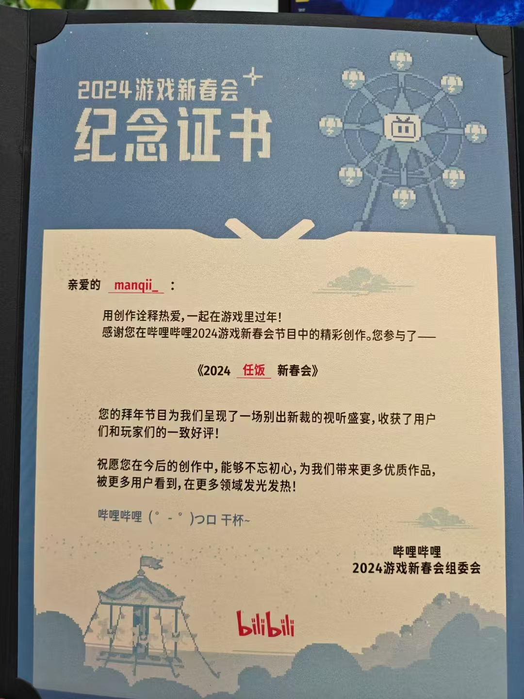

这篇文章记录了我所参与制作的游戏新春会节目《林克的大逆转》，只要我还在继续做，这篇文章应该就会一直更新下去。

喜报：2025年了，我还在做林克的大逆转！

# 2023-2024

## 林克的大逆转 2024&特别法庭

**链接**：[林克的大逆转2024](https://www.bilibili.com/video/BV1iB421z7ih/?spm_id_from=333.999.0.0&vd_source=d1cd7437519192c36dc659c247e8160e)

**链接**：[林克的大逆转特别法庭](https://www.bilibili.com/video/BV1QdPde2EbM/?spm_id_from=333.1387.homepage.video_card.click)

**加入新春会的原因**

一开始是在空间看到了任饭新春会的招募海报。往常一般这种同人制作活动，我是完全搭不上关系的。毕竟我没有什么才艺，也不懂视频制作。但这次却不一样，我定睛一看，发现他们居然在招收游戏程序。“终于轮到我大展身手了吗！”我立马就扫描了进群的二维码。

因为刚好在游戏行业，专业十分对口，我很快就通过了制作人的筛选。

加入后我总算知道他们为什么要招募游戏程序。23年春节的时候，他们做了一个塞尔达版的逆转裁判，当时把视频制作的老师累得半死。于是第二年他们学聪明了，觉得像这种逆转like，可能做成游戏会更省事一点（制作人os：逆转裁判本来就是游戏啊，所以直接干脆做一个游戏出来吧！）。

**明确程序开发思路**

这次制作对我的要求是，**实现一个自动化程序，这个程序能够读取剧情脚本，生成对应的游戏流程**。之后视频制作的老师会直接对游戏进行录屏，再基于录屏基础上进行微调，这样就省去了大部分视频剪辑的工作。

那么问题来了，啥是**剧情脚本**？

其实就是将我们常见的剧本改造成程序能够识别的形式。

例如这段剧情：

```
林克：证人，（停顿）你说你看到加侬的头上都是血。
```

就会被改造成：

```
<Name Link>
<ShowChar Link Speak>
证人，<W 7>你说你看到加侬的头上都是血...
```

这样是不是就能初步理解了？不理解也没关系！因为我一开始也是不理解的。

 

其中像ShowChar这种指示字符叫做**控制字**，像`<ShowChar Link Speak>`的意思就是“调出林克的说话动画”。

在这次制作过程中，我们根据实际需求对控制字进行了自定义，涵盖了对对话、动画、特效、音频等方面的控制，然后我基于设计实现了游戏程序。

部分当时的设计文档：


至于为什么想到了控制字的这种脚本模式呢，那就要从制作人蛋糕老师解包逆转的游戏文件说起了。当时蛋糕老师找到了逆转的剧情脚本文件，发现其中就有很多类似这样的控制字，于是我们就干脆踩在卡普空的肩膀上进行开发了！（你们搞同人的到底有什么事情是做不到的？）

**林克的大逆转2024上线 & 林克的大逆转特别法庭再延续**

程序开发在思路确定后就稳步向前，虽然过程中也有一些小坎坷，但是最后还是在大家的共同努力下按期把《林克的大逆转2024》端出来了。

而第二年的特别法庭，程序这边的故事就没有那么多啦！总结就是重构了一下程序框架，最后呈现了相比之前更合理，更好的效果（至少我是这么认为的）。

**瞎逼逼&表忠心**

这两年的节目制作给我带来的收获非常多，无论是不可替代的成就感，还是程序开发经验的增长，还是认识了一群志同道合的小伙伴。因此至少是我来说，如果林克的大逆转的大家打算继续做下去，我就会一直做下去。

所以请期待吧，更多的林克的大逆转！

**晒一下B站颁发的证书**



咱也算为老任的同人社区做出了一点贡献了~
