【进行一个倒叙xD】

【毕业前的项目基本没有什么记录，所以这篇文章从毕业之后开始写。】

# 2024

## 恶魔真探DICEMON 2024.5


**链接**：[恶魔真探DICEMON](https://www.gcores.com/games/126397)

**制作日期**：2024.4~2024.5

恶魔真探于我而言是24年最大的惊喜，一群第一次合作的人，居然能够携手走到**最佳游戏奖**的位置，难以置信。

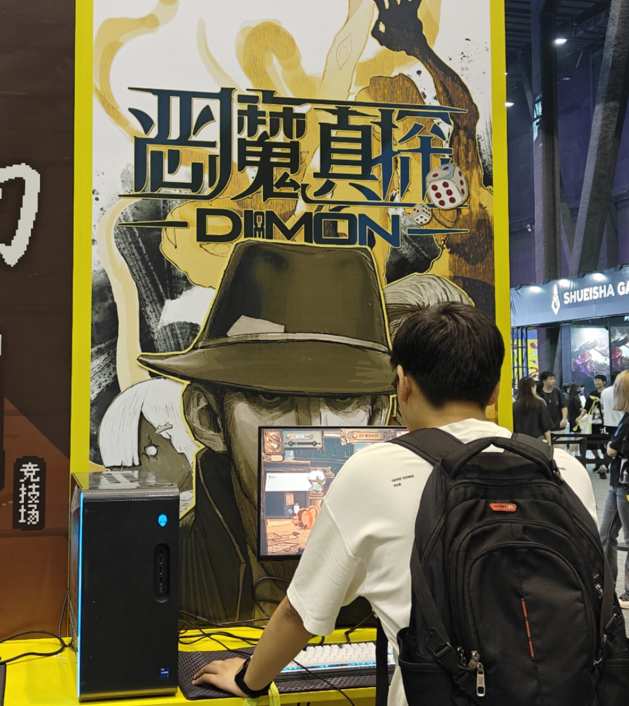

【2024鹰角开拓芯游戏创享节上，玩家正在游玩我们的游戏。】

恶魔真探是在机核BooomJam产出的作品，一开始我抱着“上次Jam我的产出太少了，这次多做点东西吧！”的心态在机核发布了组队自荐，然后幸运地被队伍后来的PM和主美邀请加入队伍，后来队伍随着我们各自的邀请逐渐壮大，扩充到了最后的11人。

后来做完游戏PM21和主美A捞跟我说，是因为我在机核社区发岩田聪的名言“程序员不能说不”才产生了邀请念头。（在机核的这篇采访里也有被提到：[为了你的“游戏梦”，我们能做的是什么？](https://www.gcores.com/articles/183395)，总而言之真是太感谢了，感谢聪哥！感谢我的队友们。）

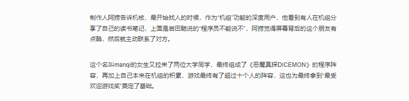

在这次制作里，我主要负责了：①UI框架搭建和UI相关功能模块的开发 ②音频管理 ③AVG系统的实现 ④游戏数据处理 ~~⑤打包XD~~。

这次游戏的机制设计我也非常喜欢，针对于主题“副作用”，我们组的策划老师们~~经过多轮策划案被我们掀翻~~，提出了这样一个提案：**“骰子的副作用是堆叠，堆叠的副作用是倒塌”。玩家需要合理分配手中的骰子，以特定的点数和排列方式堆叠骰子塔，最大化利用“恶魔”——游戏中骰子塔的载体——的作用，应对敌方攻击的同时，避免骰子塔倒塌带来反噬**。

作为桌游爱好者，我从最后的游戏成品里得到了策略型桌游类似的体验感，它主张的是其实骰子分配的平衡：你需要合理地分配骰子，在被施加的副作用最低的同时，打出最高的伤害。在后来的玩家反馈中，我发现部分中重策玩家也得到了相似的体验。

整个BooomJam的时间总共有21天，但由于我们前期不断地掀桌重来，到最后真正施工的时间只有十天左右。感谢我的队友们，我们互相信任着对方，各自发挥自己的作用，赶在最后一刻之前完成了游戏。

我们也如愿以偿得到了很多玩家的反馈，无论是好的还是坏的，其中也不乏让我们都深受感动的评价。

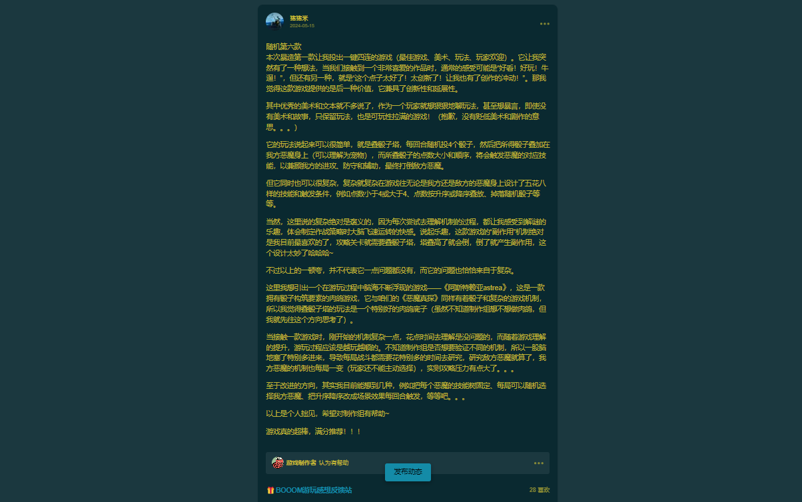

做游戏也许就是为了这一刻。

后来经过开拓芯团队的评选，我们荣获了最佳游戏奖（其实大家都没有想到哈哈哈）。

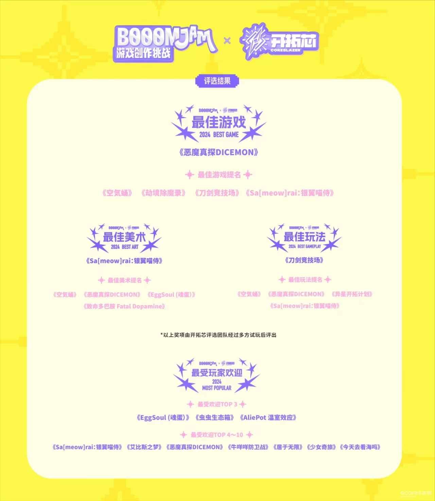

更重要的结识了热爱游戏的朋友们TT，后来我emo的时候，队友们还安慰我，鼓励我继续坚持，喜欢我的队友们！

最后放一些喜欢的游戏截图吧！

**项目图片**

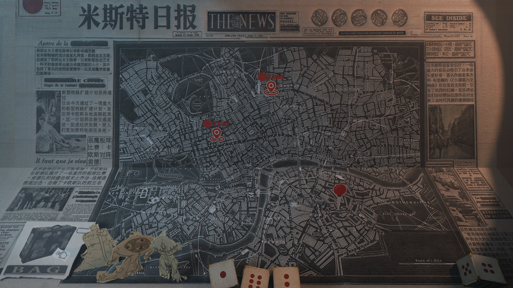

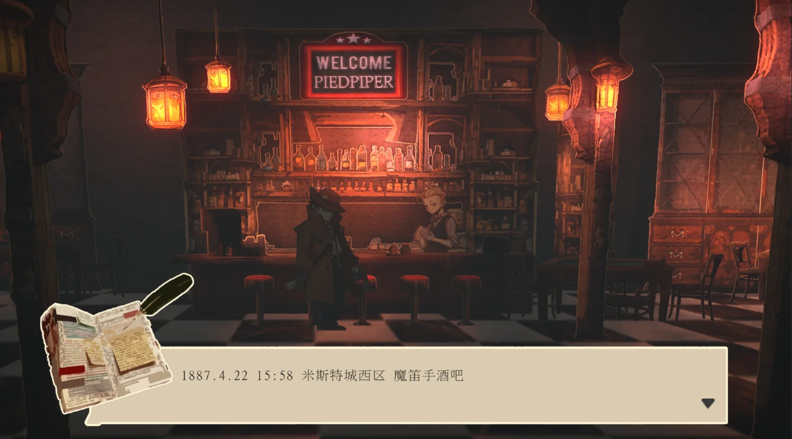

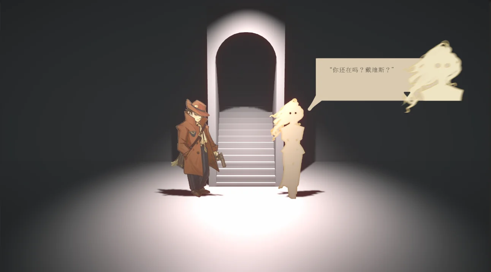

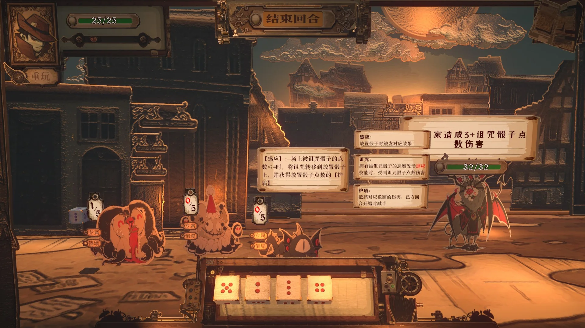

# 2023

## 林克的大逆转 2023.10


**链接**：[林克的大逆转2024](https://www.bilibili.com/video/BV1iB421z7ih/?spm_id_from=333.999.0.0&vd_source=d1cd7437519192c36dc659c247e8160e)

**制作日期**：2023.10~2024.1

林克的大逆转这个项目算是包圆了我23年剩余的时间。

一开始是在空间看到了任天堂新春会的招募海报。以前一般这种同人制作活动，我是完全搭不上关系的，毕竟我不懂cos，也不懂视频制作，总之就是没什么能端得上台面的才艺。但这次却不一样，我在招募海报里居然发现他们正在招募游戏程序。“终于轮到我大展身手了吗？”我心里想着这句话，狠狠点击加入群聊。

加入后我总算知道他们为什么要招募，因为23年春节的时候，他们也做了一个23年版的林克的大逆转，当时把视频制作的老师累得半死。于是第二年他们学聪明了，觉得像这种逆转like，可能做成游戏会更省事一点（逆转裁判本来就是游戏啊，所以直接干脆做一个出来吧XD！），于是就开始找游戏程序。

这次制作对我的要求是，**实现一个自动化程序，这个程序能够读取剧情脚本，生成对应的游戏流程**，然后视频制作的老师会直接对游戏进行录屏。

**啥是剧情脚本？**

AVG游戏的剧情脚本，实际上可以理解为某种指示游戏流程如何进行的“代码”，脚本里涵盖了对于游戏对话、特效、动画、场景切换的指示。其实联想现实生活中舞台剧给演员的演出脚本，就能很快get到。

像脚本里的这一段：

```
<ShowChar Link Speak>
证人，<W 7>你说你看到加侬的头上都是血...
```

在游戏程序里会变成这样的一段剧情：

```
切换林克人物，播放说话动画。
对话文本弹出：“证人，（停顿7帧）你说你看到加侬头上都是血...”。
```

这样是不是就能理解了？

其中像ShowChar这种指示叫做“控制字”，在这次制作过程中，我们根据实际需求对制作字进行了自定义，涵盖了对对话、动画、特效、音频等方面的控制，然后我基于设计实现了游戏程序。

当时的程序设计文档：

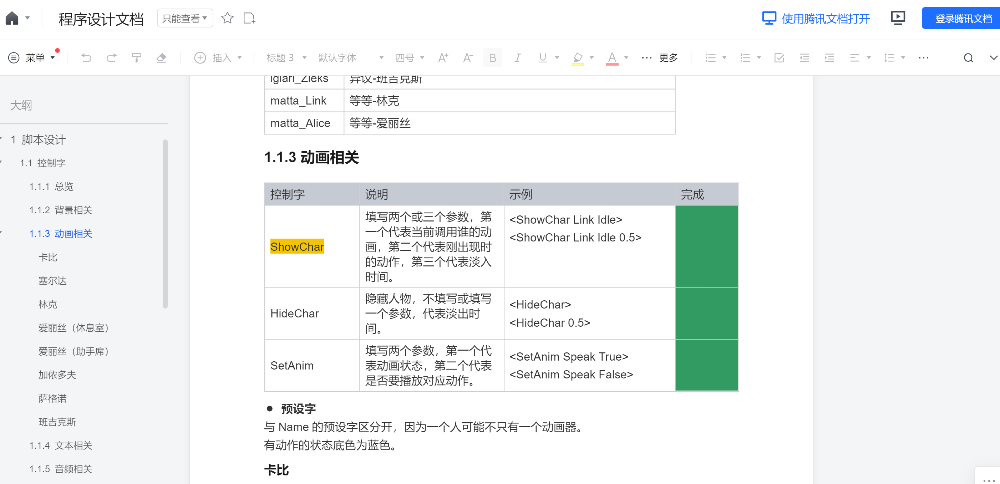

某个场景的脚本：

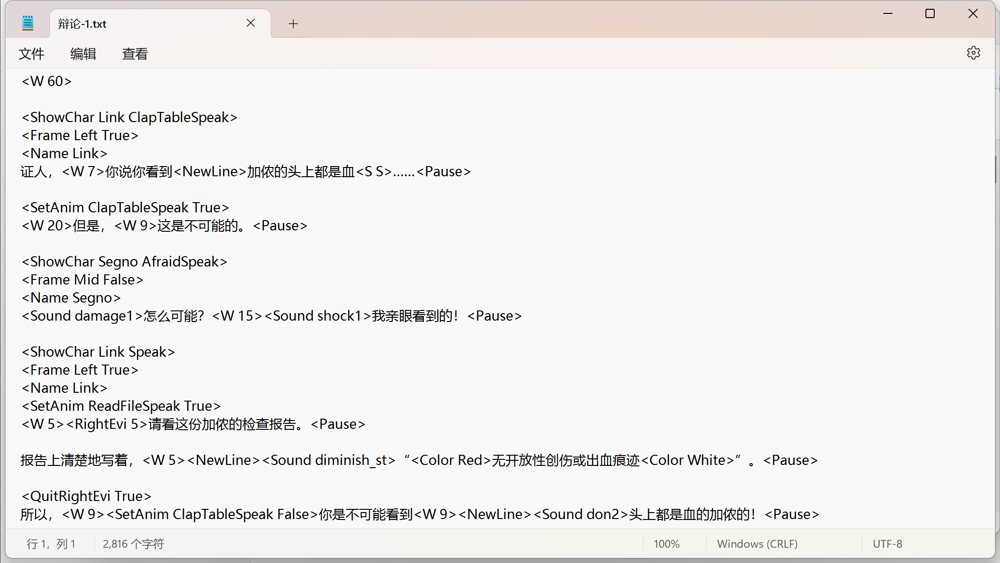

这次制作让我对AVG制作有了一点了解，也是我第一个solo完成的游戏项目XD。

后面经过组里大家的共同努力，项目稳稳落地，在春节的时候顺利播出。整个制作过程中我也有被这帮搞同人的老师震惊到，到底是有多热爱才能做到对游戏里的各种情节、角色、甚至是设计细节如数家珍的？（~~而我玩一个忘一个~~）

**项目图片**

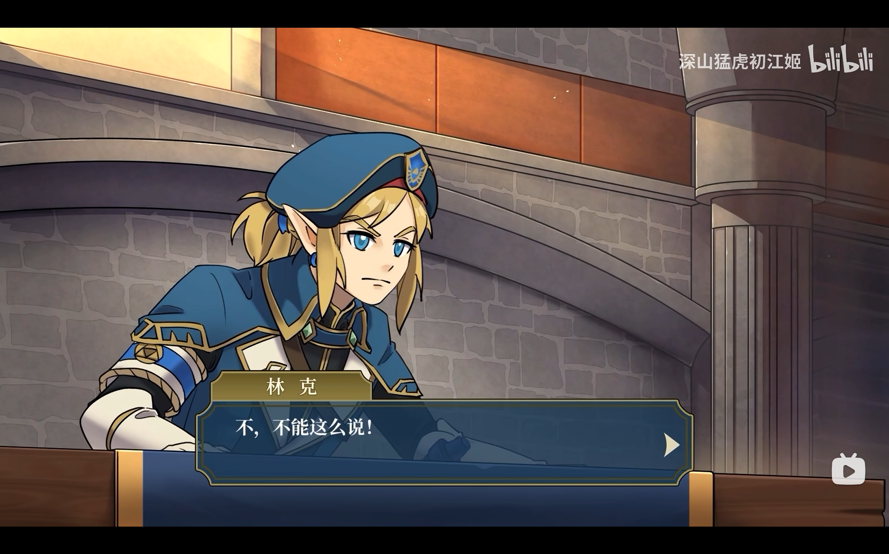

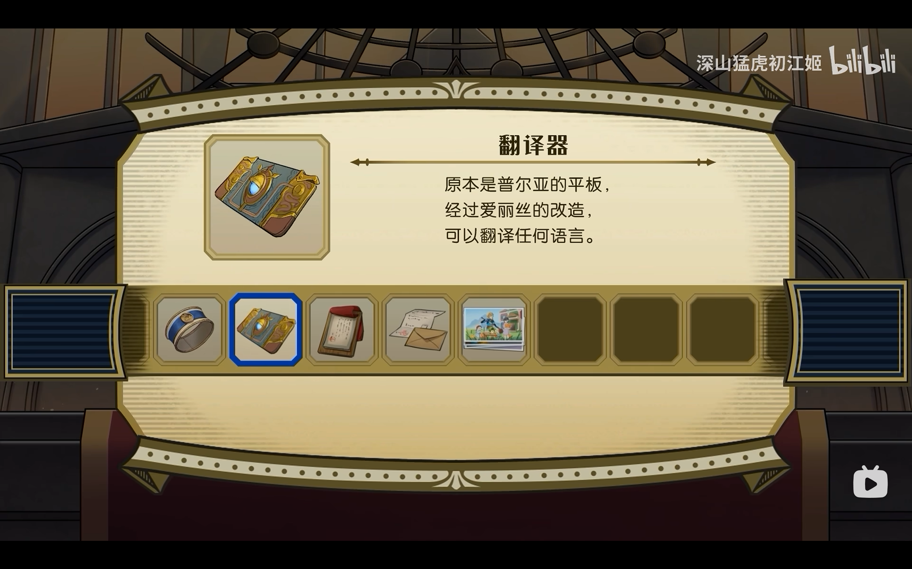

**B站颁发的证书**


咱也算为老任的同人社区做出了一点贡献了~

## 宇宙尽头的酒馆 2023.9


**链接**：[宇宙尽头的酒馆](https://www.gcores.com/games/113123)

**制作时间**：2023.9~2023.10

酒馆是我毕业之后做的第一款游戏，本科的时候沉迷于赛博朋克酒保行动，就一直想做一款酒保like游戏，后面当我决定参加机核9月份的BooomJam的时候，我发现机核群里机组的防门老师发了制作招募，定睛一看居然就是我想做的酒保like，于是我毫不犹豫地加入了。

整个游戏的制作过程非常愉快，身为制作人的防门老师有多次的制作经验，带领我们井然有序地结束了整个游戏的制作，程序组的小伙伴们也非常靠谱，我们各司其职，算得上是稳稳地完成了整个游戏的开发（这也为后面我们又一次合作参与了防门老师下一款游戏的程序制作埋下了伏笔：[第二次合作：少女奇旅](https://www.gcores.com/games/125872)）。

不过我在这次游戏的制作中负责的程序内容不多，主要是完成了小模块【音乐盒】的开发，主要功能是选择新一天需要轮询播放的音乐、预听音乐、查看音乐专辑的一些信息。

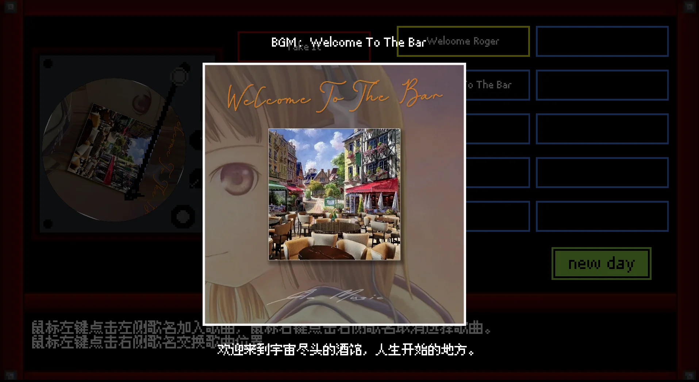

虽然工作比较简单，但我还是很享受的，这是我做游戏以来第一次游戏团队里拥有这么强大的美术和音乐阵容，也是第一次参与制作的游戏收到了特别多玩家的反馈，我第一次这么清晰地感觉到做游戏的幸福之处：能收到玩家的反馈，无论是好的还是坏的，都太幸福了，因为你做的游戏可是有人玩的啊！（因为这次非常愉快的制作，后面的一次BooomJam我也猛猛参加了，果然人还是需要正反馈啊！）

**项目图片**

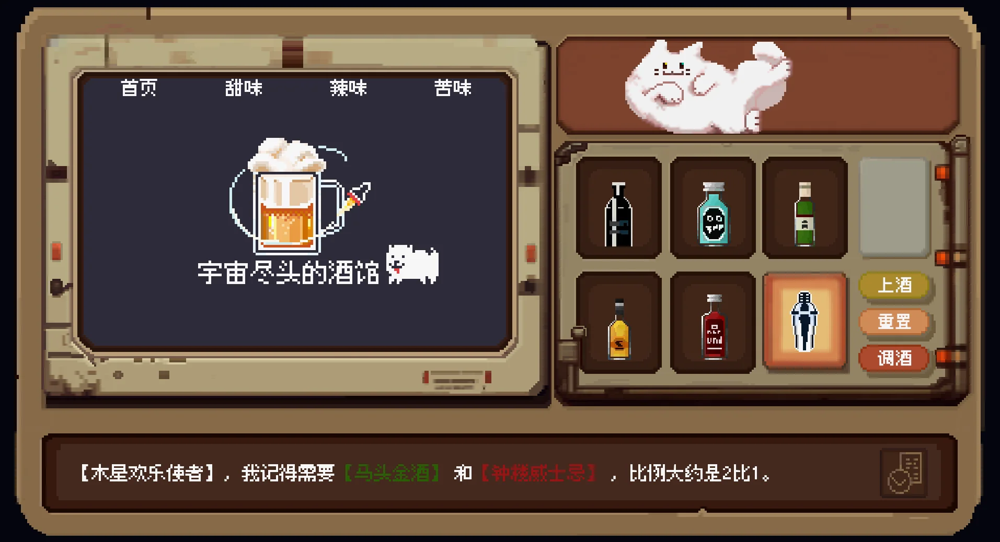

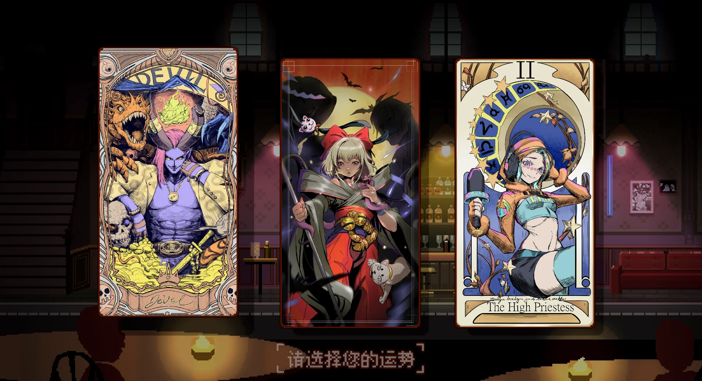


**证书**

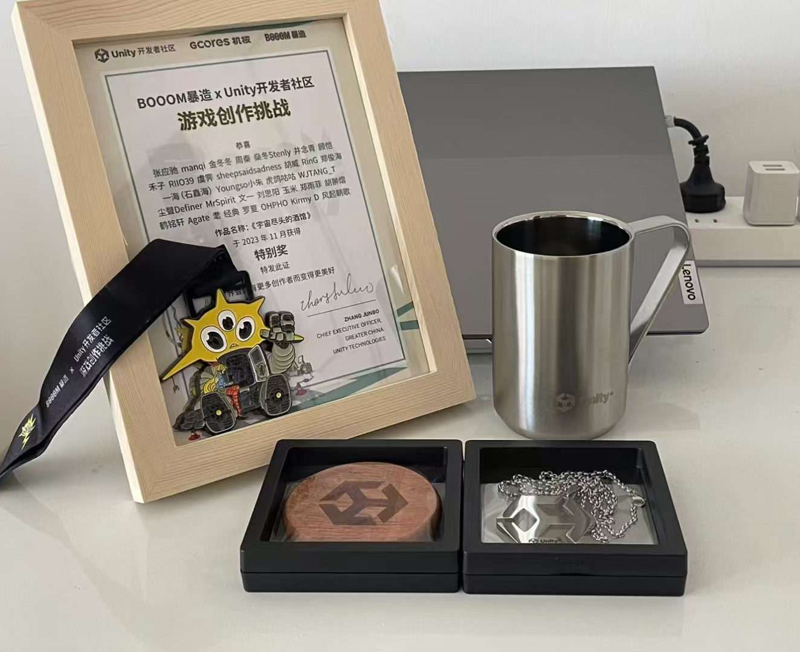
