【毕业前的项目基本没有什么记录，所以这篇文章从毕业之后开始写。】

【太好了！我还在一直做游戏qwq】

# 游戏

## 宇宙尽头的酒馆 2023.9

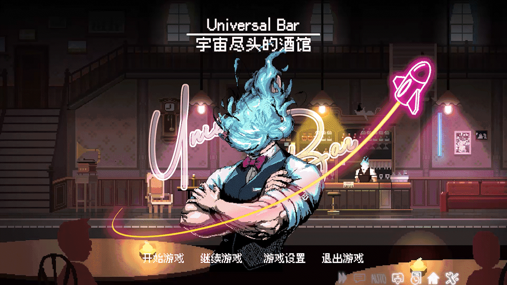

**链接**：[宇宙尽头的酒馆](https://www.gcores.com/games/113123)

**制作时间**：2023.9~2023.10

酒馆是我毕业之后做的第一款游戏，本科的时候沉迷于赛博朋克酒保行动，就一直想做一款酒保like游戏，后面当我决定参加机核9月份的BooomJam的时候，我发现机核群里机组的防门老师发了制作招募，定睛一看居然就是我想做的酒保like，于是我毫不犹豫地加入了。

整个游戏的制作过程非常愉快，身为制作人的防门老师有多次的制作经验，带领我们井然有序地结束了整个游戏的制作，程序组的小伙伴们也非常靠谱，我们各司其职，算得上是稳稳地完成了整个游戏的开发（这也为后面我们又一次合作参与了防门老师下一款游戏的程序制作埋下了伏笔：[第二次合作：少女奇旅](https://www.gcores.com/games/125872)）。

不过我在这次游戏的制作中负责的程序内容不多，主要是完成了小模块【音乐盒】的开发，主要功能是选择新一天需要轮询播放的音乐、预听音乐、查看音乐专辑的一些信息。

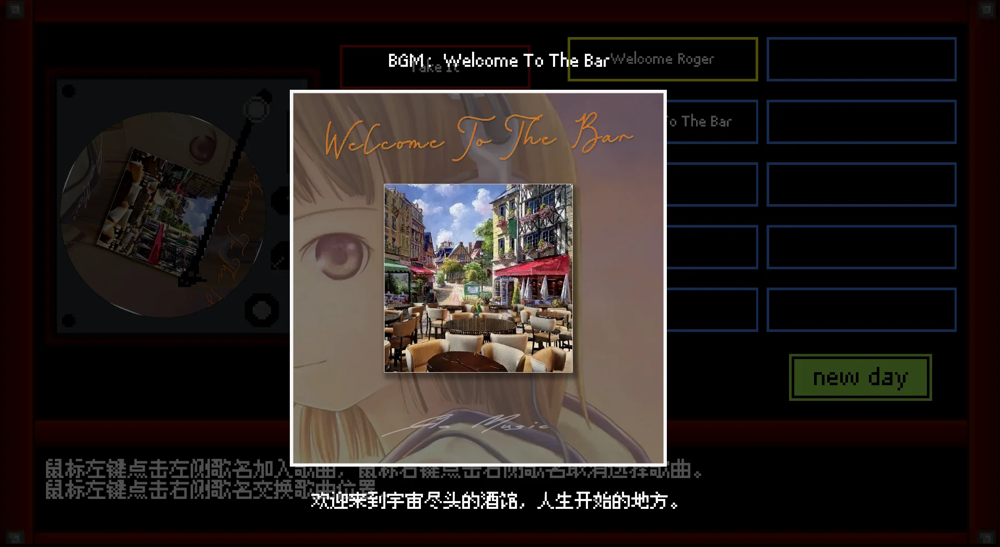

虽然工作比较简单，但我还是很享受的，这是我做游戏以来第一次游戏团队里拥有这么强大的美术和音乐阵容，也是第一次参与制作的游戏收到了特别多玩家的反馈，我第一次这么清晰地感觉到做游戏的幸福之处：能收到玩家的反馈，无论是好的还是坏的，都太幸福了，因为你做的游戏可是有人玩的啊！（因为这次非常愉快的制作，后面的一次BooomJam我也猛猛参加了，果然人还是需要正反馈啊！）

**项目图片**

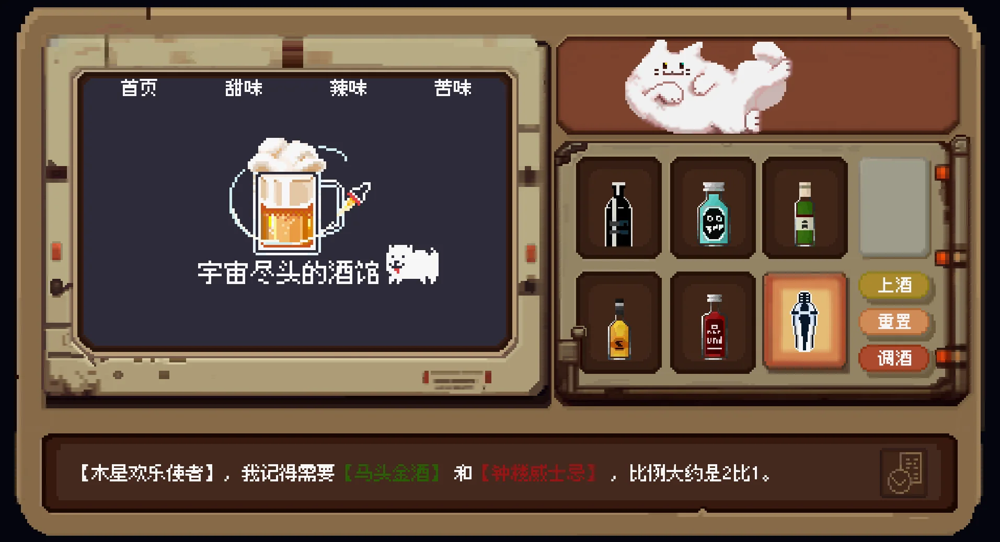

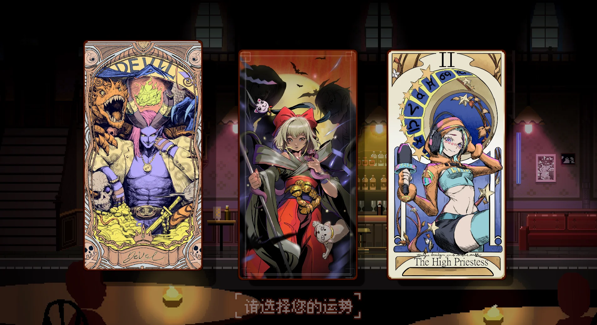

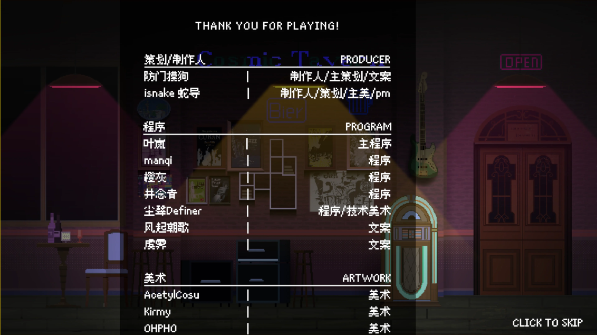

**证书**

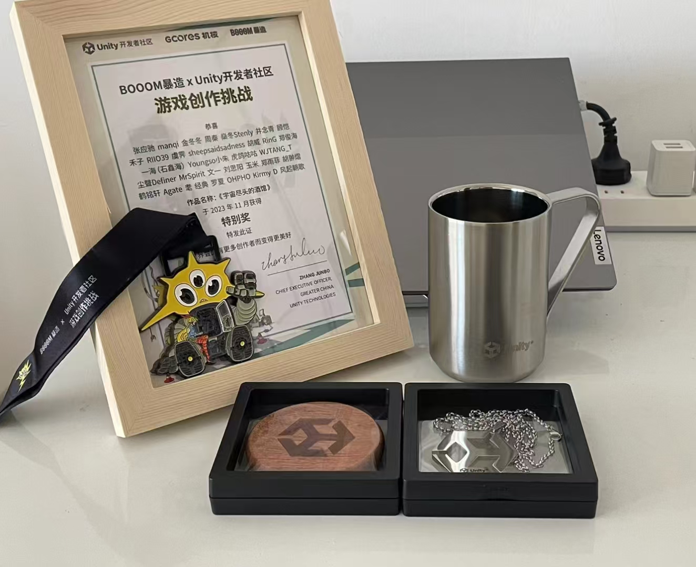

## 恶魔真探DICEMON 2024.5

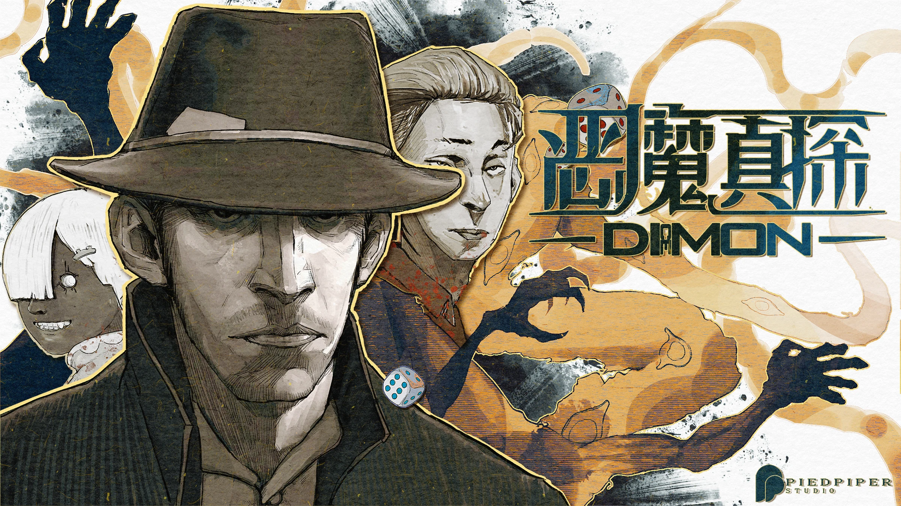

**链接**：[恶魔真探DICEMON](https://www.gcores.com/games/126397)

**制作日期**：2024.4~2024.5

恶魔真探于我而言是24年最大的惊喜，一群第一次合作的人，居然能够携手走到**最佳游戏奖**的位置，难以置信。

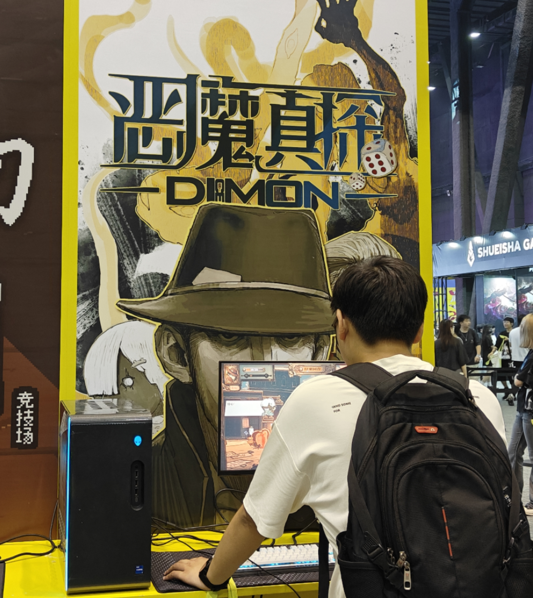

【2024鹰角开拓芯游戏创享节上，玩家正在游玩我们的游戏。】

恶魔真探是在机核BooomJam产出的作品，一开始我抱着“上次Jam我的产出太少了，这次多做点东西吧！”的心态在机核发布了组队自荐，然后幸运地被队伍后来的PM和主美邀请加入队伍，后来队伍随着我们各自的邀请逐渐壮大，扩充到了最后的11人。

后来做完游戏PM21和主美A捞跟我说，是因为我在机核社区发岩田聪的名言“程序员不能说不”才产生了邀请念头。（在机核的这篇采访里也有被提到：[为了你的“游戏梦”，我们能做的是什么？](https://www.gcores.com/articles/183395)，总而言之真是太感谢了，感谢聪哥！感谢我的队友们。）

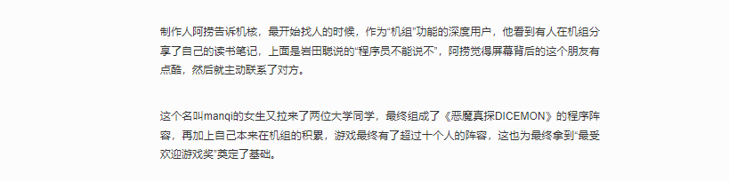

在这次制作里，我主要负责了：①UI框架搭建和UI相关功能模块的开发 ②音频管理 ③AVG系统的实现 ④游戏数据处理 ~~⑤打包XD~~。

这次游戏的机制设计我也非常喜欢，针对于主题“副作用”，我们组的策划老师们~~经过多轮策划案被我们掀翻~~，提出了这样一个提案：**“骰子的副作用是堆叠，堆叠的副作用是倒塌”。玩家需要合理分配手中的骰子，以特定的点数和排列方式堆叠骰子塔，最大化利用“恶魔”（游戏中骰子塔的载体），应对敌方攻击的同时，避免骰子塔倒塌带来反噬”**。

作为桌游爱好者，我从最后的游戏成品里得到了策略型桌游类似的体验感，它主张的是其实骰子分配的平衡：你需要合理地分配骰子，在被施加的副作用最低的同时，打出最高的伤害。在后来的玩家反馈中，我发现部分中重策玩家也得到了相似的体验。

整个BooomJam的时间总共有21天，但由于我们前期不断地掀桌重来，到最后真正施工的时间只有十天左右。感谢我的队友们，我们互相信任着对方，各自发挥自己的作用，赶在最后一刻之前完成了游戏。

我们也如愿以偿得到了很多玩家的反馈，无论是好的还是坏的，其中也不乏让我们都深受感动的评价。

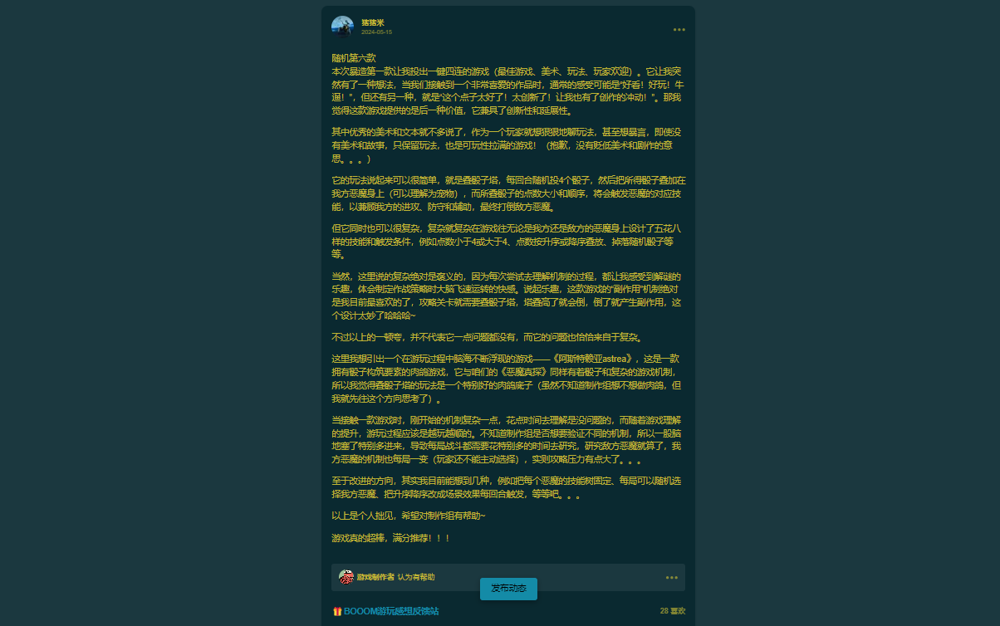

做游戏也许就是为了这一刻。

后来经过开拓芯团队的评选，我们荣获了最佳游戏奖（其实大家都没有想到哈哈哈）。

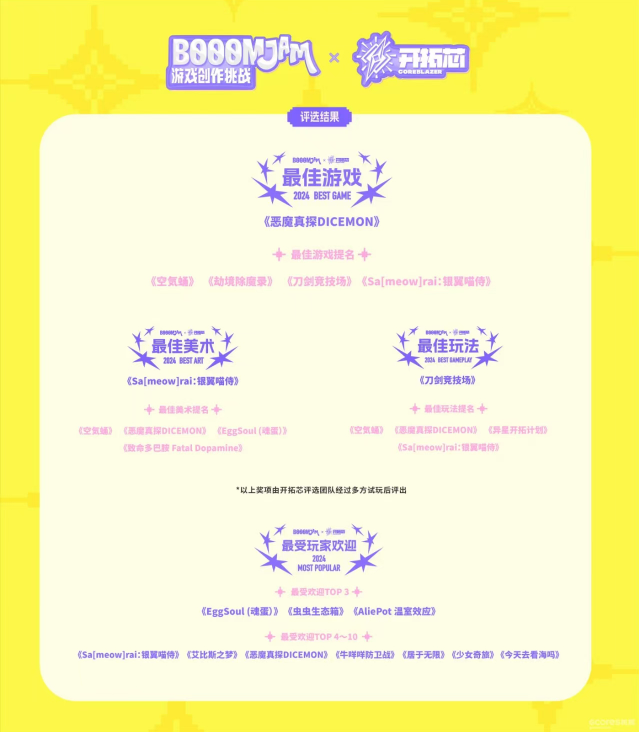

更重要的结识了热爱游戏的朋友们TT，后来我emo的时候，队友们还安慰我，鼓励我继续坚持，喜欢我的队友们！

最后放一些喜欢的游戏截图吧！

**项目图片**

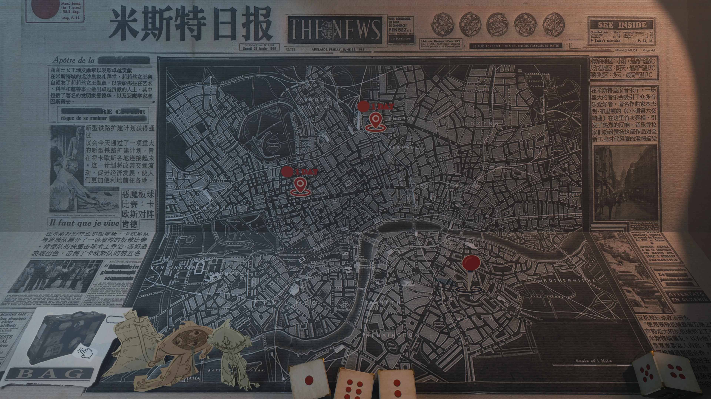

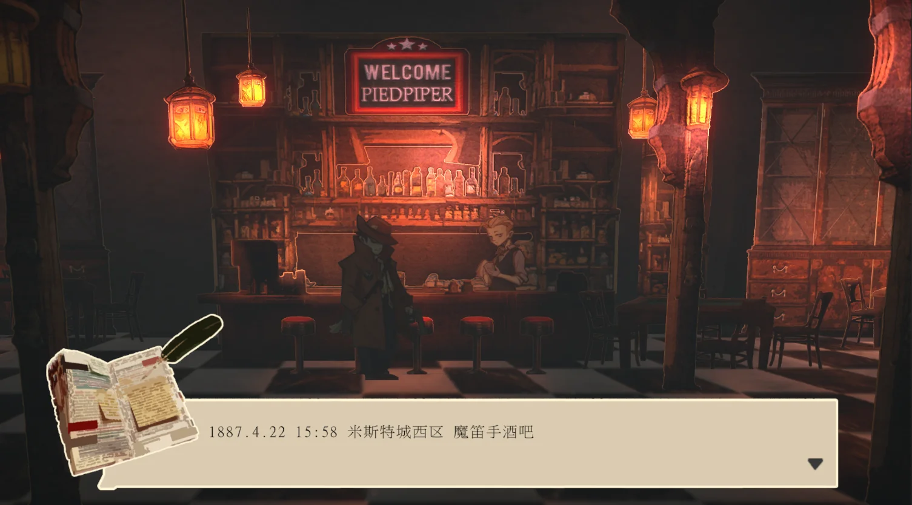

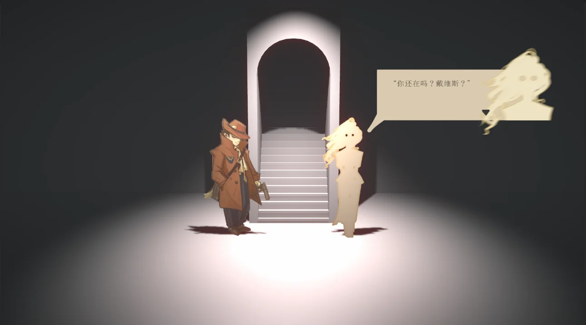

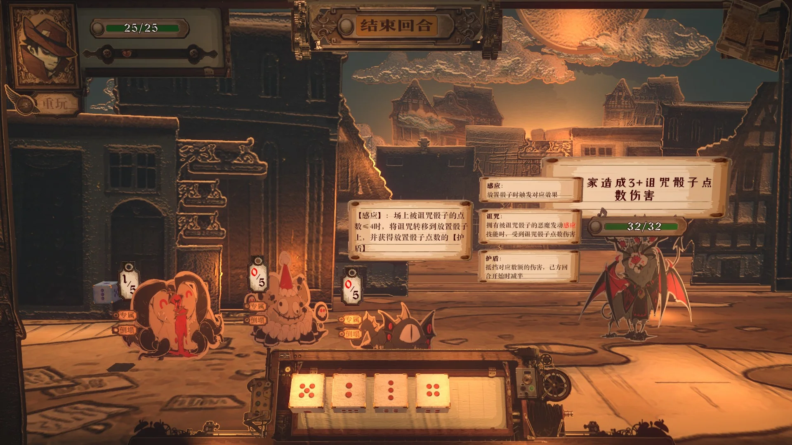

# 同人

## 林克的大逆转2024/2025/2026

**链接**：[林克的大逆转2024](https://www.bilibili.com/video/BV1iB421z7ih/?spm_id_from=333.999.0.0&vd_source=d1cd7437519192c36dc659c247e8160e)

**链接**：[林克的大逆转2025](https://www.bilibili.com/video/BV1QdPde2EbM/?spm_id_from=333.1387.homepage.video_card.click)

**链接：**[林克的大逆转2026](https://www.bilibili.com/video/BV1KCZ2BXEtB/?spm_id_from=333.1387.homepage.video_card.click&vd_source=d1cd7437519192c36dc659c247e8160e)（新的节目已然出炉！）

### 1 加入新春会的原因

一开始是在空间看到了任饭新春会的招募海报。

往常这种同人制作活动，我是搭不上什么关系的，虽然很早就对做同人、做动画什么的挺感兴趣，但苦于自己没有什么才艺（画画啊Cos啊等等），也不懂视频制作，因此大部分时间下都只能默默远观。

但这次却不一样，我定睛一看，怎么在招游戏程序啊！我没有多想，马上就扫描了二维码，生怕报名晚了没选上（后来我发现整个新春会制作组就我一个程序，然后就开启了被制作人们狠狠奴役的生涯...）。

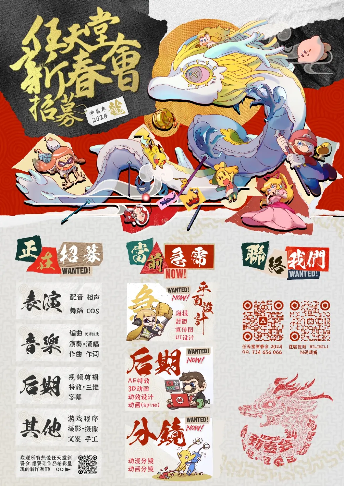

因为刚好在游戏行业，专业十分对口，我很快就通过了筛选。加入后我总算知道他们为什么要招募游戏程序。

23年春节的时候，他们做了一个塞尔达版的逆转裁判，当时把视频制作的老师累得半死。于是第二年他们学聪明了，觉得像这种逆转like，可能做成游戏会更省事一点（制作人os：逆转裁判本来就是游戏啊，所以直接干脆做一个游戏出来吧！）。

### 2 明确程序开发思路

这次制作对我的要求是，**实现一个自动化程序，这个程序能够读取剧情脚本，生成一个AVG游戏**。之后视频制作的老师会直接对游戏进行录屏，再基于录屏基础上进行微调，这样就省去了大部分视频剪辑的工作。

那么问题来了，啥是**剧情脚本**？

**其实就是将我们常见的剧本改造成程序能够识别的形式。**

例如这段剧情：

```
林克：证人，（停顿）你说你看到加侬的头上都是血。
```

就会被改造成：

```
<Name Link>                              //调出林克的名字框
<ShowChar Link Speak>                    //调出林克的说话动画
证人，<W 7>你说你看到加侬的头上都是血...       
```

这样是不是就能初步理解了？不理解也没关系！因为我一开始也是不理解的XD。

其中像`ShowChar`这种指示字符叫做**控制字**，控制字+参数连起来就能指导一个程序效果，例如`<ShowChar Link Speak>`的意思就是“调出林克的说话动画”。

在这次制作过程中，我们根据实际需求对控制字进行了自定义，涵盖了对对话、动画、特效、音频等方面的控制，然后我基于设计实现了游戏程序。

部分当时的设计文档：

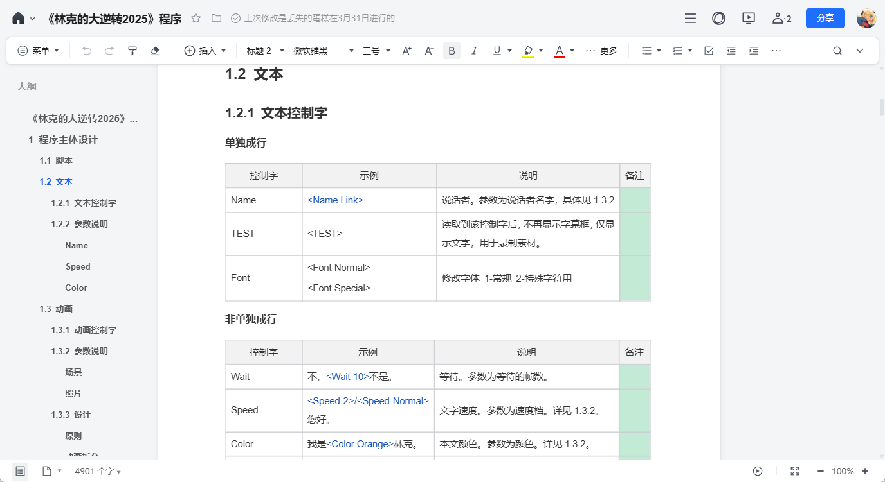

至于为什么想到了控制字的这种脚本模式呢，那就要从制作人蛋糕老师**解包逆转裁判的游戏文件**说起了（你们搞同人的.jpg）。

当时蛋糕老师找到了逆转的剧情脚本文件，发现其中就有很多类似这样的控制字。而我在做AVG游戏制作调研的过程中也发现，很多AVG游戏也是这么去进行制作的（感觉应该是为了让策划更方便直观地去调整剧情的演出效果），于是我们就干脆踩在卡普空的肩膀上进行开发了！

部分脚本：


### 3 第一年的节目上线&第二年的继续制作

程序开发在思路确定后就稳步向前，虽然过程中也有一些小坎坷，但是最后还是在大家的共同努力下按期把《林克的大逆转2024》端出来了（在节目制作的几个月里，我下班了就是写节目的代码，过得很充实，说实话也挺为自己感到骄傲的:D）。

而第二年的特别法庭，程序这边的故事就没有那么多啦！总结就是我基于新的一年在工作里学到的一些游戏制作经验，对程序框架进行了重构，最后呈现了相比之前更合理，更好的效果（至少我是这么认为的）。

### 4 最后的瞎逼逼

这两年的节目制作给我带来的收获非常多，无论是不可替代的成就感（第一次独立项目开发&第一次做同人），还是程序开发经验的增长，还是认识了一群志同道合的小伙伴（一群天南海北的陌生人聚集起来，一起做一个线上项目，参照学校里的小组作业，是不是觉得难度还挺大的）。因此至少是我来说，如果林克的大逆转的大家打算继续做下去，我就会一直做下去。

所以请期待吧，更多的林克的大逆转！

**嘻嘻，最后晒一下B站颁发的证书！**也是为老任的同人社区做出自己的贡献了！


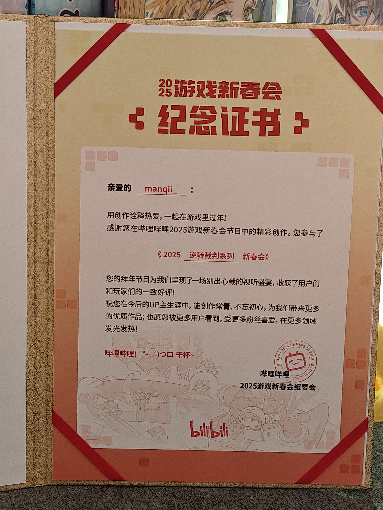

