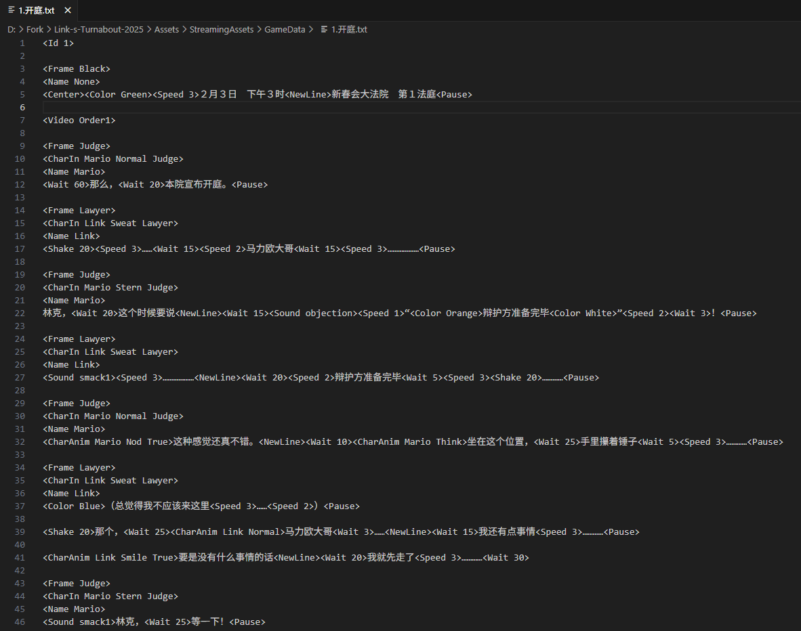
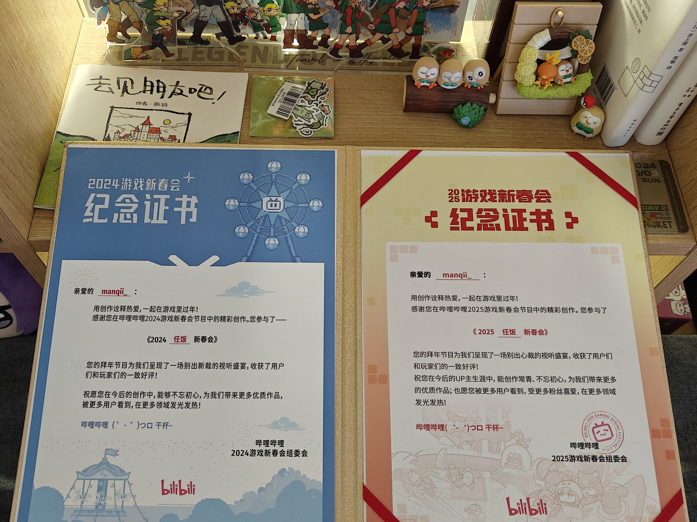
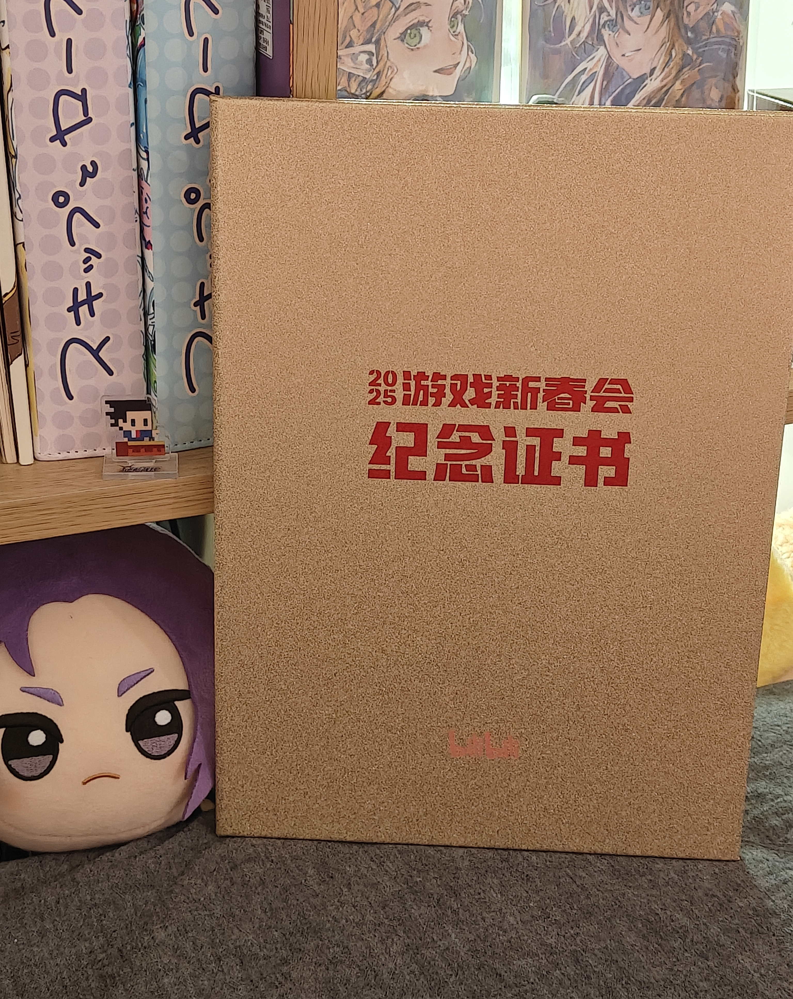

这篇文章记录了我所参与制作的游戏新春会节目《林克的大逆转》，只要我还在继续做，这篇文章应该就会一直更新下去。

**喜报：2025年了，我还在做林克的大逆转！**

# 2023-2024

## 林克的大逆转2024&特别法庭

**链接**：[林克的大逆转2024](https://www.bilibili.com/video/BV1iB421z7ih/?spm_id_from=333.999.0.0&vd_source=d1cd7437519192c36dc659c247e8160e)

**链接**：[林克的大逆转特别法庭](https://www.bilibili.com/video/BV1QdPde2EbM/?spm_id_from=333.1387.homepage.video_card.click)

### 1 加入新春会的原因

一开始是在空间看到了任饭新春会的招募海报。

往常这种同人制作活动，我是搭不上什么关系的，虽然很早就对做同人、做动画什么的挺感兴趣，但苦于自己没有什么才艺（画画啊Cos啊等等），也不懂视频制作，因此大部分时间下都只能默默远观。

但这次却不一样，我定睛一看，怎么在招游戏程序啊！我没有多想，马上就扫描了二维码，生怕报名晚了没选上（后来我发现整个新春会制作组就我一个程序XD，然后就是被制作人们狠狠奴役了）。


因为刚好在游戏行业，专业十分对口，我很快就通过了筛选。加入后我总算知道他们为什么要招募游戏程序。

23年春节的时候，他们做了一个塞尔达版的逆转裁判，当时把视频制作的老师累得半死。于是第二年他们学聪明了，觉得像这种逆转like，可能做成游戏会更省事一点（制作人os：逆转裁判本来就是游戏啊，所以直接干脆做一个游戏出来吧！）。

### 2 明确程序开发思路

这次制作对我的要求是，**实现一个自动化程序，这个程序能够读取剧情脚本，生成一个AVG游戏**。之后视频制作的老师会直接对游戏进行录屏，再基于录屏基础上进行微调，这样就省去了大部分视频剪辑的工作。

那么问题来了，啥是**剧情脚本**？

**其实就是将我们常见的剧本改造成程序能够识别的形式。**

例如这段剧情：

```
林克：证人，（停顿）你说你看到加侬的头上都是血。
```

就会被改造成：

```
<Name Link>                              //调出林克的名字框
<ShowChar Link Speak>                    //调出林克的说话动画
证人，<W 7>你说你看到加侬的头上都是血...       
```

这样是不是就能初步理解了？不理解也没关系！因为我一开始也是不理解的XD。

其中像`ShowChar`这种指示字符叫做**控制字**，控制字+参数连起来就能指导一个程序效果，例如`<ShowChar Link Speak>`的意思就是“调出林克的说话动画”。

在这次制作过程中，我们根据实际需求对控制字进行了自定义，涵盖了对对话、动画、特效、音频等方面的控制，然后我基于设计实现了游戏程序。

部分当时的设计文档：


至于为什么想到了控制字的这种脚本模式呢，那就要从制作人蛋糕老师**解包逆转裁判的游戏文件**说起了（你们搞同人的.jpg）。

当时蛋糕老师找到了逆转的剧情脚本文件，发现其中就有很多类似这样的控制字。而我在做AVG游戏制作调研的过程中也发现，很多AVG游戏也是这么去进行制作的（感觉应该是为了让策划更方便直观地去调整剧情的演出效果），于是我们就干脆踩在卡普空的肩膀上进行开发了！

部分脚本：



### 3 第一年的节目上线&第二年的继续制作

程序开发在思路确定后就稳步向前，虽然过程中也有一些小坎坷，但是最后还是在大家的共同努力下按期把《林克的大逆转2024》端出来了（在节目制作的几个月里，我下班了就是写节目的代码，过得很充实，说实话也挺为自己感到骄傲的:D）。

而第二年的特别法庭，程序这边的故事就没有那么多啦！总结就是我基于新的一年在工作里学到的一些游戏制作经验，对程序框架进行了重构，最后呈现了相比之前更合理，更好的效果（至少我是这么认为的）。

### 4 最后的瞎逼逼

这两年的节目制作给我带来的收获非常多，无论是不可替代的成就感（第一次独立项目开发&第一次做同人），还是程序开发经验的增长，还是认识了一群志同道合的小伙伴（一群天南海北的陌生人聚集起来，一起做一个线上项目，参照学校里的小组作业，是不是觉得难度还挺大的）。因此至少是我来说，如果林克的大逆转的大家打算继续做下去，我就会一直做下去。

所以请期待吧，更多的林克的大逆转！

**嘻嘻，最后晒一下B站颁发的证书！**也是为老任的同人社区做出自己的贡献了！






